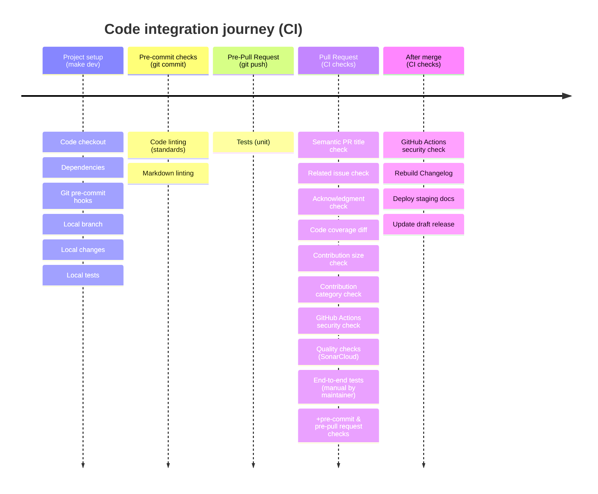

# Contributing Guidelines <!-- omit in toc -->

## Table of contents <!-- omit in toc -->

- [Reporting Bugs/Feature Requests](#reporting-bugsfeature-requests)
- [Contributing via Pull Requests](#contributing-via-pull-requests)
    - [Dev setup](#dev-setup)
        - [Gitpod](#gitpod)
        - [GitHub Codespaces](#github-codespaces)
        - [Local environment](#local-environment)
    - [Sending a pull request](#sending-a-pull-request)
    - [Local documentation](#local-documentation)
- [Conventions](#conventions)
    - [General terminology and practices](#general-terminology-and-practices)
    - [Testing definition](#testing-definition)
- [Finding contributions to work on](#finding-contributions-to-work-on)
- [Code of Conduct](#code-of-conduct)
- [Security issue notifications](#security-issue-notifications)
- [Licensing](#licensing)

<!-- markdownlint-disable MD013 -->
Thank you for your interest in contributing to our project. Whether it's a [bug report](https://github.com/aws-powertools/powertools-lambda-typescript/issues/new?assignees=&labels=type%2Fbug%2Ctriage&projects=aws-powertools%2F7&template=bug_report.yml&title=Bug%3A+TITLE), [new feature](https://github.com/aws-powertools/powertools-lambda-typescript/issues/new?assignees=&labels=type%2Ffeature-request%2Ctriage&projects=aws-powertools%2F7&template=feature_request.yml&title=Feature+request%3A+TITLE), [correction](https://github.com/aws-powertools/powertools-lambda-typescript/issues/new/choose), or [additional documentation](https://github.com/aws-powertools/powertools-lambda-typescript/issues/new?assignees=&labels=area%2Fdocumentation%2Ctriage&projects=aws-powertools%2F7&template=documentation_improvements.yml&title=Docs%3A+TITLE), we greatly value feedback and contributions from our community.
<!-- markdownlint-enable MD013 -->

Please read through this document before submitting any issues or pull requests to ensure we have all the necessary information to effectively respond to your bug report or contribution.

## Reporting Bugs/Feature Requests

We welcome you to use the GitHub issue tracker to report bugs, suggest features, or documentation improvements.

<!-- markdownlint-disable MD013 -->
[When filing an issue](https://github.com/aws-powertools/powertools-lambda-typescript/issues/new/choose), please check [existing open](https://github.com/aws-powertools/powertools-lambda-typescript/issues?q=is%3Aissue+is%3Aopen+sort%3Aupdated-desc), or [recently closed](https://github.com/aws-powertools/powertools-lambda-typescript/issues?q=is%3Aissue+sort%3Aupdated-desc+is%3Aclosed), issues to make sure somebody else hasn't already reported the issue. Please try to include as much information as you can.
<!-- markdownlint-enable MD013 -->

## Contributing via Pull Requests

Contributions via pull requests are much appreciated. Before sending us a pull request, please ensure that:

1. You are working against the latest source on the **main** branch, unless instructed otherwise.
2. You check existing open, and recently merged pull requests to make sure someone else hasn't addressed the problem already.
3. You discuss and agree the proposed changes under [an existing issue](https://github.com/aws-powertools/powertools-lambda-typescript/issues?q=is%3Aopen+is%3Aupdated-desc) or a new one before you begin any implementation. We value your time and bandwidth. As such, any pull requests created on non-triaged issues might not be successful.

At a high level, these are the steps to get code merged in the repository - don't worry, nearly all of them are automated.



### Dev setup

Firstly, [fork the repository](https://github.com/aws-powertools/powertools-lambda-typescript/fork).

To setup your development environment, we recommend using our pre-configured Cloud environment like Gitpod or GitHub Codespaces.

#### Gitpod

To start using Gitpod, copy the following URL and replace `YOUR_USERNAME` with your GitHub username or organization:

```text
https://gitpod.io/#https://github.com/YOUR_USERNAME/aws-lambda-powertools-typescript
```

This will allow the Cloud environment to target your fork correctly.

#### GitHub Codespaces

To start using GitHub Codespaces, navigate to your fork of the repository, then click on the green `Code` button, and select `Create codespace on <branch_name>` under the `Codespaces` tab (where `<branch_name>` is the branch you want to work on).

#### Local environment

Alternatively, you can use `npm run setup-local` on your local machine.

### Sending a pull request

To send us a pull request, please follow these steps:

1. Create a new branch to focus on the specific change you are contributing e.g. `improv/logger-debug-sampling`
2. Make sure that all formatting, linting, and tests tasks run as git pre-commit & pre-push hooks are passing.
3. Commit to your fork using clear commit messages.
4. Send us a pull request with a [conventional semantic title](https://github.com/aws-powertools/powertools-lambda-typescript/pull/1744), and answer any default question in the pull request interface.
5. Pay attention to any automated CI failures reported in the pull request, and stay involved in the conversation.

GitHub provides additional document on [forking a repository](https://help.github.com/articles/fork-a-repo/) and
[creating a pull request](https://help.github.com/articles/creating-a-pull-request/).

### Local documentation

You might find useful to run both the documentation website and the API reference locally while contributing:

- **Docs website**: `npm run docs-runLocalDocker`
    - If this is your first time running the docs, you need to build the image: `npm run docs-buildDockerImage`
- **API reference**: `npm run docs-api-build-run`

## Conventions

### General terminology and practices

| Category              | Convention                                                                                                                                                                                                                                                                  |
| --------------------- | --------------------------------------------------------------------------------------------------------------------------------------------------------------------------------------------------------------------------------------------------------------------------- |
| **Docstring**         | We use [TypeDoc](https://typedoc.org) annotations to help generate more readable API references. For public APIs, we always include at least one **Example** to ease everyone's experience when using an IDE.                                                               |
| **Style guide**       | We use [Eslint](https://eslint.org) and [Prettier](https://prettier.io) to enforce beyond good practices. We use TypeScript types, function return types, and access modifiers to convey intent.                                                                            |
| **Core utilities**    | Core utilities always accept `serviceName` as a constructor parameter, can work in isolation, and are also available in other languages implementation.                                                                                                                     |
| **Utilities**         | Utilities are not as strict as core and focus on community needs: development productivity, industry leading practices, etc. Both core and general utilities follow our [Tenets](https://docs.powertools.aws.dev/lambda/typescript/#tenets).                                |
| **Errors**            | Specific errors thrown by Powertools live within utilities themselves and use `Error` suffix e.g. `IdempotencyKeyError`.                                                                                                                                                    |
| **Git commits**       | We follow [conventional commits](https://www.conventionalcommits.org/en/v1.0.0/). We do not enforce conventional commits on contributors to lower the entry bar. Instead, we enforce a conventional PR title so our label automation and changelog are generated correctly. |
| **API documentation** | API reference docs are generated from docstrings which should have Examples section to allow developers to have what they need within their own IDE. Documentation website covers the wider usage, tips, and strive to be concise.                                          |
| **Documentation**     | We treat it like a product. We sub-divide content aimed at getting started (80% of customers) vs advanced usage (20%). We also ensure customers know how to unit test their code when using our features.                                                                   |

### Testing definition

We group tests in different categories

| Test              | When to write                                                                                                     | Notes                                                                                                                                      | Speed                                             |
| ----------------- | ----------------------------------------------------------------------------------------------------------------- | ------------------------------------------------------------------------------------------------------------------------------------------ | ------------------------------------------------- |
| Unit tests        | Verify the smallest possible unit works.                                                                          | Networking access is prohibited. Keep mocks and spies at minimum.                                                                          | Fast (ms to few seconds at worst)                 |
| End-to-end tests  | Gain confidence that a Lambda function with our code operates as expected. Also referred to as integration tests. | It simulates how customers configure, deploy, and run their Lambda function - Event Source configuration, IAM permissions, etc.            | Slow (minutes)                                    |
| Performance tests | Ensure critical operations won't increase latency and costs to customers.                                         | CI arbitrary hardware can make it flaky. We'll resume writing perf test after we revamp our unit/functional tests with internal utilities. | Fast to moderate (a few seconds to a few minutes) |

**NOTE**: Unit tests are mandatory. We have plans to create a guide on how to create these different tests. Maintainers will help indicate whether additional tests are necessary and provide assistance as required.

## Finding contributions to work on

Looking at the existing issues is a great way to find something to contribute on. As our projects, by default, use GitHub issue labels, [looking at any 'help-wanted' issues is a great place to start](https://github.com/orgs/aws-powertools/projects/7/views/3?query=is%3Aopen+sort%3Aupdated-desc).

## Code of Conduct

This project has adopted the [Amazon Open Source Code of Conduct](https://aws.github.io/code-of-conduct).
For more information see the [Code of Conduct FAQ](https://aws.github.io/code-of-conduct-faq) or contact
<opensource-codeofconduct@amazon.com> with any additional questions or comments.

## Security issue notifications

If you discover a potential security issue in this project we ask that you notify AWS/Amazon Security via our [vulnerability reporting page](http://aws.amazon.com/security/vulnerability-reporting/). Please do **not** create a public github issue.

## Licensing

See the [LICENSE](LICENSE) file for our project's licensing. We will ask you to confirm the licensing of your contribution.

We may ask you to sign a [Contributor License Agreement (CLA)](http://en.wikipedia.org/wiki/Contributor_License_Agreement) for larger changes.
