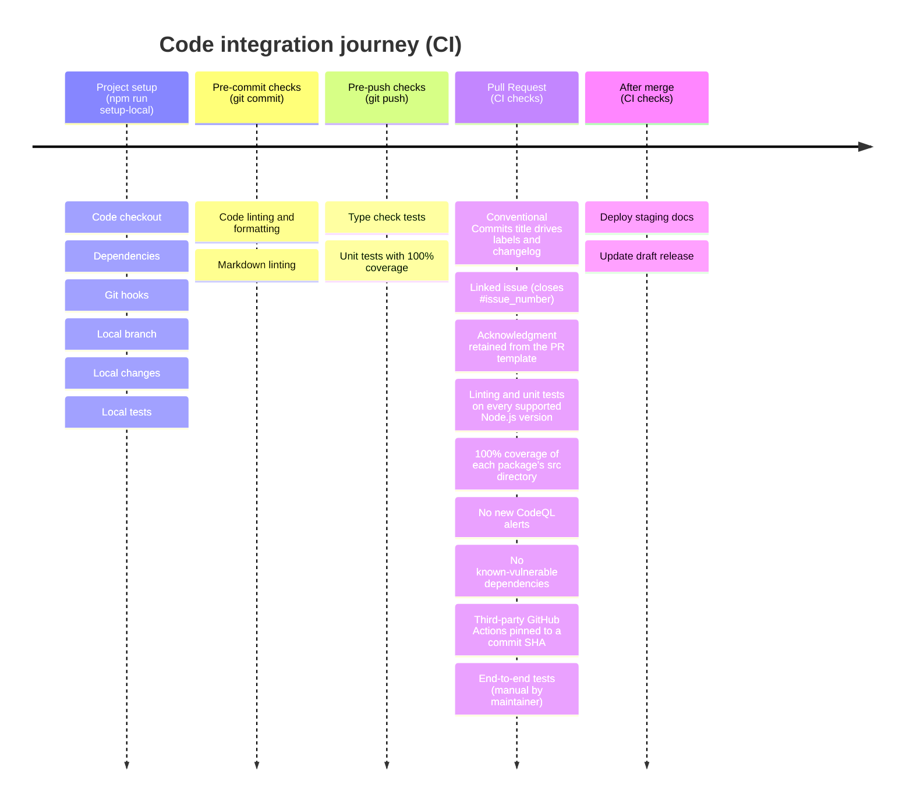
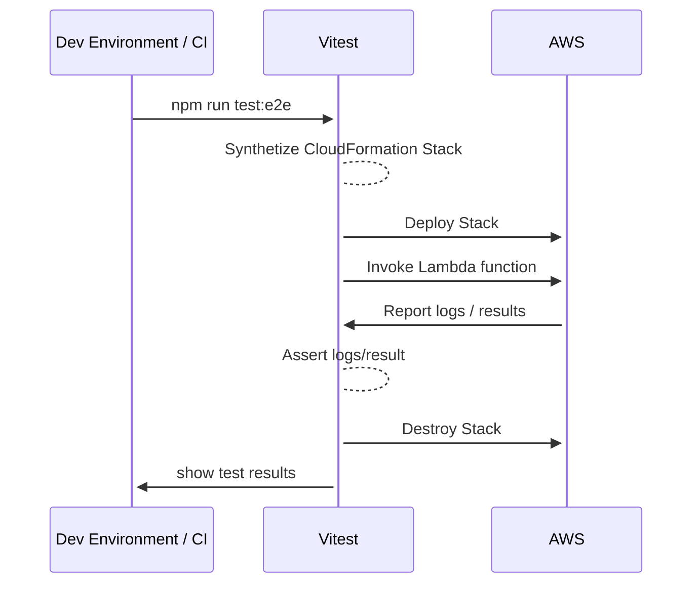

# Contributing Guidelines <!-- omit in toc -->

## Table of contents <!-- omit in toc -->

- [Reporting bugs and requesting features](#reporting-bugs-and-requesting-features)
    - [What we look for when reviewing an RFC](#what-we-look-for-when-reviewing-an-rfc)
- [Finding contributions to work on](#finding-contributions-to-work-on)
- [Contributing via pull requests](#contributing-via-pull-requests)
    - [Dev setup](#dev-setup)
    - [Coding standards](#coding-standards)
    - [Sending a pull request](#sending-a-pull-request)
    - [End-to-end tests](#end-to-end-tests)
    - [Local documentation](#local-documentation)
- [Code of Conduct](#code-of-conduct)
- [Security issue notifications](#security-issue-notifications)
- [Licensing](#licensing)

Thank you for your interest in contributing to our project. Whether it's a bug report, a new feature, a correction, or additional documentation, we greatly value feedback and contributions from our community.

We encourage contributions from the community and we will work with contributors to merge their pull requests.
Rarely, we may close pull requests that do not meet the guidelines in this document, or will require unreasonable effort to meet our quality bar.

Please read through this document before submitting any issues or pull requests to ensure we have all the necessary
information to effectively respond to your bug report or contribution.

## Reporting bugs and requesting features

Before opening anything new, please check [existing open](https://github.com/aws-powertools/powertools-lambda-typescript/issues?q=is%3Aissue+is%3Aopen+sort%3Aupdated-desc)
and [recently closed](https://github.com/aws-powertools/powertools-lambda-typescript/issues?q=is%3Aissue+sort%3Aupdated-desc+is%3Aclosed) issues, so nobody duplicates work.
Then pick the entry point that matches what you have:

- [Bug report](https://github.com/aws-powertools/powertools-lambda-typescript/issues/new?template=bug_report.yml) — a runtime error you can reproduce, whether or not you know how to fix it.
- [Feature request](https://github.com/aws-powertools/powertools-lambda-typescript/issues/new?template=feature_request.yml) — a new feature or enhancement that would help you, your team, or other customers.
- [Documentation improvement](https://github.com/aws-powertools/powertools-lambda-typescript/issues/new?template=documentation_improvements.yml) — typos, unclear guides, missing examples, diagrams.
- [Maintenance](https://github.com/aws-powertools/powertools-lambda-typescript/issues/new?template=maintenance.yml) — technical debt, governance, and anything internal.
- [Design proposal (RFC)](https://github.com/aws-powertools/powertools-lambda-typescript/discussions/new?category=rfcs-request-for-comments) — a Request for Comments that explores the user experience and tradeoffs of a larger change before anyone writes code. Substantial feature requests usually start life here.
- [Share your work](https://github.com/aws-powertools/powertools-lambda-typescript/issues/new?template=share_your_work.yml) — blog posts, workshops, talks, and sample apps built with Powertools for AWS Lambda.
- [Become a public reference](https://github.com/aws-powertools/powertools-lambda-typescript/issues/new?template=support_powertools.yml) — tell everyone how your organization uses Powertools for AWS Lambda.
- [GitHub Discussions](https://github.com/aws-powertools/powertools-lambda-typescript/discussions) — questions, half-formed ideas, and anything that isn't an issue yet.

### What we look for when reviewing an RFC

RFC review is collaborative. Before submitting an RFC, use the [RFC template](https://github.com/aws-powertools/powertools-lambda-typescript/discussions/new?category=rfcs-request-for-comments) and make sure the proposal:

- Aligns with our [tenets](https://docs.aws.amazon.com/powertools/typescript/latest/#tenets).
- Defines the use case and recommended usage, including Lambda-specific constraints and how the design works across the relevant utilities.
- Explains the mechanics at a level that someone familiar with the codebase could implement, without prescribing fine-grained implementation details.
- Covers alternatives, including existing projects or whether the use case belongs in a separate project.
- Accounts for the ongoing maintenance and skills the proposal would require.
- Says whether you want to help implement it and where you need guidance.

## Finding contributions to work on

Browsing the [open issues](https://github.com/aws-powertools/powertools-lambda-typescript/issues?q=is%3Aissue+is%3Aopen+sort%3Aupdated-desc) is the best place to start.
Issues still labelled for triage are being scoped, so comment before picking one up.
[GitHub Discussions](https://github.com/aws-powertools/powertools-lambda-typescript/discussions) is where questions and design proposals get debated — answering a question there is as valuable as a code change.

Documentation is always open: look for places that could use a clearer example or a diagram, and keep in mind a diverse audience that often reads English as a second language.

## Contributing via pull requests

Contributions via pull requests are much appreciated. Before sending us a pull request, please ensure that:

1. You are working against the latest source on the **main** branch, unless instructed otherwise.
2. You check existing open, and recently merged pull requests to make sure someone else hasn't addressed the problem already.
3. You discuss and agree the proposed changes under [an existing issue](https://github.com/aws-powertools/powertools-lambda-typescript/issues?q=is%3Aopen+is%3Aupdated-desc) or a new one before you begin any implementation. We value your time and bandwidth. As such, any pull requests created on non-triaged issues might not be successful.

At a high level, these are the steps to get code merged in the repository - don't worry, nearly all of them are automated.


```mermaid
timeline
    title Code integration journey (CI)
    Project setup <br> (npm run setup-local)   : Code checkout
                                               : Dependencies
                                               : Git hooks
                                               : Local branch
                                               : Local changes
                                               : Local tests

    Pre-commit checks <br> (git commit)   : Code linting and formatting
                                          : Markdown linting

    Pre-push checks <br> (git push)   : Type check tests
                                      : Unit tests with 100% coverage

    Pull Request <br> (CI checks)   : Conventional Commits title drives labels and changelog
                                    : Linked issue (closes #issue_number)
                                    : Acknowledgment retained from the PR template
                                    : Linting and unit tests on every supported Node.js version
                                    : 100% coverage of each package's src directory
                                    : No new CodeQL alerts
                                    : No known-vulnerable dependencies
                                    : Third-party GitHub Actions pinned to a commit SHA
                                    : End-to-end tests (manual by maintainer)

    After merge <br> (CI checks)    : Deploy staging docs
                                    : Update draft release
```

The checks are defined in the [lint and unit test](.github/workflows/pr-run-linting-check-and-unit-tests.yml), [CodeQL](.github/workflows/codeql.yml), [dependency review](.github/workflows/dependency-review.yml), and [workflow security](.github/workflows/secure-workflows.yml) workflows.
A maintainer may add a `do-not-merge` label, which blocks the merge until the underlying issue is resolved.

### Dev setup

[Fork the repository](https://github.com/aws-powertools/powertools-lambda-typescript/fork), clone your fork, then run `npm run setup-local` from the repo root to install dependencies, build every workspace, and install the Git hooks. New to this? GitHub documents [how to fork and clone a project](https://docs.github.com/en/get-started/quickstart/contributing-to-projects).

What you need installed:

- **Node.js 24.x**, the version pinned in `.nvmrc`, so `nvm use` or `fnm use` picks it up. npm 11.x ships with it; this is an npm workspaces monorepo, so always install from the repo root rather than from a package directory.
- **Docker**, only to preview the documentation with `npm run docs:docker:*`. Nothing else in the repo needs it.
- **Python 3**, only to preview the documentation without Docker, with `npm run docs:local:*`.
- **An AWS account and the AWS CLI**, only to run [end-to-end tests](#end-to-end-tests).

### Coding standards

[`CODING_STANDARDS.md`](CODING_STANDARDS.md) is the source of truth for package layout, TypeScript style, JSDoc, unit tests, and the commands that verify all of them. Read it before writing code, tests, or documentation. If you drive a coding agent, point it at [`AGENTS.md`](AGENTS.md).

### Sending a pull request

1. Create a branch named after the change you are contributing, e.g. `improv/logger-debug-sampling`.
2. Commit to your fork using clear commit messages. Don't worry about the commit format — we squash every pull request on merge.
3. Make sure the Git hooks pass. The pre-commit hook lints and formats staged files; the pre-push hook type-checks the tests and runs the unit tests with the 100% coverage threshold.
4. Open a pull request with a title that follows the [Conventional Commits specification](https://www.conventionalcommits.org/en/v1.0.0/), and fill in every area the pull request template asks for — including the issue it closes.
5. Pay attention to any automated CI failures reported in the pull request, and stay involved in the conversation.

First pull request ever? GitHub documents [forking a repository](https://help.github.com/articles/fork-a-repo/) and [creating a pull request](https://help.github.com/articles/creating-a-pull-request/).

### End-to-end tests

End-to-end tests give us confidence that a Lambda function using our code behaves as expected once deployed — event source configuration, IAM permissions, and all. They deploy real resources with AWS CDK, invoke the functions, assert on the logs, metrics, and traces they emit, then tear everything down.

> [!WARNING]
> Running end-to-end tests creates AWS resources in your account, which may incur costs. Some services are covered by the [AWS Free Tier](https://aws.amazon.com/free/), but not all of them. Use a dedicated AWS account, and when in doubt let the CI on our repository run them for you.

You'll need an [AWS account bootstrapped with CDK](https://docs.aws.amazon.com/cdk/v2/guide/bootstrapping.html) and the [AWS CLI installed and configured](https://docs.aws.amazon.com/cli/latest/userguide/getting-started-install.html). Then, from the repo root:

- `npm run test:e2e -w packages/metrics` runs the end-to-end suites of a single package on the default Node.js runtime.
- `npm run test:e2e:nodejs24x -w packages/metrics` runs the same suites pinned to a specific runtime.


```mermaid
sequenceDiagram
    Dev Environment / CI->>+Vitest: npm run test:e2e
    Vitest-->Vitest: Synthetize CloudFormation Stack
    Vitest->>+AWS: Deploy Stack
    Vitest->>+AWS: Invoke Lambda function
    AWS->>Vitest: Report logs / results
    Vitest-->Vitest: Assert logs/result
    Vitest->>+AWS: Destroy Stack
    Vitest->>+Dev Environment / CI: show test results
```

In CI these only run when a maintainer triggers [`run-e2e-tests.yml`](.github/workflows/run-e2e-tests.yml), which fans the suites out across every supported runtime version and architecture.

### Local documentation

You might find useful to run both the documentation website and the API reference locally while contributing:

#### Using Docker (recommended)

1. Build the Docker image (only needed the first time):

   ```bash
   npm run docs:docker:build
   ```

2. Run the documentation website:

   ```bash
   npm run docs:docker:run
   ```

#### Using Python directly

If you have Python 3.x installed, you can run the documentation website and API reference locally without Docker:

1. Create a virtual environment and install dependencies:

   ```bash
   npm run docs:local:setup
   ```

2. Run the documentation website:

   ```bash
   npm run docs:local:run
   ```

## Code of Conduct

This project has adopted the [Amazon Open Source Code of Conduct](https://aws.github.io/code-of-conduct).
For more information see the [Code of Conduct FAQ](https://aws.github.io/code-of-conduct-faq) or contact
<opensource-codeofconduct@amazon.com> with any additional questions or comments.

## Security issue notifications

If you discover a potential security issue in this project we ask that you notify AWS/Amazon Security via our [vulnerability reporting page](http://aws.amazon.com/security/vulnerability-reporting/). Please do **not** create a public GitHub issue.

## Licensing

See the [LICENSE](LICENSE) file for our project's licensing. We will ask you to confirm the licensing of your contribution.

We may ask you to sign a [Contributor License Agreement (CLA)](http://en.wikipedia.org/wiki/Contributor_License_Agreement) for larger changes.
