# Maintainers playbook

This is the operational runbook for maintainers of Powertools for AWS Lambda (TypeScript): who the maintainers are, the labels we use, and the step-by-step processes we follow to triage, release, and operate the project.

If you're looking to contribute, read [CONTRIBUTING.md](./CONTRIBUTING.md) instead.

> Security reports come before features and bugs. This repository is monitored and supported 24/7 by Amazon Security — see [SECURITY.md](./SECURITY.md) for how vulnerabilities are reported and handled.

## Current maintainers

| Maintainer     | GitHub ID                                   | Affiliation |
| -------------- | ------------------------------------------- | ----------- |
| Andrea Amorosi | [dreamorosi](https://github.com/dreamorosi) | Amazon      |
| Swopnil Dangol | [sdangol](https://github.com/sdangol)       | Amazon      |
| Stefano Vozza  | [svozza](https://github.com/svozza)         | Amazon      |

## Emeritus maintainers

Previous active maintainers who contributed to this project.

| Maintainer                 | GitHub ID                                       | Affiliation |
| -------------------------- | ----------------------------------------------- | ----------- |
| Alexander Schueren         | [am29d](https://github.com/am29d)               | OpenAI      |
| Simon Thulbourn            | [sthulb](https://github.com/sthulb)             |             |
| Sara Gerion                | [saragerion](https://github.com/saragerion)     | Amazon      |
| Florian Chazal             | [flochaz](https://github.com/flochaz)           |             |
| Chadchapol Vittavutkarnvej | [ijemmy](https://github.com/ijemmy)             | Booking.com |
| Alan Churley               | [alan-churley](https://github.com/alan-churley) | CloudCall   |
| Michael Bahr               | [bahrmichael](https://github.com/bahrmichael)   | Stedi       |

## Labels

Labels we actually use, and what applies them. Anything marked _manual_ is only ever set by a maintainer, so don't assume it's there.

### Issue lifecycle

| Label                             | Usage                                                                 | Applied by                                        |
| --------------------------------- | --------------------------------------------------------------------- | ------------------------------------------------- |
| `triage`                          | Not yet triaged; remove it once you've validated the request or repro | Issue templates                                   |
| `researching`                     | Still being discussed or refined; we'll update once we know more      | Manual                                            |
| `need-more-information`           | Missing information before we can make a call                         | Manual                                            |
| `need-customer-feedback`          | Needs more customer input before deciding or revisiting a decision    | Manual                                            |
| `need-response`                   | Waiting on the author; opts the issue into org-level stale automation | Manual                                            |
| `pending-close-response-required` | Went stale waiting for a response and will be closed unless it moves  | Organization-level automation                     |
| `blocked`                         | Progress is blocked by an external dependency or reason               | Manual                                            |
| `on-hold`                         | Parked and will be revisited in the future                            | Manual                                            |
| `next-major-version`              | Deferred to the next major version                                    | Manual                                            |
| `pending-release`                 | Merged and shipping in the next release                               | Organization-level automation, when the PR merges |

### Type and area

Issue type — bug, feature, documentation, or maintenance — is tracked with [GitHub Issue Types](https://docs.github.com/en/issues/tracking-your-work-with-issues/using-issues/configuring-issue-types) rather than labels. What's left are the labels that qualify an item further.

| Label                | Usage                                                  | Applied by                              |
| -------------------- | ------------------------------------------------------ | --------------------------------------- |
| `bug-upstream`       | Bug caused by an upstream dependency                   | Manual                                  |
| `good-first-issue`   | Suitable for someone who wants to start contributing   | Manual                                  |
| `help-wanted`        | We'd appreciate support from the community on this one | Manual                                  |
| `customer-reference` | Authorization to use a customer name publicly          | `support_powertools.yml` issue template |
| `community-content`  | Community content to feature in the documentation      | `share_your_work.yml` issue template    |

Area labels flag which part of the library an item belongs to: `logger`, `metrics`, `tracer`, `parameters`, `idempotency`, `batch`, `parser`, `validation`, `jmespath`, `event-handler`, `data-masking`, `kafka`, `signer`, `commons`, `layers`, and `automation` for CI/CD and workflows.

### Pull requests

| Label                                              | Usage                                                                        | Applied by                                             |
| -------------------------------------------------- | ---------------------------------------------------------------------------- | ------------------------------------------------------ |
| `do-not-merge`                                     | Blocks the merge; `.github/workflows/on_pr_updates.yml` fails while it's set | Manual                                                 |
| `need-issue`                                       | PR is missing a related issue                                                | Organization-level PR checks                           |
| `dependencies`                                     | Touches dependencies                                                         | Dependabot, alongside an ecosystem label               |
| `javascript`, `github_actions`, `docker`, `python` | Ecosystem a Dependabot PR updates                                            | Dependabot                                             |
| `skip-changelog`                                   | Excluded from the drafted release notes, see `.github/release-drafter.yml`   | Automation, on the version bump and layer ARN docs PRs |
| `size/XS` … `size/XXL`                             | Rough PR size, from 0-9 LOC up to 1K+ LOC                                    | Organization-level automation                          |

## Triaging issues and pull requests

Remove `triage` once you can confirm a request is valid or a bug reproduces, then set a state label from the table above if one applies — an item with no state label is one whose scope is clear and that nothing is blocking. Give priority to the original author for implementation, unless the task is sensitive enough that it's better handled by maintainers.

Not everything needs a label: close an issue as **duplicate** when it repeats an existing one, and as **not planned** when we won't work on it. The close reason is what customers see, and it keeps the label list to what's actionable.

Issues are tracked on the [board of activities](https://github.com/orgs/aws-powertools/projects/7).

### What counts as a bug

A bug produces incorrect or unexpected results at runtime that differ from the intended behavior, is reproducible, and affects customers who follow the recommended usage. Documentation snippets, use of internal components, and unadvertised functionality are not bugs — close the issue as not planned and explain why.

For bugs caused by an upstream dependency, apply `bug-upstream` and ask the author whether they'd like to raise the issue upstream or prefer us to. Assess the impact and decide whether an emergency release is warranted; ask another maintainer when in doubt.

### Reviewing pull requests

PR titles must follow [Conventional Commits](https://www.conventionalcommits.org/) — they feed the [changelog](./CHANGELOG.md) and the drafted release notes, so make sure they read well to a human. PR titles, related issues, and the acknowledgment checkbox are enforced by organization-level checks, not by workflows in this repository.

Labels need no action when you merge: organization-level automation applies `pending-release` to the linked issue, and `.github/workflows/post-release.yml` removes it from every closed issue once the GitHub release is published.

## Adding a new package

Two things need to happen before a brand-new package (e.g. a new utility) can ship: its name has to exist on npm, and CI has to know about it.

### Reserving the package name on npm

`Make Release` publishes with [npm Trusted Publishing](https://docs.npmjs.com/trusted-publishers) via GitHub Actions OIDC, so we get provenance without storing a long-lived `NPM_TOKEN`.

Trusted publishers can only be configured for a package that **already exists** on npm, so a new package can't reserve its own name that way the first time around: a maintainer has to publish a placeholder version manually, once, before the first real release.

1. **Create a temporary local package** using the same placeholder shape every utility has used before its first release:

    ```json
    {
      "name": "@aws-lambda-powertools/<name>",
      "version": "0.0.0",
      "description": "The <name> package for the Powertools for AWS Lambda (TypeScript) library",
      "author": { "name": "Amazon Web Services", "url": "https://aws.amazon.com" },
      "publishConfig": { "access": "public" },
      "homepage": "https://github.com/aws-powertools/powertools-lambda-typescript",
      "license": "MIT-0",
      "main": "./lib/index.js",
      "types": "./lib/index.d.ts",
      "files": ["lib"],
      "repository": {
        "type": "git",
        "url": "git+https://github.com/aws-powertools/powertools-lambda-typescript.git"
      },
      "bugs": { "url": "https://github.com/aws-powertools/powertools-lambda-typescript/issues" },
      "dependencies": {},
      "keywords": ["aws", "lambda", "powertools", "handler", "nodejs", "serverless"],
      "devDependencies": {}
    }
    ```

    Add a `README.md` with the same "do not use this in production yet" disclaimer other placeholders use — [`@aws-lambda-powertools/validation@0.0.0`](https://www.npmjs.com/package/@aws-lambda-powertools/validation/v/0.0.0) is a good reference — and a `lib/index.js`/`lib/index.d.ts` pair where the former only logs that it's a placeholder reserving the name.

2. **Authenticate locally** as an npm user who's a member of the `@aws-lambda-powertools` org with publish rights. Use a short-lived, least-privilege token, never commit it to `.npmrc`, and revoke it as soon as you're done.

3. **Publish with the `pre` dist-tag**, not `latest`:

    ```bash
    npm publish --access public --tag pre
    ```

    npm always assigns `latest` to the very first version ever published for a package, regardless of `--tag`, so `0.0.0` will briefly carry both `latest` and `pre`. That's expected and self-corrects: the next real release moves `latest` forward, while `pre` stays pinned to `0.0.0` as a permanent marker of the placeholder.

4. **Configure Trusted Publishing** at `https://www.npmjs.com/package/<name>/access`: add a Trusted Publisher for GitHub Actions pointing at this repository and the `make-release.yml` workflow. This is what lets `Make Release` publish real versions with OIDC and provenance, without an `NPM_TOKEN`.

### Wiring the package into CI

The PR that adds the package must also add it to:

- the `workspaces` array in the root `package.json` — this is also what gets it into the Lambda layer, since the layer bundles every non-private `@aws-lambda-powertools/*` workspace;
- `.github/workflows/reusable-run-linting-check-and-unit-tests.yml`;
- `.github/workflows/quality_check.yml`;
- `.github/workflows/run-e2e-tests.yml`, if it has end-to-end tests.

Once that's done, the package ships like any other on the next `Make Release` run.

## Releasing a new version

It takes a few hours end to end, most of it spent waiting on the layer rollout and on the two PRs that need a human review.

1. **Run the end-to-end tests** via the `Run e2e Tests` workflow and make sure they pass.
2. **Run `Make Version`** (`.github/workflows/make-version.yml`) and pick a release type — `auto` unless you have a reason not to. It bumps every package version, regenerates the changelogs, updates the user agent version in `packages/commons/src/version.ts`, and opens a `chore(ci): bump version to X.Y.Z` PR.
3. **Review and merge the version PR.** Read the diff carefully: the version numbers and the changelog are what customers will see. `.github/workflows/on_version_bump_pr_merge.yml` watches for that merge and dispatches `Make Release` for you.
4. **Approve the `Release` deployment** when `Make Release` asks for it — that's the gate in front of publishing to npm.
5. **Let `Make Release` run.** In order, it:
    - runs linting and unit tests;
    - publishes every workspace to npm with provenance, then waits until the registry actually serves the new versions;
    - creates and pushes the `vX.Y.Z` tag;
    - builds the layer and rolls it out to Beta and then Prod across commercial Regions, with a canary in each;
    - writes the Prod SSM parameters;
    - copies the layer into the GovCloud and China partitions, Gamma then Prod, both in parallel;
    - opens a `chore(ci): update layer ARN on documentation` PR once all three Prod deployments are done.
6. **Review and merge the layer ARN docs PR.** `.github/workflows/on_layer_docs_pr_merge.yml` picks up the merge and dispatches `Rebuild latest docs`, which republishes the user guide and API reference.
7. **Draft and publish the release notes** (see below). Publishing the GitHub release triggers `.github/workflows/post-release.yml`, which removes `pending-release` from the shipped issues.

### Release process visualized

The GitHub Actions UI is the source of truth; this is a close visual representation of the main steps, with approximate durations.

```mermaid
gantt

title      Release process
dateFormat HH:mm
axisFormat %H:%M

Release start   : milestone, m1, 10:00, 8s

section Version
    Bump versions and changelogs      : active, 8s
    Open version PR                   : active, 8s

Review and merge version PR : milestone, m2

section QA
    Linting and unit tests            : active, 2.4m

section npm
    Publish workspaces (provenance)   : active, npm, 10:03, 40s
    Verify registry propagation       : active, after npm, 30s

npmjs.com release : milestone, m3

section Git release
    Create and push tag               : active, 8s

section Layer release
    Build layer                       : active, layer_build, 10:05, 2.5m
    Deploy Beta (incl. canary)        : active, layer_beta, after layer_build, 6m
    Deploy Prod (incl. canary)        : active, layer_prod, after layer_beta, 6m

Layer release : milestone, m4

section SSM
    Update SSM parameters (Prod)      : active, after layer_prod, 2m

section GovCloud
    Publish GovCloud layers (Gamma)   : active, govcloud_gamma, after layer_prod, 8s
    Publish GovCloud layers (Prod)    : active, govcloud_prod, after govcloud_gamma, 8s
GovCloud layers published : milestone, m5

section China
    Publish China layers (Gamma)      : active, china_gamma, after layer_prod, 8s
    Publish China layers (Prod)       : active, china_prod, after china_gamma, 8s
China layers published : milestone, m6

section Docs
    Commit layer ARNs                 : active, after govcloud_prod china_prod, 8s
    Open docs PR                      : active, 8s

Review and merge docs PR : milestone, m7

    Publish updated docs              : active, 2m

Documentation release : milestone, m8

Release complete : milestone, m9
```



### Drafting release notes

`.github/workflows/release-drafter.yml` keeps a draft release ready on the [Releases page](https://github.com/aws-powertools/powertools-lambda-typescript/releases) — open it with the edit pencil.

Check that the `tag` field is the version you're releasing, the target branch is `main`, and the release title matches the tag, e.g. `v2.28.0`. Changes are grouped by label according to the `categories` in `.github/release-drafter.yml`.

**I spotted a typo or incorrect grouping — how do I fix it?** Edit the PR title and labels, then re-run the [Release Drafter workflow](https://github.com/aws-powertools/powertools-lambda-typescript/actions/workflows/release-drafter.yml) to regenerate the draft.

This won't change the changelog, since the merge commit is immutable — that's fine. We'd only ever rewrite git history if it could genuinely confuse customers, and we'd pair with another maintainer to do it.

Then replace the `[Human readable summary of changes]` placeholder with what you want customers to take away from this release. Questions worth asking yourself:

- Can customers understand at a high level what changed?
- Is there a link to the documentation for each main change?
- Would a graphic or code snippet make it easier to read?
- Is there a key contributor worth calling out? Everyone is credited automatically, so use this for exceptional cases. If someone is missing from the generated list, add them manually.

Once you're happy, hit `Publish release`.

## Running end-to-end tests

End-to-end tests must pass before a release. Run them via the [Run e2e Tests workflow](https://github.com/aws-powertools/powertools-lambda-typescript/actions/workflows/run-e2e-tests.yml). Also run them manually for large maintainer-authored contributions before merging to `main`.

To run them locally you need the [AWS CDK CLI](https://docs.aws.amazon.com/cdk/v2/guide/getting_started.html) and a [bootstrapped account](https://docs.aws.amazon.com/cdk/v2/guide/bootstrapping.html). With a default AWS CLI profile configured, or `AWS_PROFILE` set:

```bash
npm run test:e2e                        # every package, sequentially
npm run test:e2e -w packages/logger     # a single package
```

These tests deploy real infrastructure. `.github/workflows/sweep-stale-e2e-stacks.yml` sweeps up anything a failed run leaves behind, but prefer cleaning up after yourself.

## Releasing a documentation hotfix

You can republish the documentation without a full release via the [Rebuild latest docs workflow](https://github.com/aws-powertools/powertools-lambda-typescript/actions/workflows/rebuild_latest_docs.yml). Choose `Run workflow`, keep `main` as the branch, and pass the latest published version. This updates both the user guide and the API reference.

## Publishing Lambda Layers to a new AWS Region

When a new AWS Region becomes available, check that it supports AWS Lambda and the Node.js runtimes we publish for, then:

1. Run the `Region Bootstrap` workflow (`.github/workflows/bootstrap_region.yml`) once for `beta` and once for `prod`, passing the new Region. It bootstraps CDK in that Region, then runs the `layer-balancer` `balance` command to copy every existing layer version from `us-east-1`, so the new Region ends up with the same layer version numbers as everywhere else.
2. Add the Region to the `region` matrix in `.github/workflows/reusable_deploy_layer_stack.yml` and to the `region` matrix in `.github/workflows/update_ssm.yml`, so future releases deploy the layer and publish SSM parameters there.
3. Add a row for the Region to the ARN table in `docs/getting-started/lambda-layers.md`, using the layer version currently published. From then on `.github/scripts/update_layer_arn.sh` keeps it current on every release.

If an existing Region drifts behind — a failed deployment, for instance — run `Region Balance` (`.github/workflows/layer_balance.yml`) to copy the missing versions across, optionally passing `start_at` to resume from a specific layer version.

Regions temporarily excluded from releases are commented out in the deploy matrices and listed in `paused_regions` in `.github/scripts/update_layer_arn.sh`, so their frozen ARNs aren't bumped in the docs. Keep the two in sync.

To re-deploy a partition outside the normal release flow, run `Layer Deployment (Partitions)` (`.github/workflows/layers_partitions.yml`) with the target partition.
