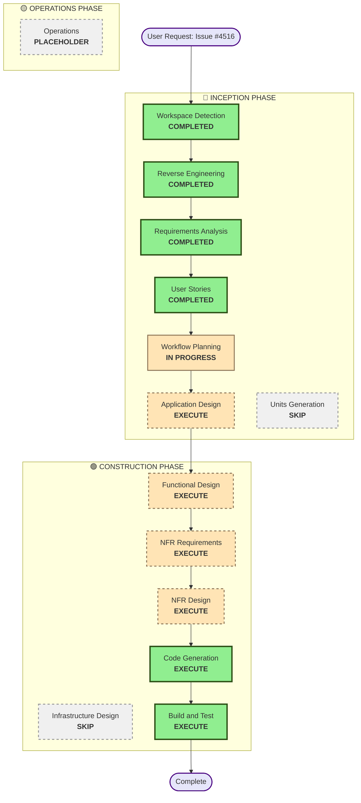

# Execution Plan

**Feature**: GitHub Issue #4516 - Data Validation in Event Handler  
**Date**: 2025-11-07  
**Project Type**: Brownfield (Existing Event Handler package)

---

## Detailed Analysis Summary

### Transformation Scope
- **Transformation Type**: Single Component Enhancement
- **Primary Changes**: Add validation middleware and configuration to existing Event Handler package
- **Related Components**: 
  - Event Handler package (primary)
  - Standard Schema integration (new dependency)
  - OpenAPI generation (integration with issue #4515)

### Change Impact Assessment

**User-facing changes**: Yes
- Developers will use new validation configuration API
- New error types (RequestValidationError, ResponseValidationError)
- Type inference changes for validated routes

**Structural changes**: No
- Extends existing Event Handler architecture
- Adds middleware layer for validation
- No changes to core routing or resolver structure

**Data model changes**: No
- No database schema changes
- Validation schemas are configuration, not data models

**API changes**: Yes (Additive only)
- New validation configuration option in route registration
- New error handler types
- Backward compatible (existing API unchanged)

**NFR impact**: Yes
- Performance: Validation adds processing overhead
- Security: Validation improves input security
- Type Safety: Enhanced TypeScript inference

### Component Relationships

**Primary Component**: `@aws-lambda-powertools/event-handler`

**New Dependencies**:
- `standard-schema` (required)
- `zod`, `valibot`, `arktype` (peer dependencies)

**Integration Points**:
- Existing middleware system (validation as middleware)
- Existing error handler registry (validation errors)
- OpenAPI generation (issue #4515 integration)

**No Dependent Components**: Event Handler is a leaf package (no other packages depend on it)

### Risk Assessment

**Risk Level**: Medium
- **Rationale**: New feature with multiple integration points, but isolated to single package
- **Rollback Complexity**: Easy (feature is opt-in, can be disabled per route)
- **Testing Complexity**: Moderate (multiple schema libraries, various validation scenarios)
- **Unknowns**: Standard Schema specification stability, OpenAPI conversion complexity

---

## Workflow Visualization

---

## Phases to Execute

### 🔵 INCEPTION PHASE

- [x] **Workspace Detection** - COMPLETED
  - Detected brownfield project (Event Handler package)
  - Identified existing codebase structure

- [x] **Reverse Engineering** - COMPLETED
  - Analyzed Event Handler architecture
  - Documented middleware system, error handling, routing
  - Identified integration points

- [x] **Requirements Analysis** - COMPLETED
  - 8 Functional Requirements defined
  - 6 Non-Functional Requirements defined
  - Comprehensive validation scope (body, headers, path, query)

- [x] **User Stories** - COMPLETED
  - 30 user stories in Job Story format
  - Organized by feature area (6 categories)
  - All requirements covered

- [x] **Workflow Planning** - IN PROGRESS
  - Creating execution plan

- [ ] **Application Design** - EXECUTE
  - **Rationale**: New components needed for validation system
  - **Scope**: 
    - Validation middleware component
    - Schema configuration structures
    - Error types and handlers
    - Type inference utilities
    - Standard Schema adapter layer
  - **Deliverables**:
    - Component architecture diagram
    - Component methods and interfaces
    - Component dependencies
    - Integration points with existing Event Handler

- [ ] **Units Generation** - SKIP
  - **Rationale**: Single package implementation, no need for multiple units
  - **Note**: All work contained within Event Handler package

---

### 🟢 CONSTRUCTION PHASE

- [ ] **Functional Design** - EXECUTE
  - **Rationale**: Complex validation logic and schema handling requires detailed design
  - **Scope**:
    - Validation middleware flow (request/response)
    - Schema configuration parsing
    - Standard Schema integration patterns
    - Type inference mechanisms
    - Error construction and propagation
  - **Deliverables**:
    - Validation flow diagrams
    - Schema handling logic
    - Type inference design
    - Error handling flows

- [ ] **NFR Requirements Assessment** - EXECUTE
  - **Rationale**: Performance, security, and type safety are critical NFRs
  - **Scope**:
    - Performance impact of validation
    - Security considerations (opaque errors, input sanitization)
    - Type safety approach (TypeScript generics)
    - Backward compatibility strategy
  - **Deliverables**:
    - NFR requirements document
    - Performance benchmarks needed
    - Security requirements
    - Type safety requirements

- [ ] **NFR Design** - EXECUTE
  - **Rationale**: NFR requirements need specific design patterns
  - **Scope**:
    - Performance optimization patterns
    - Security patterns (error sanitization)
    - Type inference implementation approach
    - Backward compatibility layer design
  - **Deliverables**:
    - NFR design patterns
    - Type system design
    - Security implementation approach
    - Compatibility layer design

- [ ] **Infrastructure Design** - SKIP
  - **Rationale**: No infrastructure changes needed
  - **Note**: Pure application code, no deployment or infrastructure impact

- [ ] **Code Generation** - EXECUTE (ALWAYS)
  - **Rationale**: Implementation of validation system
  - **Scope**:
    - Validation middleware implementation
    - Schema configuration types and parsers
    - Standard Schema adapter
    - Error types and handlers
    - Type inference utilities
    - OpenAPI integration
    - Tests (unit and integration)
  - **Deliverables**:
    - Source code files
    - Type definitions
    - Tests
    - Examples

- [ ] **Build and Test** - EXECUTE (ALWAYS)
  - **Rationale**: Verification and quality assurance
  - **Scope**:
    - Unit tests for all components
    - Integration tests with Zod, Valibot, ArkType
    - Type inference tests
    - Error handling tests
    - OpenAPI generation tests
    - Backward compatibility tests
  - **Deliverables**:
    - Test suite
    - Build instructions
    - Test coverage report

---

### 🟡 OPERATIONS PHASE

- [ ] **Operations** - PLACEHOLDER
  - **Rationale**: Future deployment and monitoring workflows
  - **Note**: Library package, no operational deployment needed

---

## Implementation Strategy

### Single Package Approach
- All changes contained within `@aws-lambda-powertools/event-handler` package
- No cross-package dependencies or coordination needed
- Straightforward implementation and testing

### Backward Compatibility
- Existing routes without validation continue to work unchanged
- Simple `input`/`output` configuration maps to new `req.body`/`res.body`
- No breaking changes to existing API
- Experimental feature status allows future breaking changes

### Integration Points
1. **Middleware System**: Validation as middleware (before/after handler)
2. **Error Handler Registry**: Validation errors use existing error handling
3. **Type System**: Generic types for schema inference
4. **OpenAPI**: Integration with issue #4515 for spec generation

---

## Estimated Timeline

**Total Phases to Execute**: 7 phases
- Inception: 1 phase (Application Design)
- Construction: 5 phases (Functional Design, NFR Requirements, NFR Design, Code Generation, Build and Test)
- Operations: 0 phases (placeholder)

**Estimated Duration**: Medium complexity project
- Application Design: Moderate effort (component architecture)
- Functional Design: Significant effort (validation flows, type inference)
- NFR Design: Moderate effort (performance, security patterns)
- Code Generation: Significant effort (middleware, adapters, types, tests)
- Build and Test: Moderate effort (comprehensive test suite)

---

## Success Criteria

### Primary Goal
Implement first-class data validation support in Event Handler using Standard Schema-compatible libraries

### Key Deliverables
1. Validation middleware for request/response components
2. Schema configuration API (`req`/`res` structure)
3. Support for Zod, Valibot, and ArkType via Standard Schema
4. Type inference from validation schemas
5. Error handling with HTTP 422/500 responses
6. OpenAPI integration for all validated components
7. Comprehensive test suite
8. Documentation and examples
9. Backward compatibility with existing API

### Quality Gates
1. All 30 user stories have acceptance criteria met
2. All functional requirements (FR-1 through FR-8) implemented
3. All non-functional requirements (NFR-1 through NFR-6) satisfied
4. Type inference works correctly in TypeScript
5. Tests pass for all supported schema libraries
6. OpenAPI generation produces valid specs
7. Backward compatibility verified
8. No breaking changes to existing Event Handler API
9. Code review approved
10. Documentation complete

---

## Risk Mitigation

### Medium Risk Items
1. **Standard Schema Specification Stability**
   - Mitigation: Use stable version, monitor spec changes
   
2. **OpenAPI Conversion Complexity**
   - Mitigation: Incremental implementation, comprehensive tests
   
3. **Type Inference Edge Cases**
   - Mitigation: Extensive TypeScript testing, community feedback

4. **Performance Impact**
   - Mitigation: Benchmarking, optimization if needed, opt-in design

### Low Risk Items
1. **Backward Compatibility**: Opt-in design ensures no breaking changes
2. **Integration**: Existing middleware and error systems well-understood
3. **Testing**: Single package simplifies test strategy

---

## Next Steps

1. **User Approval**: Review and approve this execution plan
2. **Application Design**: Design validation components and architecture
3. **Construction Phase**: Execute functional design, NFR design, code generation
4. **Testing**: Comprehensive test suite execution
5. **Documentation**: Update Event Handler documentation
6. **Release**: Package and release new version
