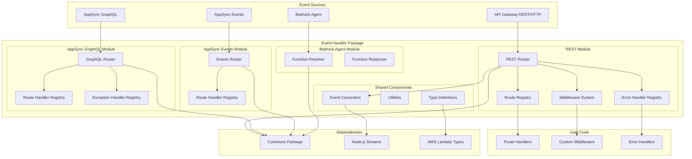
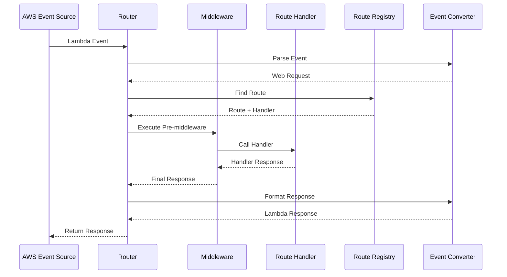

# System Architecture

## System Overview
The AWS Lambda Powertools Event Handler is a TypeScript library that provides lightweight routing and request/response handling for AWS Lambda functions. It abstracts different AWS event sources (API Gateway, ALB, AppSync, Bedrock) into a unified interface while maintaining type safety and supporting middleware patterns.

## Architecture Diagram

## Component Descriptions

### REST Router
- **Purpose**: Main orchestrator for HTTP request handling
- **Responsibilities**: Route registration, middleware execution, error handling, response formatting
- **Dependencies**: Route Registry, Error Handler Registry, Middleware System, Converters
- **Type**: Core Application Component

### Route Registry
- **Purpose**: Store and match routes based on HTTP method and path patterns
- **Responsibilities**: Route registration, path matching with parameters, route compilation
- **Dependencies**: Route class, path utilities
- **Type**: Registry/Storage Component

### Middleware System
- **Purpose**: Execute cross-cutting concerns in onion model pattern
- **Responsibilities**: Middleware registration, execution order, error propagation
- **Dependencies**: Built-in middleware (CORS, compression), custom middleware interface
- **Type**: Execution Pipeline Component

### Error Handler Registry
- **Purpose**: Manage custom error handlers for different error types
- **Responsibilities**: Error handler registration, error type matching, fallback handling
- **Dependencies**: Error classes, handler functions
- **Type**: Registry/Handler Component

### Event Converters
- **Purpose**: Transform AWS event formats to standard web Request/Response objects
- **Responsibilities**: Event parsing, response formatting, streaming support
- **Dependencies**: Node.js streams, AWS Lambda types
- **Type**: Adapter/Converter Component

### AppSync GraphQL Router
- **Purpose**: Handle GraphQL field resolution for AppSync
- **Responsibilities**: Field resolver registration, GraphQL context handling, scalar transformations
- **Dependencies**: GraphQL types, exception handlers
- **Type**: Specialized Router Component

### AppSync Events Router
- **Purpose**: Handle AppSync subscription events
- **Responsibilities**: Event routing, subscription management
- **Dependencies**: AppSync event types
- **Type**: Event Handler Component

### Bedrock Agent Resolver
- **Purpose**: Handle Amazon Bedrock Agent function calls
- **Responsibilities**: Function invocation handling, response formatting for agents
- **Dependencies**: Bedrock types, function response utilities
- **Type**: Specialized Handler Component

## Data Flow

## Integration Points

### External APIs
- **AWS API Gateway**: REST and HTTP API events, proxy integration
- **AWS AppSync**: GraphQL field resolvers and subscription events
- **Amazon Bedrock**: Agent function invocation events

### Internal Dependencies
- **@aws-lambda-powertools/commons**: Shared utilities, logging interfaces, environment helpers
- **Node.js Streams**: Response streaming support for large payloads
- **AWS Lambda Runtime**: Context and event type definitions

### Third-party Services
- **None**: The package has minimal external dependencies to maintain lightweight footprint

## Infrastructure Components

### Build System
- **Type**: npm/TypeScript monorepo workspace
- **Configuration**: Dual ESM/CommonJS builds with TypeScript compilation
- **Testing**: Vitest for unit testing with coverage reporting
- **Linting**: Biome for code formatting and linting

### Deployment Model
- **Distribution**: npm package published to public registry
- **Versioning**: Semantic versioning with automated releases
- **Documentation**: TypeDoc for API documentation, MkDocs for user guides

### Package Structure
- **Modular Exports**: Separate entry points for different event source types
- **Type Safety**: Full TypeScript support with strict type checking
- **Tree Shaking**: ESM modules support for optimal bundle sizes
