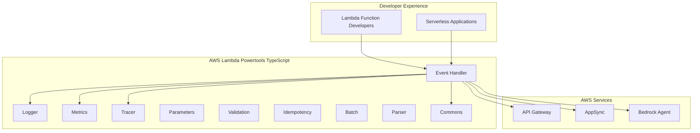

# Business Overview

## Business Context Diagram

## Business Description
- **Business Description**: AWS Lambda Powertools for TypeScript is a developer toolkit that implements serverless best practices and increases developer velocity. The Event Handler package specifically provides lightweight routing to reduce boilerplate for various AWS event sources including API Gateway REST/HTTP API, ALB, Lambda Function URLs, and AppSync.

- **Business Transactions**: 
  - **HTTP Request Routing**: Route incoming HTTP requests to appropriate handler functions based on path and method
  - **Request/Response Processing**: Parse incoming requests and format outgoing responses
  - **Middleware Execution**: Execute middleware functions for cross-cutting concerns (CORS, compression, authentication)
  - **Error Handling**: Provide structured error handling with custom error handlers
  - **Event Source Abstraction**: Abstract different AWS event sources into a unified interface

- **Business Dictionary**: 
  - **Router**: Main class that handles request routing and response generation
  - **Route**: A specific path and HTTP method combination mapped to a handler function
  - **Middleware**: Functions that execute before/after route handlers for cross-cutting concerns
  - **Handler**: User-defined function that processes a specific route
  - **RequestContext**: Object containing request details, Lambda context, and response utilities
  - **Resolver**: Component that processes specific event source types (REST, AppSync, Bedrock)

## Component Level Business Descriptions

### Event Handler Package
- **Purpose**: Simplify Lambda function development by providing routing and request/response handling for multiple AWS event sources
- **Responsibilities**: 
  - Route requests to appropriate handlers
  - Parse and validate incoming requests
  - Execute middleware pipeline
  - Handle errors gracefully
  - Format responses according to event source requirements
  - Provide type-safe interfaces for request/response handling

### REST API Handler
- **Purpose**: Handle HTTP requests from API Gateway, ALB, and Lambda Function URLs
- **Responsibilities**:
  - Parse HTTP events into standard Request objects
  - Route based on HTTP method and path
  - Support path parameters and query strings
  - Execute middleware pipeline
  - Convert handler responses to appropriate format

### AppSync Handlers
- **Purpose**: Handle GraphQL requests from AWS AppSync
- **Responsibilities**:
  - Process GraphQL field resolvers
  - Handle AppSync Events (subscriptions)
  - Provide GraphQL-specific error handling
  - Support scalar type transformations

### Bedrock Agent Handler
- **Purpose**: Handle function calls from Amazon Bedrock Agents
- **Responsibilities**:
  - Process Bedrock Agent function invocations
  - Format responses for Bedrock Agent consumption
  - Handle agent-specific error scenarios

### Middleware System
- **Purpose**: Provide reusable cross-cutting functionality
- **Responsibilities**:
  - Execute in onion model (before/after handler execution)
  - Support CORS handling
  - Provide response compression
  - Enable custom middleware development
  - Maintain execution order and error propagation
