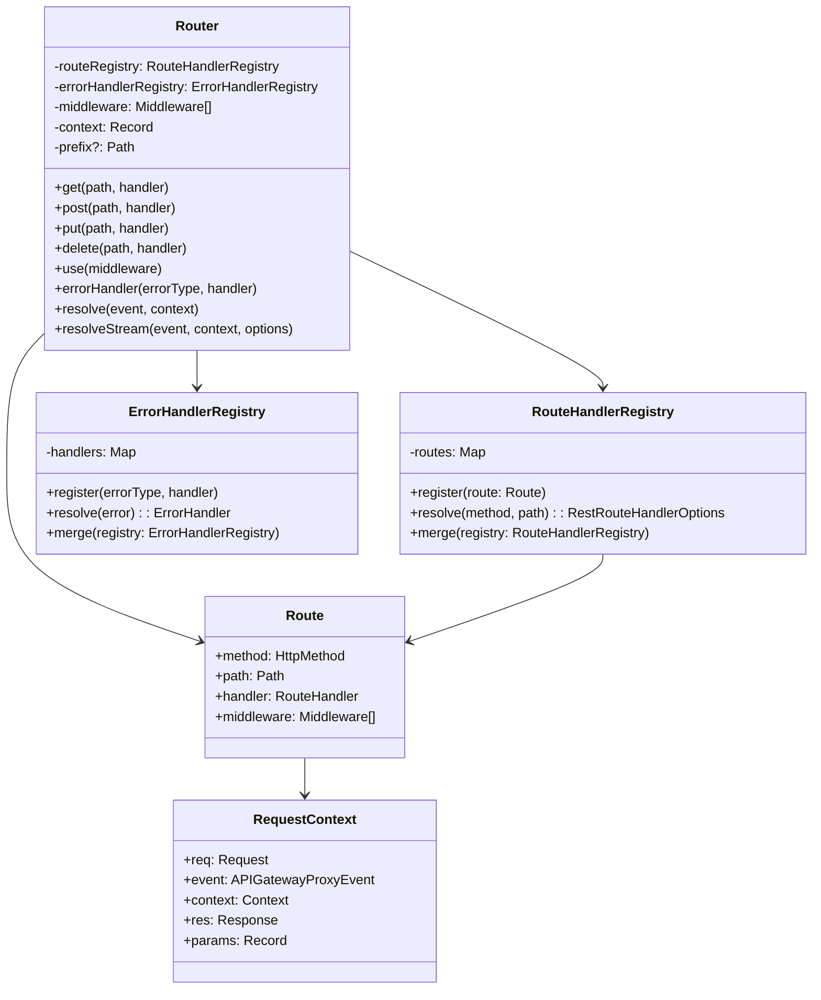

# Code Structure

## Build System
- **Type**: npm workspace with TypeScript
- **Configuration**: 
  - `package.json`: Workspace configuration with dual ESM/CommonJS builds
  - `tsconfig.json`: TypeScript configuration for ESM build
  - `tsconfig.cjs.json`: TypeScript configuration for CommonJS build
  - `vitest.config.ts`: Test configuration
  - `biome.json`: Linting and formatting configuration

## Key Classes/Modules


## Design Patterns

### Registry Pattern
- **Location**: `RouteHandlerRegistry.ts`, `ErrorHandlerRegistry.ts`
- **Purpose**: Centralized storage and retrieval of routes and error handlers
- **Implementation**: Map-based storage with type-safe registration and resolution methods

### Middleware Pattern (Onion Model)
- **Location**: `Router.ts`, middleware composition in `utils.ts`
- **Purpose**: Cross-cutting concerns execution before and after route handlers
- **Implementation**: Async function composition with `next()` callback pattern

### Adapter Pattern
- **Location**: `converters.ts`
- **Purpose**: Convert between AWS Lambda events and standard web Request/Response objects
- **Implementation**: Transformation functions for different event source formats

### Strategy Pattern
- **Location**: Different resolver classes (REST, AppSync, Bedrock)
- **Purpose**: Handle different event source types with unified interface
- **Implementation**: Separate router classes with common interface patterns

### Decorator Pattern
- **Location**: HTTP method decorators (`@get`, `@post`, etc.)
- **Purpose**: Declarative route registration using TypeScript decorators
- **Implementation**: Method decorators that register routes on class methods

### Factory Pattern
- **Location**: Route compilation and middleware composition
- **Purpose**: Create configured route objects and middleware chains
- **Implementation**: Factory functions for route creation and middleware composition

## Critical Dependencies

### @aws-lambda-powertools/commons
- **Version**: 2.28.1 (internal dependency)
- **Usage**: Shared utilities, type definitions, environment helpers
- **Purpose**: Common functionality across all Powertools packages
- **Key Imports**: `GenericLogger`, `JSONObject`, environment utilities

### Node.js Built-ins
- **node:stream**: Response streaming support
- **node:stream/promises**: Pipeline utilities for streaming
- **Usage**: Large response handling and streaming to Lambda response streams
- **Purpose**: Enable efficient handling of large payloads

### AWS Lambda Types
- **Source**: `aws-lambda` package (peer dependency)
- **Usage**: Event and context type definitions
- **Purpose**: Type safety for Lambda runtime objects
- **Key Types**: `APIGatewayProxyEvent`, `Context`, `APIGatewayProxyResult`

### TypeScript Compiler
- **Version**: Latest stable
- **Usage**: Dual build system (ESM + CommonJS)
- **Purpose**: Type checking and compilation to JavaScript
- **Configuration**: Strict mode with full type checking enabled

## Module Structure

### Source Organization
```
src/
├── types/                    # Type definitions
│   ├── common.ts            # Shared types
│   ├── rest.ts              # REST-specific types
│   ├── appsync-graphql.ts   # GraphQL types
│   ├── appsync-events.ts    # AppSync Events types
│   ├── bedrock-agent.ts     # Bedrock Agent types
│   └── index.ts             # Type exports
├── rest/                    # REST API implementation
│   ├── Router.ts            # Main router class
│   ├── Route.ts             # Route representation
│   ├── RouteHandlerRegistry.ts  # Route storage
│   ├── ErrorHandlerRegistry.ts  # Error handler storage
│   ├── converters.ts        # Event/response conversion
│   ├── utils.ts             # Utility functions
│   ├── errors.ts            # HTTP error classes
│   ├── constants.ts         # HTTP constants
│   ├── middleware/          # Built-in middleware
│   │   ├── cors.ts          # CORS middleware
│   │   ├── compress.ts      # Compression middleware
│   │   └── index.ts         # Middleware exports
│   └── index.ts             # REST exports
├── appsync-graphql/         # AppSync GraphQL implementation
├── appsync-events/          # AppSync Events implementation
└── bedrock-agent/           # Bedrock Agent implementation
```

### Export Strategy
- **Modular Exports**: Separate entry points for each event source type
- **Type Exports**: Dedicated `/types` export for type-only imports
- **Middleware Exports**: Separate `/middleware` export for built-in middleware
- **Experimental Marking**: REST API marked as experimental with `/experimental-rest` path

### Build Artifacts
```
lib/
├── esm/                     # ES Module build
│   ├── types/
│   ├── rest/
│   ├── appsync-graphql/
│   ├── appsync-events/
│   ├── bedrock-agent/
│   └── package.json         # {"type": "module"}
└── cjs/                     # CommonJS build
    ├── types/
    ├── rest/
    ├── appsync-graphql/
    ├── appsync-events/
    ├── bedrock-agent/
    └── package.json         # {"type": "commonjs"}
```

## Code Quality Indicators

### Type Safety
- **Strict TypeScript**: Full strict mode enabled
- **Generic Types**: Extensive use of generics for type safety
- **Discriminated Unions**: Type-safe event source handling
- **Interface Segregation**: Focused interfaces for different concerns

### Error Handling
- **Custom Error Classes**: HTTP-specific error types with proper inheritance
- **Error Registry**: Type-safe error handler registration
- **Graceful Degradation**: Fallback error handlers for unhandled cases

### Testing Structure
- **Unit Tests**: Comprehensive test coverage for all modules
- **Test Organization**: Mirror source structure in test directory
- **Mock Factories**: Reusable test data factories
- **Coverage Reporting**: 100% coverage threshold for critical paths
