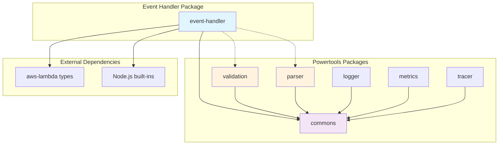
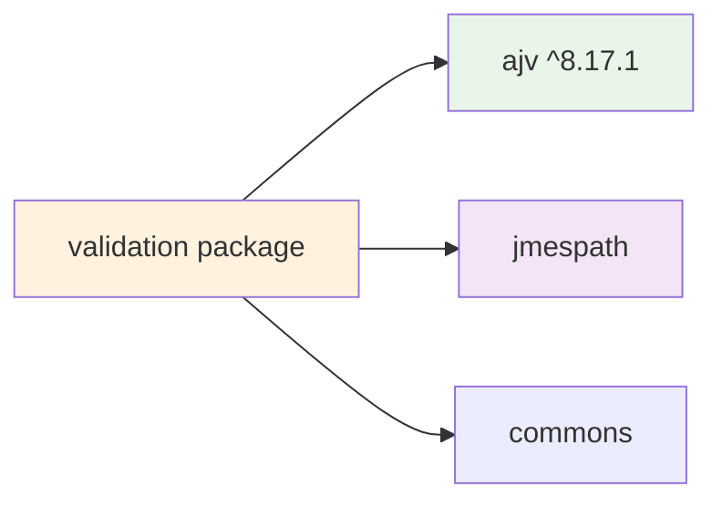
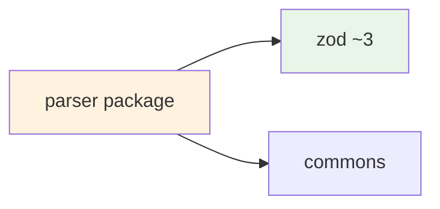

# Dependencies

## Internal Dependencies

### @aws-lambda-powertools/event-handler depends on @aws-lambda-powertools/commons
- **Type**: Compile/Runtime
- **Reason**: Shared utilities, type definitions, environment helpers, logging interfaces
- **Key Imports**: `GenericLogger`, `JSONObject`, `getStringFromEnv`, `isDevMode`

### @aws-lambda-powertools/event-handler potential integration with @aws-lambda-powertools/validation
- **Type**: Future Integration (Issue #4516)
- **Reason**: JSON Schema validation capabilities for request/response validation
- **Current State**: Separate packages, no direct dependency
- **Integration Opportunity**: Middleware-based validation integration

### @aws-lambda-powertools/event-handler potential integration with @aws-lambda-powertools/parser
- **Type**: Future Integration (Issue #4516)
- **Reason**: Zod-based parsing and Standard Schema compatibility
- **Current State**: Separate packages, no direct dependency
- **Integration Opportunity**: Standard Schema validation layer

## External Dependencies

### aws-lambda (Peer Dependency)
- **Version**: ^1.0.7
- **Purpose**: AWS Lambda runtime type definitions
- **License**: Apache-2.0
- **Key Types**: `APIGatewayProxyEvent`, `Context`, `APIGatewayProxyResult`
- **Usage**: Type safety for Lambda event handling

### @types/aws-lambda (Development Dependency)
- **Version**: ^8.10.145
- **Purpose**: Enhanced TypeScript definitions for AWS Lambda
- **License**: MIT
- **Usage**: Additional type definitions and improved type safety

### Node.js Built-in Modules
- **node:stream**: Response streaming support
- **node:stream/promises**: Pipeline utilities for async streaming
- **node:util**: Utility functions
- **Purpose**: Core functionality without external dependencies

## Development Dependencies

### TypeScript Ecosystem
- **typescript**: ^5.6.3 - Type checking and compilation
- **@types/node**: Latest - Node.js type definitions
- **Purpose**: Development-time type safety and compilation

### Testing Framework
- **vitest**: ^2.1.4 - Testing framework with coverage
- **@vitest/coverage-v8**: Coverage reporting
- **Purpose**: Unit testing and code coverage analysis

### Code Quality Tools
- **@biomejs/biome**: ^1.9.4 - Linting and formatting
- **markdownlint-cli2**: Documentation linting
- **Purpose**: Code quality and consistency

### AWS Testing Utilities
- **aws-sdk-client-mock**: ^4.1.0 - AWS service mocking
- **aws-sdk-client-mock-vitest**: Vitest integration
- **Purpose**: Mock AWS services in tests

## Validation-Related Dependencies (Analysis for Issue #4516)

### Current Validation Package Dependencies

### Current Parser Package Dependencies

### Standard Schema Compatible Libraries (Target for #4516)
- **zod**: ~3.23+ - Standard Schema compatible
- **valibot**: ^0.42.0 - Lightweight Standard Schema library
- **arktype**: ^2.0.0 - High-performance runtime validation
- **@standard-schema/spec**: Standard Schema specification

## Dependency Analysis

### Internal Dependency Strengths
- **Minimal Coupling**: Event Handler only depends on Commons
- **Shared Infrastructure**: Commons provides consistent utilities
- **Type Safety**: Strong TypeScript integration across packages
- **Modular Design**: Each package can be used independently

### External Dependency Strengths
- **Minimal Surface**: Very few external runtime dependencies
- **Standard APIs**: Relies on Node.js built-ins and AWS standard types
- **Peer Dependencies**: Allows users to control AWS SDK versions
- **Zero Runtime Dependencies**: No third-party runtime dependencies

### Potential Integration Challenges for Issue #4516

#### Validation Package Integration
- **Challenge**: Different validation approaches (JSON Schema vs Standard Schema)
- **Opportunity**: Middleware-based integration without breaking changes
- **Solution**: Optional validation middleware that works with both approaches

#### Parser Package Integration
- **Challenge**: Zod-specific implementation vs Standard Schema generics
- **Opportunity**: Standard Schema abstraction layer
- **Solution**: Standard Schema adapter that works with multiple libraries

#### Type System Integration
- **Challenge**: Maintaining type safety across validation libraries
- **Opportunity**: TypeScript inference from Standard Schema
- **Solution**: Generic types that preserve schema-derived types

## Dependency Management Strategy

### Version Management
- **Semantic Versioning**: All internal packages use consistent versioning
- **Workspace Dependencies**: Internal packages reference exact versions
- **Peer Dependencies**: External packages use compatible version ranges

### Security Management
- **Automated Updates**: Dependabot for security updates
- **Vulnerability Scanning**: Regular security audits
- **Minimal Dependencies**: Reduced attack surface

### Build Dependencies
- **Development Only**: Heavy tooling kept in devDependencies
- **Runtime Minimal**: Only essential dependencies in production
- **Tree Shaking**: ESM modules for optimal bundling

## Future Dependency Considerations (Issue #4516)

### Standard Schema Integration
- **New Dependencies**: Standard Schema specification and compatible libraries
- **Peer Dependencies**: Allow users to choose validation library
- **Optional Dependencies**: Validation features as optional enhancements

### Backward Compatibility
- **No Breaking Changes**: Validation features as additive enhancements
- **Migration Path**: Gradual adoption of new validation features
- **Deprecation Strategy**: Graceful transition from existing patterns

### Performance Impact
- **Bundle Size**: Minimal impact through optional imports
- **Runtime Performance**: Efficient validation execution
- **Memory Usage**: Optimized validation pipeline
