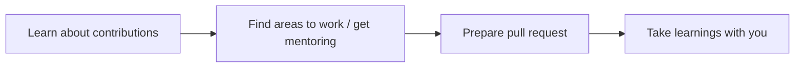

<!-- markdownlint-disable MD043 -->

Thank you for your interest in contributing to our project - we couldn't be more excited!

<i>End-to-end process</i>

## Types of contributions

We consider any contribution that help this project improve everyone's experience to be valid, as long as you agree with our [tenets](../index.md#tenets){target="_blank"}, [licensing](https://github.com/aws-powertools/powertools-lambda-typescript/blob/main/LICENSE){target="_blank"}, and [Code of Conduct](#code-of-conduct).

Whether you're new contributor or a pro, we compiled a list of the common contributions to help you choose your first:

!!! info "Please check [existing open](https://github.com/aws-powertools/powertools-lambda-typescript/issues?q=is%3Aissue+is%3Aopen+sort%3Aupdated-desc){target='_blank'}, or [recently closed](https://github.com/aws-powertools/powertools-lambda-typescript/issues?q=is%3Aissue+sort%3Aupdated-desc+is%3Aclosed){target='_blank'} issues before creating a new one."
    Each type link goes to their respective template, or Discord invite.

| Type                                                                                                  | Description                                                                                                                                                                                       |
|------------------------------------------------------------------------------------------------------ | ------------------------------------------------------------------------------------------------------------------------------------------------------------------------------------------------- |
| [Documentation](https://s12d.com/pt-ts-new-issue-documentation){target="_blank" rel="nofollow"}       | Ideas to make user guide or API guide clearer. This includes typos, diagrams, tutorials, the lack of documentation, etc.                                                                          |
| [Feature request](https://s12d.com/pt-ts-new-issue-feature-request){target="_blank" rel="nofollow"}   | New features or enhancements that could help you, your team, or existing and future customers. Check out our [process to understand how we prioritize it](../roadmap.md#process){target="_blank"} |
| [Design proposals](https://s12d.com/pt-ts-new-rfc){target="_blank" rel="nofollow"}                    | Request for Comments (RFC) including user experience (UX) based on a feature request to gather the community feedback, and demonstrate the art of the possible.                                   |
| [Bug report](https://s12d.com/pt-ts-new-issue-bug){target="_blank" rel="nofollow"}                    | A runtime error that is reproducible whether you have an idea how to solve it or not                                                                                                              |
| [Advocacy](https://s12d.com/pt-ts-new-issue-community-content){target="_blank" rel="nofollow"}        | Share what you did with Powertools for AWS Lambda. Blog posts, workshops, presentation, sample applications, podcasts, etc.                                                                       |
| [Public reference](https://s12d.com/pt-ts-new-issue-public-reference){target="_blank" rel="nofollow"} | Become a public reference to share how you're using Powertools for AWS Lambda at your organization                                                                                                |
| [Discussions](https://discord.gg/B8zZKbbyET){target="_blank" rel="nofollow"}                          | Kick off a discussion on Discord, introduce yourself, and help respond to existing questions from the community                                                                                   |
| [Maintenance](https://s12d.com/pt-ts-new-issue-bug-maintenance){target="_blank" rel="nofollow"}       | Suggest areas to address technical debt, governance, and anything internal. Generally used by maintainers and contributors                                                                        |

## Finding contributions to work on

[Besides suggesting ideas](#types-of-contributions) you think it'll improve everyone's experience, these are the most common places to find work:

| Area                                                                                                              | Description                                                                                                                                                                 |
| ----------------------------------------------------------------------------------------------------------------- | --------------------------------------------------------------------------------------------------------------------------------------------------------------------------- |
| [Help wanted issues](https://s12d.com/pt-ts-help-wanted){target="_blank" rel="nofollow"}                          | These are triaged areas that we'd appreciate any level of contribution - from opinions to actual implementation                                                             |
| [Missing customer feedback issues](https://s12d.com/pt-ts-need-customer-feedback){target="_blank" rel="nofollow"} | These are items we'd like to hear from more customers before making any decision. Sharing your thoughts, use case, or asking additional questions are great help            |
| [Pending design proposals](https://s12d.com/pt-ts-open-rfcs){target="_blank" rel="nofollow"}                      | These are feature requests that initially look good but need a RFC to enrich the discussion by validating user-experience, tradeoffs, and highlight use cases               |
| [Backlog items](https://s12d.com/pt-ts-backlog){target="_blank" rel="nofollow"}                                   | We use GitHub projects to surface what we're working on, needs triage, etc. This view shows items we already triaged but don't have the bandwidth to tackle them just yet   |
| [Documentation](https://docs.powertools.aws.dev/lambda/typescript/latest/){target="_blank"}                       | Documentation can always be improved. Look for areas that could use a better example, or a diagram - keep in mind a diverse audience and English as a second language folks |
| [Participate in discussions](https://discord.gg/B8zZKbbyET){target="_blank" rel="nofollow"}                       | There's always a discussion that could benefit others in the form of documentation, blog post, etc.                                                                         |
| [Roadmap](../roadmap.md){target="_blank"}                                                                         | Some roadmap items need a RFC to discuss design options, or gather customers use case before we can prioritize it                                                           |
| Build a sample application                                                                                        | Using Powertools for AWS Lambda in different contexts will give you insights on what could be made easier, which documentation could be enriched, and more                  |

!!! question "Still couldn't find anything that match your skill set?"
    Please reach out on [Discord](https://discord.gg/B8zZKbbyET){target="_blank" rel="nofollow"}, specially if you'd like to get mentoring for a task you'd like to take but you don't feel ready yet :blush:

    Contributions are meant to be bi-directional. There's always something we can learn from each other.

## Sending a pull request

!!! note "First time creating a Pull Request? Keep [this document handy.](https://help.github.com/articles/creating-a-pull-request/){target='blank' rel='nofollow'}"

Before sending us a pull request, please ensure that:

* You are working against the latest source on the **main** branch, unless instructed otherwise.
* You check existing [open, and recently merged](https://github.com/aws-powertools/powertools-lambda-typescript/pulls?q=is%3Apr+is%3Aopen%2Cmerged+sort%3Aupdated-desc){target="_blank" rel="nofollow"} pull requests to make sure someone else hasn't addressed the problem already.
* You discuss and agree the proposed changes under [an existing issue](https://github.com/aws-powertools/powertools-lambda-typescript/issues?q=is%3Aopen+is%3Aupdated-desc) or a new one before you begin any implementation. We value your time and bandwidth. As such, any pull requests created on non-triaged issues might not be successful.
* Create a new branch named after the change you are contributing _e.g._ `feat/logger-debug-sampling`

**Ready?**

These are the steps to send a pull request:

1. Make sure that all formatting, linting, and tests tasks run as git pre-commit & pre-push hooks are passing.
2. Commit to your fork using clear commit messages. Don't worry about typos or format, we squash all commits during merge.
3. Send us a pull request with a conventional semantic title - see [full list of scopes and actions](https://github.com/aws-powertools/powertools-lambda-typescript/blob/main/.github/semantic.yml#L2).
4. Fill in the areas pre-defined in the pull request body to help expedite reviewing your work.
5. Pay attention to any automated CI failures reported in the pull request, and stay involved in the conversation.

## Code of Conduct

!!! info "This project has adopted the [Amazon Open Source Code of Conduct](https://aws.github.io/code-of-conduct){target='_blank'}"

For more information see the [Code of Conduct FAQ](https://aws.github.io/code-of-conduct-faq) or contact
<opensource-codeofconduct@amazon.com> with any additional questions or comments.

## Security issue notifications

If you discover a potential security issue in this project, we kindly ask you to notify AWS/Amazon Security via our [vulnerability reporting page](http://aws.amazon.com/security/vulnerability-reporting/). Please do **not** create a public github issue.
