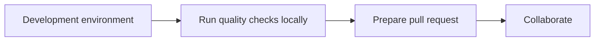

<!-- markdownlint-disable MD043 -->

[](https://discord.gg/B8zZKbbyET){target="_blank" rel="nofollow"}

This page describes how to setup your development environment (Cloud or locally) to contribute to Powertools for AWS Lambda (TypeScript).

<center>

<i>End-to-end process</i>
</center>

## Requirements

!!! question "First time contributing to an open-source project ever?"
    Read this [introduction on how to fork and clone a project on GitHub](https://docs.github.com/en/get-started/quickstart/contributing-to-projects){target="_blank" rel="nofollow"}.

You'll need the following installed:

* [GitHub account](https://github.com/join){target="_blank" rel="nofollow"}. You'll need to be able to fork, clone, and contribute via pull request.
* [Node.js 24.x](https://nodejs.org/download/release/latest-v24.x/){target="_blank" rel="nofollow"}. The repository contains an `.nvmrc` file, so if you use tools like [nvm](https://github.com/nvm-sh/nvm#nvmrc), [fnm](https://github.com/Schniz/fnm) you can switch version quickly.
* [npm 10.x](https://www.npmjs.com/). We use it to install dependencies and manage the workspaces.
* [Docker](https://docs.docker.com/engine/install/){target="_blank" rel="nofollow"}. We use it to run documentation, and non-JavaScript tooling.
* [Fork the repository](https://github.com/aws-powertools/powertools-lambda-typescript/fork). You'll work against your fork of this repository.

??? note "Additional requirements if running end-to-end tests"

    * [AWS Account bootstrapped with CDK](https://docs.aws.amazon.com/cdk/v2/guide/bootstrapping.html){target="_blank"}
    * [AWS CLI installed and configured](https://docs.aws.amazon.com/cli/latest/userguide/getting-started-install.html)

## Local environment

You can use `npm run setup-local` to install all dependencies locally and setup pre-commit hooks.

!!! note "Curious about what `setup-local` does under the hood?"
    We use npm scripts to [automate common tasks](https://github.com/aws-powertools/powertools-lambda-typescript/blob/main/package.json#L24){target="_blank" rel="nofollow"} locally and in Continuous Integration environments.

### Local documentation

You might find useful to run both the documentation website and the API reference locally while contributing:

#### Using Docker (recommended)

1. Build the Docker image (only needed the first time):

   ```bash
   npm run docs:docker:build
   ```

2. Run the documentation website:

   ```bash
   npm run docs:docker:run
   ```

#### Using Python directly

If you have Python installed, you can run the documentation website and API reference locally without Docker:

1. Create a virtual environment and install dependencies:

   ```bash
   npm run docs:local:setup
   ```

2. Run the documentation website:

   ```bash
   npm run docs:local:run
   ```
