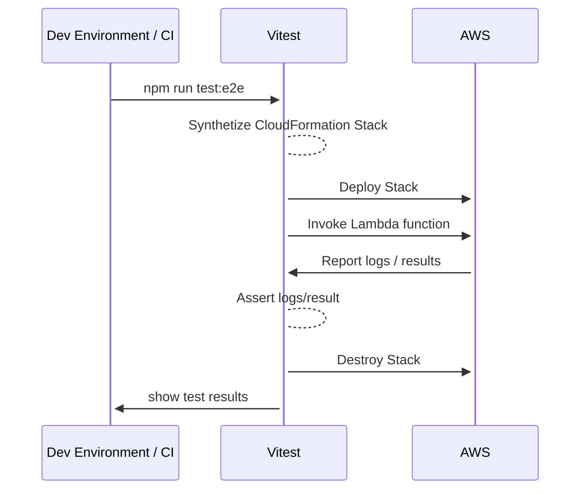

<!-- markdownlint-disable MD043 -->

## General practices

As discussed in the [conventions](./conventions.md) page, we have different types of tests that aim to verify different aspects of the code.

Tests are defined alongside the code they test, and can be found under the `tests` folder of each module. For example, the tests for the `@aws-lambda-powertools/logger` module can be found under `packages/logger/tests`.

Each test type has its own folder, and each test file is named after the feature it tests. For example, the tests for the `@aws-lambda-powertools/logger` module can be found under `packages/logger/tests/unit` and `packages/logger/tests/e2e`.

Tests use [Vitest](http://vitest.dev) as test runner and are grouped by packages and type. You can run each group separately or all together by passing extra arguments to the test command.

The test file should contain one or more tests organized using the `describe` and `it` functions. Each test should be named after the feature it tests, and should be as descriptive as possible. For example, the test for the `Logger` class `info` method is named `should log info message`.

```typescript
describe('Class: Logger', () => {
  describe('Method: info', () => {
    it('should log info message', () => {
      // ...
    })
  })
})
```

Single tests should be as simple as possible, and should follow the Prepare, Act, Assess pattern. For example, the test from the previous example should look like this:

```typescript
describe('Class: Logger', () => {
  describe('Method: info', () => {
    it('should log info message', () => {
      // Prepare
      const logger = new Logger()

      // Act
      logger.info('test')

      // Assess
      expect(logger.info).toHaveBeenCalledWith('test')
    })
  })
})
```

## Unit tests

Unit tests are used to verify the smallest possible unit of code works as expected. They are fast to run and should be used to test the core logic of the code. They should not test external dependencies, such as network calls, and should use mocks and spies as needed to verify the code behaves as expected.

When writing unit tests, you should follow the same conventions we use for the code. For example, each test file should correspond to a single discrete feature such as a single high-level function, class, or middleware. For example, the `Logger` class for the `@aws-lambda-powertools/logger` module has a single test file named `logger.test.ts`.

To run unit tests, you can use of the following commands from the root folder:

* `npm test -ws` to run all the unit tests for all the modules sequentially
* `npm run test:parallel` to run all the unit tests for all the modules in parallel
* `npm test -w packages/metrics` to run all the unit tests for the `metrics` module

We enforce 100% code coverage for unit tests. The test command will fail if the coverage is not 100% both on your local machine and in CI.

## Integration tests

Integration tests are used to verify that the code works as expected when deployed to AWS. They are slower than unit tests, and should be used to test the code in a real environment. They should test the code as a whole, including external dependencies such as network calls, and should not use mocks and spies.

When writing integration tests, you should follow the same conventions used for existing tests. For example, each test file should correspond to an utility and a specific usage type. For example, the test for the middleware usage for the `@aws-lambda-powertools/logger` module has a single test file named `basicFeatures.middy.test.ts`.

!!! warning "A word of caution"
    Running integration tests will deploy AWS resources in your AWS account, which might incur costs. The cost from **some services** are covered by the [AWS Free Tier](https://aws.amazon.com/free/) but not all of them. We recommend you to use a dedicated AWS account for testing purposes, and when in doubt, let the CI on our repository run the tests for you.

To run integration tests you'll need to set up an AWS account and obtain credentials as described in the [prerequisites](./setup.md#requirements). Once ready, you can use of the following commands from the root folder:

* `npm test:e2e -ws` to run all the integration tests for all the modules sequentially
* `test:e2e:parallel` to run all the integration tests for all the modules in parallel
* `npm test:e2e -w packages/metrics` to run all the integration tests for the `metrics` module
* `npm run test:e2e:nodejs22x -w packages/metrics` to run all the integration tests for the `metrics` module using the `nodejs22x` runtime

The tests will deploy the necessary AWS resources using AWS CDK, and will run the Lambda functions using the AWS SDK. After that, the tests will verify the Lambda functions behave as expected by checking logs, metrics, traces, and other resources as needed. Finally, the tests will destroy all the AWS resources created at the beginning.

Below is a diagram that shows the flow of the integration tests:


