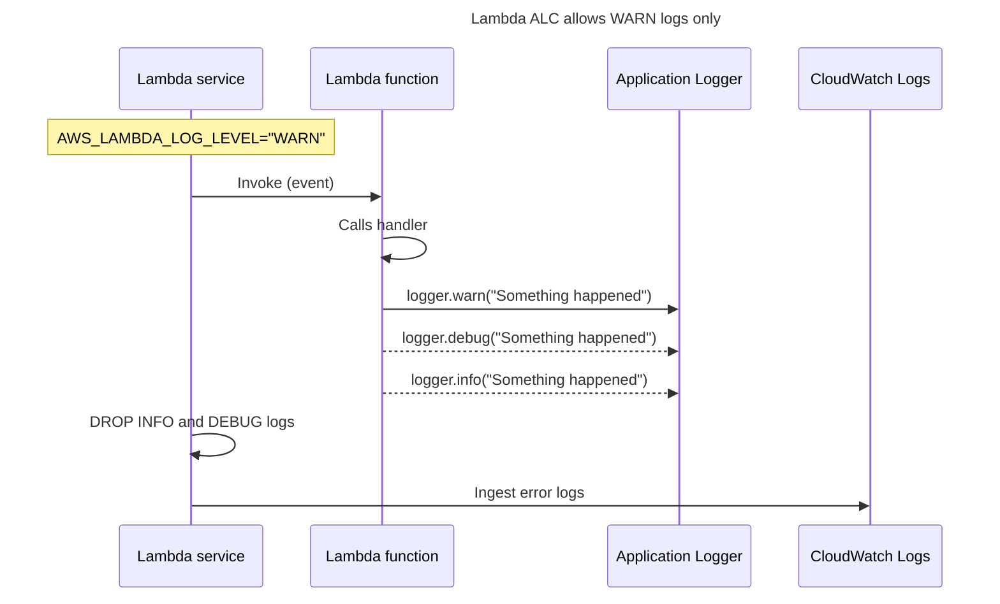

Logger provides an opinionated logger with output structured as JSON.

## Key features

* Capturing key fields from the Lambda context, cold starts, and structure logging output as JSON.
* Logging Lambda invocation events when instructed (disabled by default).
* Printing all the logs only for a percentage of invocations via log sampling (disabled by default).
* Appending additional keys to structured logs at any point in time.
* Providing a custom log formatter (Bring Your Own Formatter) to output logs in a structure compatible with your organization’s Logging RFC.

<br />

<figure>
  
  <figcaption>Logger showcase - Log attributes</figcaption>
</figure>

## Getting started

### Installation

Install the library in your project:

```shell
npm install @aws-lambda-powertools/logger
```

### Usage

The `Logger` utility must always be instantiated outside the Lambda handler. By doing this, subsequent invocations processed by the same instance of your function can reuse these resources. This saves cost by reducing function run time. In addition, `Logger` can keep track of a cold start and inject the appropriate fields into logs.

=== "handler.ts"

    ```typescript hl_lines="1 3"
    --8<-- "examples/snippets/logger/basicUsage.ts"
    ```

### Utility settings

The library has three optional settings, which can be set via environment variables or passed in the constructor.

These settings will be used across all logs emitted:

| Setting           | Description                                                                                                      | Environment variable            | Default Value       | Allowed Values                                         | Example Value       | Constructor parameter |
| ----------------- | ---------------------------------------------------------------------------------------------------------------- | ------------------------------- | ------------------- | ------------------------------------------------------ | ------------------- | --------------------- |
| **Service name**  | Sets the name of service of which the Lambda function is part of, that will be present across all log statements | `POWERTOOLS_SERVICE_NAME`       | `service_undefined` | Any string                                             | `serverlessAirline` | `serviceName`         |
| **Logging level** | Sets how verbose Logger should be, from the most verbose to the least verbose (no logs)                          | `POWERTOOLS_LOG_LEVEL`          | `INFO`              | `DEBUG`, `INFO`, `WARN`, `ERROR`, `CRITICAL`, `SILENT` | `ERROR`             | `logLevel`            |
| **Sample rate**   | Probability that a Lambda invocation will print all the log items regardless of the log level setting            | `POWERTOOLS_LOGGER_SAMPLE_RATE` | `0`                 | `0.0` to `1.0`                                         | `0.1`               | `sampleRateValue`     |

???+ info
    When `POWERTOOLS_DEV` environment variable is present and set to `"true"` or `"1"`, Logger will pretty-print log messages for easier readability. We recommend to use this setting only when debugging on local environments.

See all environment variables in the [Environment variables](../index.md/#environment-variables) section.
Check API docs to learn more about [Logger constructor options](https://docs.powertools.aws.dev/lambda/typescript/latest/api/types/_aws_lambda_powertools_logger.types.ConstructorOptions.html){target="_blank"}.

#### Example using AWS Serverless Application Model (SAM)

=== "handler.ts"

    ```typescript hl_lines="1 4"
    --8<-- "examples/snippets/logger/sam.ts"
    ```

=== "template.yaml"

    ```yaml hl_lines="8 9"
    Resources:
      ShoppingCartApiFunction:
        Type: AWS::Serverless::Function
        Properties:
          Runtime: nodejs22.x
          Environment:
            Variables:
              POWERTOOLS_LOG_LEVEL: WARN
              POWERTOOLS_SERVICE_NAME: serverlessAirline
    ```

### Standard structured keys

Your Logger will include the following keys to your structured logging (default log formatter):

| Key                         | Example                                                                                                          | Note                                                                                                                                                                                                                            |
| --------------------------- | ---------------------------------------------------------------------------------------------------------------- | ------------------------------------------------------------------------------------------------------------------------------------------------------------------------------------------------------------------------------- |
| **level**: `string`         | `INFO`                                                                                                           | Logging level set for the Lambda function's invocation                                                                                                                                                                          |
| **message**: `string`       | `Query performed to DynamoDB`                                                                                    | A descriptive, human-readable representation of this log item                                                                                                                                                                   |
| **sampling_rate**: `float`  | `0.1`                                                                                                            | When enabled, it prints all the logs of a percentage of invocations, e.g. 10%                                                                                                                                                   |
| **service**: `string`       | `serverlessAirline`                                                                                              | A unique name identifier of the service this Lambda function belongs to, by default `service_undefined`                                                                                                                         |
| **timestamp**: `string`     | `2011-10-05T14:48:00.000Z`                                                                                       | Timestamp string in simplified extended ISO format (ISO 8601)                                                                                                                                                                   |
| **xray_trace_id**: `string` | `1-5759e988-bd862e3fe1be46a994272793`                                                                            | X-Ray Trace ID. This value is always presented in Lambda environment, whether [tracing is enabled](https://docs.aws.amazon.com/lambda/latest/dg/services-xray.html){target="_blank"} or not. Logger will always log this value. |
| **error**: `Object`         | `{ name: "Error", location: "/my-project/handler.ts:18", message: "Unexpected error #1", stack: "[stacktrace]"}` | Optional - An object containing information about the Error passed to the logger                                                                                                                                                |

???+ note
    If you emit a log message with a key that matches one of `level`, `message`, `sampling_rate`, `service`, or `timestamp`, the Logger will log a warning message and ignore the key.

### Capturing Lambda context info

You can enrich your structured logs with key Lambda context information in multiple ways.

This functionality will include the following keys in your structured logs:

| Key                                | Example                                                                                  |
| ---------------------------------- | ---------------------------------------------------------------------------------------- |
| **cold_start**: `bool`             | `false`                                                                                  |
| **function_name** `string`         | `shopping-cart-api-lambda-prod-eu-west-1`                                                |
| **function_memory_size**: `number` | `128`                                                                                    |
| **function_arn**: `string`         | `arn:aws:lambda:eu-west-1:123456789012:function:shopping-cart-api-lambda-prod-eu-west-1` |
| **function_request_id**: `string`  | `c6af9ac6-7b61-11e6-9a41-93e812345678`                                                   |

=== "Middy Middleware"

    !!! tip "A note about Middy"
        We guarantee support for Middy.js `v4.x` through `v6.x` versions.
        Check their docs to learn more about [Middy and its middleware stack](https://middy.js.org/docs/intro/getting-started){target="_blank"} as well as [best practices when working with Powertools](https://middy.js.org/docs/integrations/lambda-powertools#best-practices){target="_blank"}.

    ```typescript hl_lines="2 14"
    --8<-- "examples/snippets/logger/middy.ts"
    ```

=== "Decorator"

    !!! note
        The class method decorators in this project follow the experimental implementation enabled via the [`experimentalDecorators` compiler option](https://www.typescriptlang.org/tsconfig#experimentalDecorators) in TypeScript.

        Additionally, they are implemented to decorate async methods. When decorating a synchronous one, the decorator replaces its implementation with an async one causing the caller to have to `await` the now decorated method.

        If this is not the desired behavior, you can call the `logger.injectLambdaContext()` method directly in your handler.

    ```typescript hl_lines="8"
    --8<-- "examples/snippets/logger/decorator.ts"
    ```

    1. Binding your handler method allows your handler to access `this` within the class methods.

=== "Manual"

    ```typescript hl_lines="10"
    --8<-- "examples/snippets/logger/manual.ts"
    ```

In each case, the printed log will look like this:

=== "Example CloudWatch Logs excerpt"

    ```json hl_lines="2-6"
    {
        "level": "INFO",
        "message": "This is an INFO log with some context",
        "timestamp": "2021-12-12T21:21:08.921Z",
        "service": "serverlessAirline",
        "cold_start": true,
        "function_arn": "arn:aws:lambda:eu-west-1:123456789012:function:shopping-cart-api-lambda-prod-eu-west-1",
        "function_memory_size": 128,
        "function_request_id": "c6af9ac6-7b61-11e6-9a41-93e812345678",
        "function_name": "shopping-cart-api-lambda-prod-eu-west-1",
        "xray_trace_id": "abcdef123456abcdef123456abcdef123456"
    }
    ```

### Log incoming event

When debugging in non-production environments, you can log the incoming event using the `logEventIfEnabled()` method or by setting the `logEvent` option in the `injectLambdaContext()` Middy.js middleware or class method decorator.

???+ warning
	This is disabled by default to prevent sensitive info being logged

=== "`logEventIfEnabled()`"

    ```typescript hl_lines="1 8"
    --8<-- "examples/snippets/logger/logEventManual.ts"
    ```

    1. You can control the event logging via the `POWERTOOLS_LOGGER_LOG_EVENT` environment variable.

=== "Middy.js Middleware"

    ```typescript hl_lines="10"
    --8<-- "examples/snippets/logger/logEventMiddy.ts"
    ```

    1. The `logEvent` option takes precedence over the `POWERTOOLS_LOGGER_LOG_EVENT` environment variable.

=== "Decorator"

    ```typescript hl_lines="7"
    --8<-- "examples/snippets/logger/logEventDecorator.ts"
    ```

    1. The `logEvent` option takes precedence over the `POWERTOOLS_LOGGER_LOG_EVENT` environment variable.

=== "payload.json"

    ```json
    --8<-- "examples/snippets/logger/samples/logEventInput.json"
    ```

=== "CloudWatch output"

    ```json hl_lines="8 13-15"
    --8<-- "examples/snippets/logger/samples/logEventOutput.json"
    ```

Use `POWERTOOLS_LOGGER_LOG_EVENT` environment variable to enable or disable (`true`/`false`) this feature. When using Middy.js middleware or class method decorator, the `logEvent` option will take precedence over the environment variable.

### Appending additional keys

You can append additional keys using either mechanism:

* Add **extra keys** to a single log message by passing them to the log method directly
* Append **temporary keys** to all future log messages via the `appendKeys()` method until `resetKeys()` is called
* Set **Persistent keys** for the logger instance via the `persistentKeys` constructor option or the `appendPersistentKeys()` method

To prevent you from accidentally overwriting some of the [standard keys](#standard-structured-keys), we will log a warning message and ignore the key if you try to overwrite them.

#### Extra keys

You can append additional data to a single log item by passing objects as additional parameters.

* Pass a simple string for logging it with default key name `extra`
* Pass one or multiple objects containing arbitrary data to be logged. Each data object should be placed in an enclosing object as a single property value, you can name this property as you need: `{ myData: arbitraryObjectToLog }`
* If you already have an object containing a `message` key and an additional property, you can pass this object directly

=== "handler.ts"

    ```typescript hl_lines="16-18 23-25 37"
    --8<-- "examples/snippets/logger/extraData.ts"
    ```
=== "Example CloudWatch Logs excerpt"

    ```json hl_lines="7 15-21 29 37"
    {
        "level": "INFO",
        "message": "This is a log with an extra variable",
        "service": "serverlessAirline",
        "timestamp": "2021-12-12T22:06:17.463Z",
        "xray_trace_id": "abcdef123456abcdef123456abcdef123456",
        "data": { "foo": "bar" }
    }
    {
        "level": "INFO",
        "message": "This is a log with 3 extra objects",
        "service": "serverlessAirline",
        "timestamp": "2021-12-12T22:06:17.466Z",
        "xray_trace_id": "abcdef123456abcdef123456abcdef123456",
        "data": { "foo": "bar" },
        "correlationIds": { "myCustomCorrelationId": "foo-bar-baz" },
        "lambdaEvent": { 
            "exampleEventData": {
                "eventValue": 42
            }
        }
    }
    {
        "level": "INFO",
        "message": "This is a log with additional string value",
        "service": "serverlessAirline",
        "timestamp": "2021-12-12T22:06:17.463Z",
        "xray_trace_id": "abcdef123456abcdef123456abcdef123456",
        "extra": "string value"
    }
    {
        "level": "INFO",
        "message": "This is a log message",
        "service": "serverlessAirline",
        "timestamp": "2021-12-12T22:06:17.463Z",
        "xray_trace_id": "abcdef123456abcdef123456abcdef123456",
        "additionalValue": 42
    }
    ```

#### Temporary keys

You can append additional keys to all future log messages by using the `appendKeys()` method.

???+ tip "When is this useful?"
    This is helpful to contextualize log messages emitted during a specific function.

=== "handler.ts"

    ```typescript hl_lines="9-11"
    --8<-- "examples/snippets/logger/appendAndRemoveKeys.ts"
    ```

    1. You can also remove specific keys by calling the `removeKeys()` method.

=== "Example CloudWatch Logs excerpt"

    ```json hl_lines="7"
    {
        "level": "INFO",
        "message": "transaction processed",
        "service": "serverlessAirline",
        "timestamp": "2021-12-12T21:49:58.084Z",
        "xray_trace_id": "abcdef123456abcdef123456abcdef123456",
        "customerId": "123456789012"
    }
    {
        "level": "INFO",
        "message": "other business logic processed",
        "service": "serverlessAirline",
        "timestamp": "2021-12-12T21:49:58.088Z",
        "xray_trace_id": "abcdef123456abcdef123456abcdef123456"
    }
    ```

#### Persistent keys

You can persist keys across Lambda invocations by using the `persistentKeys` constructor option or the `appendPersistentKeys()` method. These keys will persist even if you call the [`resetKeys()` method](#resetting-keys).

A common use case is to set keys about your environment or application version, so that you can easily filter logs in CloudWatch Logs.

=== "As constructor options"

    ```typescript hl_lines="5-8"
    --8<-- "examples/snippets/logger/persistentKeysConstructor.ts"
    ```

=== "Via dynamic method"

    ```typescript hl_lines="13"
    --8<-- "examples/snippets/logger/persistentKeys.ts"
    ```

=== "Example CloudWatch Logs excerpt"

    ```json hl_lines="7-8"
    {
        "level": "INFO",
        "message": "processing transaction",
        "service": "serverlessAirline",
        "timestamp": "2021-12-12T21:49:58.084Z",
        "xray_trace_id": "abcdef123456abcdef123456abcdef123456",
        "environment": "prod",
        "version": "1.2.0",
    }
    ```

### Removing additional keys

You can remove additional keys from the logger instance at any time:

* Remove temporary keys added via the `appendKeys()` method by using the `removeKeys()` method
* Remove persistent keys added via the `persistentKeys` constructor option or the `appendPersistentKeys()` method by using the `removePersistentKeys()` method

=== "Remove temporary keys"

    ```typescript hl_lines="17"
    --8<-- "examples/snippets/logger/removeKeys.ts"
    ```

=== "Remove persistent keys"

    ```typescript hl_lines="19"
    --8<-- "examples/snippets/logger/removePersistentKeys.ts"
    ```

#### Resetting keys

Logger is commonly initialized in the global scope. Due to [Lambda Execution Context](https://docs.aws.amazon.com/lambda/latest/dg/lambda-runtime-environment.html){target="_blank"} reuse, this means that custom keys can be persisted across invocations.

Resetting the state allows you to clear all the temporary keys you have added.

???+ tip "Tip: When is this useful?"
    This is useful when you add multiple custom keys conditionally or when you use canonical or wide logs.

=== "Clearing state manually"

    ```typescript hl_lines="25"
    --8<-- "examples/snippets/logger/resetKeys.ts"
    ```

=== "Middy Middleware"

    ```typescript hl_lines="24"
    --8<-- "examples/snippets/logger/resetKeysMiddy.ts"
    ```

=== "Decorator"

    ```typescript hl_lines="13"
    --8<-- "examples/snippets/logger/resetKeysDecorator.ts"
    ```

    1. Binding your handler method allows your handler to access `this` within the class methods.

=== "First invocation"

    ```json hl_lines="2 4"
    {
        "environment": "prod",
        "cold_start": true,
        "userId": "123456789012",
        "foo": "bar",
        "function_arn": "arn:aws:lambda:eu-west-1:123456789012:function:foo-bar-function",
        "function_memory_size": 128,
        "function_name": "foo-bar-function",
        "function_request_id": "abcdef123456abcdef123456",
        "level": "INFO",
        "message": "WIDE",
        "service": "hello-world",
        "timestamp": "2021-12-12T22:32:54.670Z",
        "xray_trace_id": "1-5759e988-bd862e3fe1be46a994272793"
    }
    ```
=== "Second invocation"

    ```json hl_lines="2 4"
    {
        "environment": "prod",
        "cold_start": false,
        "userId": "210987654321",
        "function_arn": "arn:aws:lambda:eu-west-1:123456789012:function:foo-bar-function",
        "function_memory_size": 128,
        "function_name": "foo-bar-function",
        "function_request_id": "abcdef123456abcdef123456",
        "level": "INFO",
        "message": "WIDE",
        "service": "hello-world",
        "timestamp": "2021-12-12T22:40:23.120Z",
        "xray_trace_id": "1-5759e988-bd862e3fe1be46a994272793"
    }
    ```

### Logging errors

You can log errors by using the `error` method and pass the error object as parameter.
The error will be logged with default key name `error`, but you can also pass your own custom key name.

=== "handler.ts"

    ```typescript hl_lines="13 20-22"
    --8<-- "examples/snippets/logger/logError.ts"
    ```

=== "Example CloudWatch Logs excerpt"
    <!-- markdownlint-disable MD013 -->
    ```json hl_lines="7-12 20-25"
    {
        "level": "ERROR",
        "message": "This is the first error",
        "service": "serverlessAirline",
        "timestamp": "2021-12-12T22:12:39.345Z",
        "xray_trace_id": "abcdef123456abcdef123456abcdef123456",
        "error": {
            "name": "Error",
            "location": "/path/to/my/source-code/my-service/handler.ts:18",
            "message": "Unexpected error #1",
            "stack": "Error: Unexpected error #1    at lambdaHandler (/path/to/my/source-code/my-service/handler.ts:18:11)    at Object.<anonymous> (/path/to/my/source-code/my-service/handler.ts:35:1)    at Module._compile (node:internal/modules/cjs/loader:1108:14)    at Module.m._compile (/path/to/my/source-code/node_modules/ts-node/src/index.ts:1371:23)    at Module._extensions..js (node:internal/modules/cjs/loader:1137:10)    at Object.require.extensions.<computed> [as .ts] (/path/to/my/source-code/node_modules/ts-node/src/index.ts:1374:12)    at Module.load (node:internal/modules/cjs/loader:973:32)    at Function.Module._load (node:internal/modules/cjs/loader:813:14)    at Function.executeUserEntryPoint [as runMain] (node:internal/modules/run_main:76:12)    at main (/path/to/my/source-code/node_modules/ts-node/src/bin.ts:331:12)"
        }
    }
    {
        "level": "ERROR",
        "message": "This is the second error",
        "service": "serverlessAirline",
        "timestamp": "2021-12-12T22:12:39.377Z",
        "xray_trace_id": "abcdef123456abcdef123456abcdef123456",
        "myCustomErrorKey": {
            "name": "Error",
            "location": "/path/to/my/source-code/my-service/handler.ts:24",
            "message": "Unexpected error #2",
            "stack": "Error: Unexpected error #2    at lambdaHandler (/path/to/my/source-code/my-service/handler.ts:24:11)    at Object.<anonymous> (/path/to/my/source-code/my-service/handler.ts:35:1)    at Module._compile (node:internal/modules/cjs/loader:1108:14)    at Module.m._compile (/path/to/my/source-code/node_modules/ts-node/src/index.ts:1371:23)    at Module._extensions..js (node:internal/modules/cjs/loader:1137:10)    at Object.require.extensions.<computed> [as .ts] (/path/to/my/source-code/node_modules/ts-node/src/index.ts:1374:12)    at Module.load (node:internal/modules/cjs/loader:973:32)    at Function.Module._load (node:internal/modules/cjs/loader:813:14)    at Function.executeUserEntryPoint [as runMain] (node:internal/modules/run_main:76:12)    at main (/path/to/my/source-code/node_modules/ts-node/src/bin.ts:331:12)"
        }
    }
    ```
    <!-- markdownlint-enable MD013 -->

!!! tip "Logging errors and log level"
    You can also log errors using the `warn`, `info`, and `debug` methods. Be aware of the log level though, you might miss those  errors when analyzing the log later depending on the log level configuration.

## Advanced

### Log levels

The default log level is `INFO` and can be set using the `logLevel` constructor option or by using the `POWERTOOLS_LOG_LEVEL` environment variable.

We support the following log levels:

| Level      | Numeric value |
| ---------- | ------------- |
| `TRACE`    | 6             |
| `DEBUG`    | 8             |
| `INFO`     | 12            |
| `WARN`     | 16            |
| `ERROR`    | 20            |
| `CRITICAL` | 24            |
| `SILENT`   | 28            |

You can access the current log level by using the `getLevelName()` method. This method returns the name of the current log level as a string. If you want to change the log level at runtime, you can use the `setLogLevel()` method. This method accepts a string value that represents the log level you want to set, both lower and upper case values are supported.

```typescript
--8<-- "examples/snippets/logger/logLevel.ts"
```

If you want to access the numeric value of the current log level, you can use the `level` property. For example, if the current log level is `INFO`, `logger.level` property will return `12`.

#### Silencing logs

The `SILENT` log level provides a simple and efficient way to suppress all log messages without the need to modify your code. When you set this log level, all log messages, regardless of their severity, will be silenced.

This feature is useful when you want to have your code instrumented to produce logs, but due to some requirement or business decision, you prefer to not emit them.

By setting the log level to `SILENT`, which can be done either through the `logLevel` constructor option or by using the `POWERTOOLS_LOG_LEVEL` environment variable, you can easily suppress all logs as needed.

!!! note
    Use the `SILENT` log level with care, as it can make it more challenging to monitor and debug your application. Therefore, we advise using this log level judiciously.

#### AWS Lambda Advanced Logging Controls (ALC)

With [AWS Lambda Advanced Logging Controls (ALC)](https://docs.aws.amazon.com/lambda/latest/dg/monitoring-cloudwatchlogs.html#monitoring-cloudwatchlogs-advanced), you can control the output format of your logs as either `TEXT` or `JSON` and specify the minimum accepted log level for your application.

Regardless of the output format setting in Lambda, we will always output JSON formatted logging messages.

When you have this feature enabled, log messages that don’t meet the configured log level are discarded by Lambda. For example, if you set the minimum log level to `WARN`, you will only receive `WARN` and `ERROR` messages in your AWS CloudWatch Logs, all other log levels will be discarded by Lambda.



**Priority of log level settings in Powertools for AWS Lambda**

When the Advanced Logging Controls feature is enabled, we are unable to increase the minimum log level below the `AWS_LAMBDA_LOG_LEVEL` environment variable value, see [AWS Lambda service documentation](https://docs.aws.amazon.com/lambda/latest/dg/monitoring-cloudwatchlogs.html#monitoring-cloudwatchlogs-log-level) for more details.

We prioritise log level settings in this order:

1. `AWS_LAMBDA_LOG_LEVEL` environment variable
2. Setting the log level in code using the `logLevel` constructor option, or by calling the `logger.setLogLevel()` method
3. `POWERTOOLS_LOG_LEVEL` environment variable

In the event you have set a log level in Powertools to a level that is lower than the ACL setting, we will output a warning log message informing you that your messages will be discarded by Lambda.

### Reordering log keys position

You can change the order of [standard Logger keys](#standard-structured-keys) or any keys that will be appended later at runtime via the `logRecordOrder` parameter.

!!! note
    This feature is available only in the default log formatter and not with custom log formatters.

=== "reorderLogKeys.ts"

    ```typescript hl_lines="5 10"
    --8<-- "examples/snippets/logger/reorderLogKeys.ts"
    ```

=== "reorderLogKeysOutput.json"

    ```json hl_lines="2-3"
    --8<-- "examples/snippets/logger/reorderLogKeysOutput.json"
    ```

### Setting timestamp to custom Timezone

By default, Logger emits records with the default Lambda timestamp in **UTC**, i.e. `2016-06-20T12:08:10.000Z`

If you prefer to log in a specific timezone, you can configure it by setting the `TZ` environment variable. You can do this either as an environment variable or directly within your Lambda function settings.

[Click here](https://docs.aws.amazon.com/lambda/latest/dg/configuration-envvars.html#configuration-envvars-runtime){target="_blank"} for a comprehensive list of available Lambda environment variables.

=== "customTimezone.ts"

    ```typescript hl_lines="8"
    --8<-- "examples/snippets/logger/customTimezone.ts"
    ```

=== "customTimezoneOutput.json"

    ```json hl_lines="7 15"
    --8<-- "examples/snippets/logger/customTimezoneOutput.json"
    ```

### Using multiple Logger instances across your code

The `createChild` method allows you to create a child instance of the Logger, which inherits all of the attributes from its parent. You have the option to override any of the settings and attributes from the parent logger, including [its settings](#utility-settings), any [extra keys](#appending-additional-keys), and [the log formatter](#custom-log-formatter).

Once a child logger is created, the logger and its parent will act as separate instances of the Logger class, and as such any change to one won't be applied to the other.

 The following example shows how to create multiple Loggers that share service name and persistent attributes while specifying different logging levels within a single Lambda invocation. As the result, only ERROR logs with all the inherited attributes will be displayed in CloudWatch Logs from the child logger, but all logs emitted will have the same service name and persistent attributes.

=== "handler.ts"

    ```typescript hl_lines="16-18"
    --8<-- "examples/snippets/logger/createChild.ts"
    ```

=== "Example CloudWatch Logs excerpt"

    ```json hl_lines="21"
    {
        "level": "INFO",
        "message": "This is an INFO log, from the parent logger",
        "service": "serverlessAirline",
        "timestamp": "2021-12-12T22:32:54.667Z",
        "aws_account_id":"123456789012",
        "aws_region":"eu-west-1",
        "xray_trace_id": "abcdef123456abcdef123456abcdef123456"
    }
    {
        "level": "ERROR",
        "message": "This is an ERROR log, from the parent logger",
        "service": "serverlessAirline",
        "timestamp": "2021-12-12T22:32:54.670Z",
        "aws_account_id":"123456789012",
        "aws_region":"eu-west-1",
        "xray_trace_id": "abcdef123456abcdef123456abcdef123456"
    }
    {
        "level": "ERROR",
        "message": "This is an ERROR log, from the child logger",
        "service": "serverlessAirline",
        "timestamp": "2021-12-12T22:32:54.670Z",
        "aws_account_id":"123456789012",
        "aws_region":"eu-west-1",
        "xray_trace_id": "abcdef123456abcdef123456abcdef123456"
    }
    ```

### Sampling debug logs

Use sampling when you want to dynamically change your log level to **DEBUG** based on a **percentage of your concurrent/cold start invocations**.

You can use values ranging from `0` to `1` (100%) when setting the `sampleRateValue` constructor option or `POWERTOOLS_LOGGER_SAMPLE_RATE` env var.

!!! tip "When is this useful?"
    Let's imagine a sudden spike increase in concurrency triggered a transient issue downstream. When looking into the logs you might not have enough information, and while you can adjust log levels it might not happen again.

    This feature takes into account transient issues where additional debugging information can be useful.

Sampling decision happens at the Logger initialization. This means sampling may happen significantly more or less than depending on your traffic patterns, for example a steady low number of invocations and thus few cold starts.

!!! note
    Open a [feature request](https://github.com/aws-powertools/powertools-lambda-typescript/issues/new?assignees=&labels=type%2Ffeature-request%2Ctriage&projects=aws-powertools%2F7&template=feature_request.yml&title=Feature+request%3A+TITLE) if you want Logger to calculate sampling for every invocation

=== "handler.ts"

    ```typescript hl_lines="6"
    --8<-- "examples/snippets/logger/logSampling.ts"
    ```

=== "Example CloudWatch Logs excerpt - Invocation #1"

    ```json
    {
        "level": "ERROR",
        "message": "This is an ERROR log",
        "sampling_rate": "0.5",
        "service": "serverlessAirline",
        "timestamp": "2021-12-12T22:59:06.334Z",
        "xray_trace_id": "abcdef123456abcdef123456abcdef123456"
    }
    {
        "level": "DEBUG",
        "message": "This is a DEBUG log that has 50% chance of being printed",
        "sampling_rate": "0.5", 
        "service": "serverlessAirline",
        "timestamp": "2021-12-12T22:59:06.337Z",
        "xray_trace_id": "abcdef123456abcdef123456abcdef123456"
    }
    {
        "level": "INFO",
        "message": "This is an INFO log that has 50% chance of being printed",
        "sampling_rate": "0.5", 
        "service": "serverlessAirline",
        "timestamp": "2021-12-12T22:59:06.338Z",
        "xray_trace_id": "abcdef123456abcdef123456abcdef123456"
    }
    {
        "level": "WARN",
        "message": "This is a WARN log that has 50% chance of being printed",
        "sampling_rate": "0.5", 
        "service": "serverlessAirline",
        "timestamp": "2021-12-12T22:59:06.338Z",
        "xray_trace_id": "abcdef123456abcdef123456abcdef123456"
    }
    ```

=== "Example CloudWatch Logs excerpt - Invocation #2"

    ```json
    {
        "level": "ERROR",
        "message": "This is an ERROR log",
        "sampling_rate": "0.5",
        "service": "serverlessAirline",
        "timestamp": "2021-12-12T22:59:06.334Z",
        "xray_trace_id": "abcdef123456abcdef123456abcdef123456"
    }
    ```

=== "Example CloudWatch Logs excerpt - Invocation #3"

    ```json
    {
        "level": "ERROR",
        "message": "This is an ERROR log",
        "sampling_rate": "0.5",
        "service": "serverlessAirline",
        "timestamp": "2021-12-12T22:59:06.334Z",
        "xray_trace_id": "abcdef123456abcdef123456abcdef123456"
    }
    {
        "level": "DEBUG",
        "message": "This is a DEBUG log that has 50% chance of being printed",
        "sampling_rate": "0.5", 
        "service": "serverlessAirline",
        "timestamp": "2021-12-12T22:59:06.337Z",
        "xray_trace_id": "abcdef123456abcdef123456abcdef123456"
    }
    {
        "level": "INFO",
        "message": "This is an INFO log that has 50% chance of being printed",
        "sampling_rate": "0.5", 
        "service": "serverlessAirline",
        "timestamp": "2021-12-12T22:59:06.338Z",
        "xray_trace_id": "abcdef123456abcdef123456abcdef123456"
    }
    {
        "level": "WARN",
        "message": "This is a WARN log that has 50% chance of being printed",
        "sampling_rate": "0.5", 
        "service": "serverlessAirline",
        "timestamp": "2021-12-12T22:59:06.338Z",
        "xray_trace_id": "abcdef123456abcdef123456abcdef123456"
    }
    ```

=== "Example CloudWatch Logs excerpt - Invocation #4"

    ```json
    {
        "level": "ERROR",
        "message": "This is an ERROR log",
        "sampling_rate": "0.5",
        "service": "serverlessAirline",
        "timestamp": "2021-12-12T22:59:06.334Z",
        "xray_trace_id": "abcdef123456abcdef123456abcdef123456"
    }
    ```

### Custom Log formatter

You can customize the structure (keys and values) of your logs by passing a custom log formatter, a class that implements the `LogFormatter` interface, to the `Logger` constructor.

When working with custom log formatters, you take full control over the structure of your logs. This allows you to optionally drop or transform keys, add new ones, or change the format to suit your company's logging standards or use Logger with a third-party logging service.

=== "handler.ts"

    ```typescript hl_lines="2 6"
    --8<-- "examples/snippets/logger/bringYourOwnFormatterHandler.ts"
    ```

=== "utils/formatters/MyCompanyLogFormatter.ts"

    ```typescript
    --8<-- "examples/snippets/logger/bringYourOwnFormatterClass.ts"
    ```

=== "Example CloudWatch Logs excerpt"

    ```json
    {
        "message": "This is an INFO log",
        "service": "serverlessAirline",
        "awsRegion": "eu-west-1",
        "correlationIds": {
            "awsRequestId": "c6af9ac6-7b61-11e6-9a41-93e812345678",
            "xRayTraceId": "abcdef123456abcdef123456abcdef123456",
            "myCustomCorrelationId": "foo-bar-baz"
        },
        "lambdaFunction": {
            "name": "shopping-cart-api-lambda-prod-eu-west-1",
            "arn": "arn:aws:lambda:eu-west-1:123456789012:function:shopping-cart-api-lambda-prod-eu-west-1",
            "memoryLimitInMB": 128,
            "version": "$LATEST",
            "coldStart": true
        },
        "logLevel": "INFO",
        "timestamp": "2021-12-12T23:13:53.404Z",
        "logger": {
            "sampleRateValue": "0.5",
            "name": "aws-lambda-powertools-typescript",
            "version": "0.0.1"
        },
        "awsAccountId": "123456789012"
    }
    ```

Note that when implementing this method, you should avoid mutating the `attributes` and `additionalLogAttributes` objects directly. Instead, create a new object with the desired structure and return it. If mutation is necessary, you can create a [`structuredClone`](https://developer.mozilla.org/en-US/docs/Web/API/Window/structuredClone) of the object to avoid side effects.

### Bring your own JSON serializer

You can extend the default JSON serializer by passing a custom serializer function to the `Logger` constructor, using the `jsonReplacerFn` option. This is useful when you want to customize the serialization of specific values.

=== "unserializableValues.ts"

    ```typescript hl_lines="4-5 7"
    --8<-- "examples/snippets/logger/unserializableValues.ts"
    ```

=== "unserializableValues.json"

    ```json hl_lines="8"
    --8<-- "examples/snippets/logger/unserializableValues.json"
    ```

By default, Logger uses `JSON.stringify()` to serialize log items and a [custom replacer function](https://developer.mozilla.org/en-US/docs/Web/JavaScript/Reference/Global_Objects/JSON/stringify#the_replacer_parameter) to serialize common unserializable values such as `BigInt`, circular references, and `Error` objects.

When you extend the default JSON serializer, we will call your custom serializer function before the default one. This allows you to customize the serialization while still benefiting from the default behavior.

## Testing your code

### Inject Lambda Context

When unit testing your code that makes use of `logger.addContext()` or `injectLambdaContext` middleware and decorator, you can optionally pass a dummy Lambda Context if you want your logs to contain this information.

This is a sample that provides the minimum information necessary for Logger to inject context data:

=== "handler.test.ts"

    ```typescript
    --8<-- "examples/snippets/logger/unitTesting.ts"
    ```

### Suppress logs

When unit testing your code with [Jest](https://jestjs.io) or [Vitest](http://vitest.dev) you can use the `POWERTOOLS_DEV` environment variable in conjunction with the `--silent` CLI option to suppress logs from Logger.

```bash title="Disabling logs while testing with Vitest"
export POWERTOOLS_DEV=true && npx vitest --silent
```

Alternatively, you can also set the `POWERTOOLS_DEV` environment variable to `true` in your test setup file, or in a hoisted block at the top of your test file.
