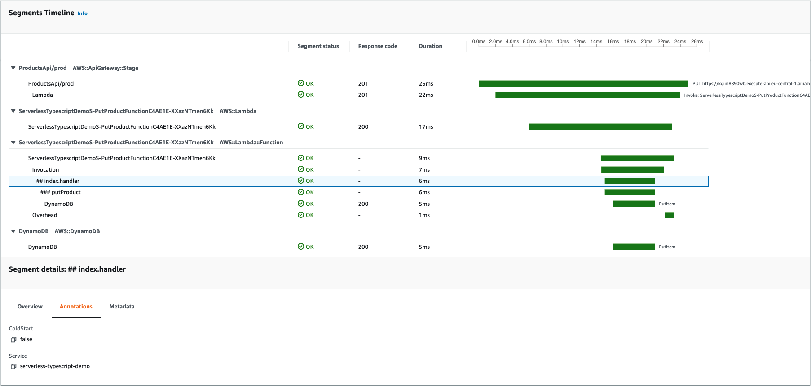

!!! warning  "Do not use this library in production"

    AWS Lambda Powertools for TypeScript is currently released as a beta developer preview and is intended strictly for feedback purposes only.  
    This version is not stable, and significant breaking changes might incur as part of the upcoming [production-ready release](https://github.com/awslabs/aws-lambda-powertools-typescript/milestone/2){target="_blank"}.

    **Do not use this library for production workloads.**

Tracer is an opinionated thin wrapper for [AWS X-Ray SDK for Node.js](https://github.com/aws/aws-xray-sdk-node).

## Key features

* Auto capture cold start and service name as annotations, and responses or full exceptions as metadata
* Auto-disable when not running in AWS Lambda environment
* Support tracing functions via decorators, middleware, and manual instrumentation
* Support tracing AWS SDK v2 and v3 via AWS X-Ray SDK for Node.js  



## Getting started

### Installation

Install the library in your project:

```shell
npm install @aws-lambda-powertools/tracer
```

### Utility settings

The library has one optional setting. You can set it as environment variable, or pass it in the constructor.

This setting will be used across all traces emitted:

Setting | Description                                                                                    | Environment variable | Constructor parameter
------------------------------------------------- |------------------------------------------------------------------------------------------------| ------------------------------------------------- | -------------------------------------------------
**Service name** | Sets an annotation with the **name of the service** across all traces e.g. `serverlessAirline` | `POWERTOOLS_SERVICE_NAME` | `serviceName`

For a **complete list** of supported environment variables, refer to [this section](./../index.md#environment-variables).

!!! note
    Before your use this utility, your AWS Lambda function [must have permissions](https://docs.aws.amazon.com/lambda/latest/dg/services-xray.html#services-xray-permissions) to send traces to AWS X-Ray.

#### Example using AWS Serverless Application Model (SAM)

=== "handler.ts"

    ```typescript hl_lines="1 4"
    import { Tracer } from '@aws-lambda-powertools/tracer';

    // Tracer parameter fetched from the environment variables (see template.yaml tab)
    const tracer = new Tracer();

    // You can also pass the parameter in the constructor
    // const tracer = new Tracer({
    //     serviceName: "serverlessAirline"
    // });
    ```

=== "template.yml"

    ```yaml hl_lines="6 9"
    Resources:
      HelloWorldFunction:
        Type: AWS::Serverless::Function
        Properties:
          Runtime: nodejs14.x
          Tracing: Active
          Environment:
            Variables:
              POWERTOOLS_SERVICE_NAME: serverlessAirline
    ```

### Lambda handler

You can quickly start by importing the `Tracer` class, initialize it outside the Lambda handler, and instrument your function.

=== "Manual"

    ```typescript hl_lines="6 8-9 12-13 19 22 26 28"
    import { Tracer } from '@aws-lambda-powertools/tracer';
    
    const tracer = new Tracer({ serviceName: 'serverlessAirline' });

    export const handler = async (_event: any, context: any): Promise<unknown> => {
        const segment = tracer.getSegment(); // This is the facade segment (the one that is created by AWS Lambda)
        // Create subsegment for the function & set it as active
        const subsegment = segment.addNewSubsegment(`## ${process.env._HANDLER}`);
        tracer.setSegment(subsegment);

        // Annotate the subsegment with the cold start & serviceName
        tracer.annotateColdStart();
        tracer.addServiceNameAnnotation();

        let res;
        try {
            /* ... */
            // Add the response as metadata 
            tracer.addResponseAsMetadata(res, process.env._HANDLER);
        } catch (err) {
            // Add the error as metadata
            tracer.addErrorAsMetadata(err as Error);
            throw err;
        } finally {
            // Close subsegment (the AWS Lambda one is closed automatically)
            subsegment.close();
            // Set back the facade segment as active again
            tracer.setSegment(segment);
        }
    
        return res;
    };
    ```

=== "Middy Middleware"

    !!! note
        Middy comes bundled with Tracer, so you can just import it when using the middleware.

    !!! tip "Using Middy for the first time?"
        Learn more about [its usage and lifecycle in the official Middy documentation](https://github.com/middyjs/middy#usage){target="_blank"}.

    ```typescript hl_lines="1-2 11 13"
    import { Tracer, captureLambdaHandler } from '@aws-lambda-powertools/tracer';
    import middy from '@middy/core';

    const tracer = new Tracer({ serviceName: 'serverlessAirline' });

    const lambdaHandler = async (_event: any, _context: any): Promise<void> => {
        /* ... */
    };

    // Wrap the handler with middy
    export const handler = middy(lambdaHandler)
        // Use the middleware by passing the Tracer instance as a parameter
        .use(captureLambdaHandler(tracer));
    ```

=== "Decorator"

    !!! info
        Decorators can only be attached to a class declaration, method, accessor, property, or parameter. Therefore, if you prefer to write your handler as a standard function rather than a Class method, use the middleware or the manual instrumentations instead.  
        See the [official TypeScript documentation](https://www.typescriptlang.org/docs/handbook/decorators.html) for more details.

    ```typescript hl_lines="8"
    import { Tracer } from '@aws-lambda-powertools/tracer';
    import { LambdaInterface } from '@aws-lambda-powertools/commons';

    const tracer = new Tracer({ serviceName: 'serverlessAirline' });

    class Lambda implements LambdaInterface {
        // Decorate your handler class method
        @tracer.captureLambdaHandler()
        public async handler(_event: any, _context: any): Promise<void> {
            /* ... */
        }
    }
     
    export const handlerClass = new Lambda();
    export const handler = handlerClass.handler;
    ```

When using the `captureLambdaHandler` decorator or middleware, Tracer performs these additional tasks to ease operations:

* Handles the lifecycle of the subsegment
* Creates a `ColdStart` annotation to easily filter traces that have had an initialization overhead
* Creates a `Service` annotation to easily filter traces that have a specific service name
* Captures any response, or full exceptions generated by the handler, and include them as tracing metadata

### Annotations & Metadata

**Annotations** are key-values associated with traces and indexed by AWS X-Ray. You can use them to filter traces and to create [Trace Groups](https://aws.amazon.com/about-aws/whats-new/2018/11/aws-xray-adds-the-ability-to-group-traces/) to slice and dice your transactions.

**Metadata** are key-values also associated with traces but not indexed by AWS X-Ray. You can use them to add additional context for an operation using any native object.

=== "Annotations"
    You can add annotations using `putAnnotation` method.

    ```typescript hl_lines="6"
    import { Tracer } from '@aws-lambda-powertools/tracer';
    
    const tracer = new Tracer({ serviceName: 'serverlessAirline' });
 
    export const handler = async (_event: any, _context: any): Promise<void> => {
        tracer.putAnnotation('successfulBooking', true);
    };
    ```
=== "Metadata"
    You can add metadata using `putMetadata` method.

    ```typescript hl_lines="7"
    import { Tracer } from '@aws-lambda-powertools/tracer';

    const tracer = new Tracer({ serviceName: 'serverlessAirline' });

    export const handler = async (_event: any, _context: any): Promise<void> => {
        const res; /* ... */
        tracer.putMetadata('paymentResponse', res);
    };
    ```

### Methods

You can trace other Class methods using the `captureMethod` decorator or any arbitrary function using manual instrumentation.

=== "Manual"

    ```typescript hl_lines="6 8-9 15 18 23 25"
    import { Tracer } from '@aws-lambda-powertools/tracer';
    
    const tracer = new Tracer({ serviceName: 'serverlessAirline' });

    const getChargeId = async (): Promise<unknown> => {
        const parentSubsegment = tracer.getSegment(); // This is the subsegment currently active
        // Create subsegment for the function & set it as active
        const subsegment = parentSubsegment.addNewSubsegment(`### chargeId`);
        tracer.setSegment(subsegment);

        let res;
        try {
            /* ... */
            // Add the response as metadata
            tracer.addResponseAsMetadata(res, 'chargeId');
        } catch (err) {
            // Add the error as metadata
            tracer.addErrorAsMetadata(err as Error);
            throw err;
        }

        // Close subsegment (the AWS Lambda one is closed automatically)
        subsegment.close();
        // Set the facade segment as active again
        tracer.setSegment(parentSubsegment);
    
        return res;
    };

    export const handler = async (_event: any, _context: any): Promise<void> => {
        const chargeId = getChargeId();
        const payment = collectPayment(chargeId);
        /* ... */
    };
    ```

=== "Decorator"

    ```typescript hl_lines="8"
    import { Tracer } from '@aws-lambda-powertools/tracer';
    import { LambdaInterface } from '@aws-lambda-powertools/commons';

    const tracer = new Tracer({ serviceName: 'serverlessAirline' });

    class Lambda implements LambdaInterface {
        // Decorate your class method
        @tracer.captureMethod()
        public getChargeId(): string {
            /* ... */
            return 'foo bar';
        }

        public async handler(_event: any, _context: any): Promise<void> {
            /* ... */
        }
    }
     
    export const myFunction = new Lambda();
    export const handler = myFunction.handler; 
    ```

### Patching AWS SDK clients

Tracer can patch any [AWS SDK clients](https://docs.aws.amazon.com/xray/latest/devguide/xray-sdk-nodejs-awssdkclients.html) and create traces when your application makes calls to AWS services.

!!! info
    The following snippet assumes you are using the [**AWS SDK v3** for JavaScript](https://docs.aws.amazon.com/AWSJavaScriptSDK/v3/latest/)

You can patch any AWS SDK clients by calling the `captureAWSv3Client` method:

=== "index.ts"

    ```typescript hl_lines="5"
    import { S3Client } from '@aws-sdk/client-s3';
    import { Tracer } from '@aws-lambda-powertools/tracer';

    const tracer = new Tracer({ serviceName: 'serverlessAirline' });
    const client = tracer.captureAWSv3Client(new S3Client({}));
    ```

!!! info
    The following two snippets assume you are using the [**AWS SDK v2** for JavaScript](https://docs.aws.amazon.com/sdk-for-javascript/v2/developer-guide/welcome.html)

You can patch all AWS SDK v2 clients by calling the `captureAWS` method:

=== "index.ts"

    ```typescript hl_lines="4"
    import { Tracer } from '@aws-lambda-powertools/tracer';

    const tracer = new Tracer({ serviceName: 'serverlessAirline' });
    const AWS = tracer.captureAWS(require('aws-sdk'));
    ```

If you're looking to shave a few microseconds, or milliseconds depending on your function memory configuration, you can patch only specific AWS SDK v2 clients using `captureAWSClient`:

=== "index.ts"

    ```typescript hl_lines="5"
    import { S3 } from "aws-sdk";
    import { Tracer } from '@aws-lambda-powertools/tracer';

    const tracer = new Tracer({ serviceName: 'serverlessAirline' });
    const s3 = tracer.captureAWSClient(new S3());
    ```

## Advanced

### Disabling response auto-capture

Use **`POWERTOOLS_TRACER_CAPTURE_RESPONSE=false`** environment variable to instruct Tracer **not** to serialize function responses as metadata.

!!! info "This is commonly useful in three scenarios"

    1. You might **return sensitive** information you don't want it to be added to your traces
    2. You might manipulate **streaming objects that can be read only once**; this prevents subsequent calls from being empty
    3. You might return **more than 64K** of data _e.g., `message too long` error_

### Disabling exception auto-capture

Use **`POWERTOOLS_TRACER_CAPTURE_ERROR=false`** environment variable to instruct Tracer **not** to serialize exceptions as metadata.

!!! info "Commonly useful in one scenario"

    1. You might **return sensitive** information from exceptions, stack traces you might not control

### Escape hatch mechanism

You can use `tracer.provider` attribute to access all methods provided by the [AWS X-Ray SDK](https://docs.aws.amazon.com/xray-sdk-for-nodejs/latest/reference/AWSXRay.html).

This is useful when you need a feature available in X-Ray that is not available in the Tracer utility, for example [SQL queries tracing](https://docs.aws.amazon.com/xray/latest/devguide/xray-sdk-nodejs-sqlclients.html), or [a custom logger](https://docs.aws.amazon.com/xray/latest/devguide/xray-sdk-nodejs-configuration.html#xray-sdk-nodejs-configuration-logging).

=== "index.ts"

    ```typescript hl_lines="6"
    import { Logger } from '@aws-lambda-powertools/logger';
    import { Tracer } from '@aws-lambda-powertools/tracer';

    const serviceName = 'serverlessAirline';
    const logger = new Logger({ serviceName: serviceName });
    const tracer = new Tracer({ serviceName: serviceName });
    tracer.provider.setLogger(logger);
    ```

## Testing your code

Tracer is disabled by default when not running in the AWS Lambda environment - This means no code changes or environment variables to be set.

## Tips

* Use annotations on key operations to slice and dice traces, create unique views, and create metrics from it via Trace Groups
* Use a namespace when adding metadata to group data more easily
* Annotations and metadata are added to the current subsegment opened. If you want them in a specific subsegment, [create one](https://docs.aws.amazon.com/xray/latest/devguide/xray-sdk-nodejs-subsegments.html#xray-sdk-nodejs-subsegments-lambda) via the escape hatch mechanism
