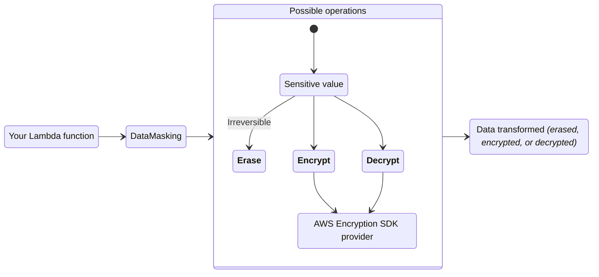
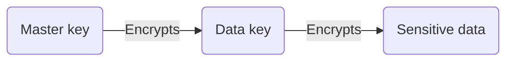
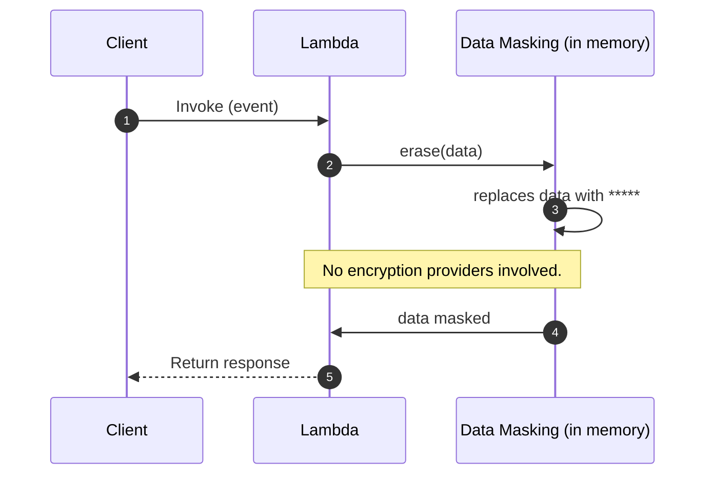
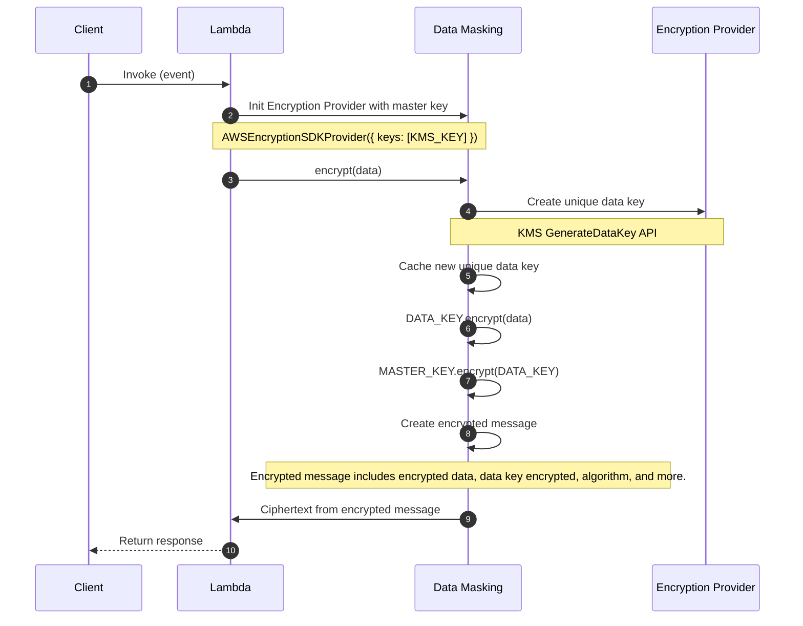
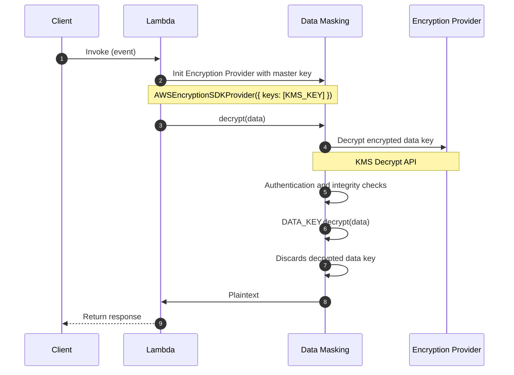
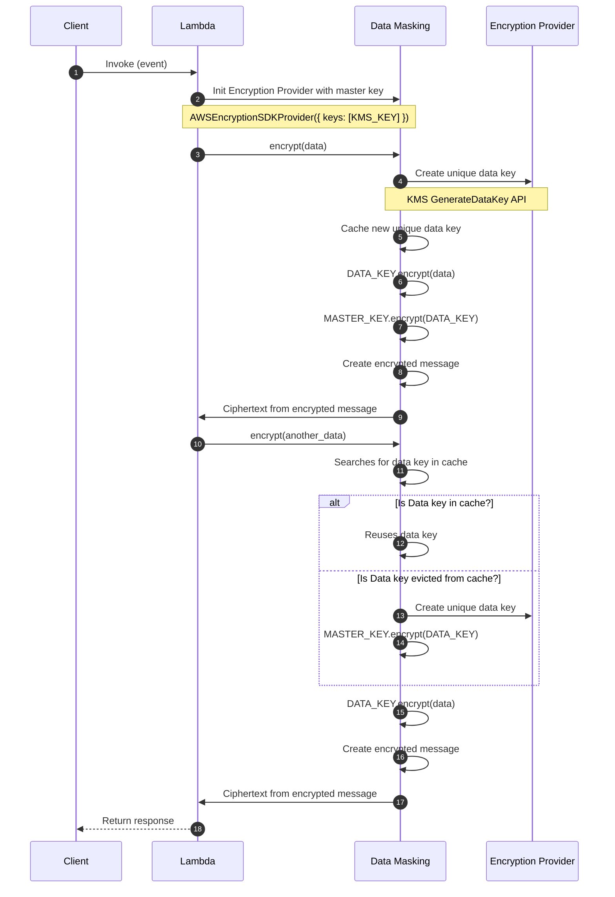

The data masking utility can encrypt, decrypt, or irreversibly erase sensitive information to protect data confidentiality.



## Key features

* Encrypt, decrypt, or irreversibly erase data with ease
* Erase sensitive information in one or more fields within nested data
* Seamless integration with [AWS Encryption SDK](https://docs.aws.amazon.com/encryption-sdk/latest/developer-guide/introduction.html){target="_blank"} for industry and AWS security best practices

## Terminology

**Erasing** replaces sensitive information **irreversibly** with a non-sensitive placeholder _(`*****`)_, or with a customised mask. This operation replaces data in-memory, making it a one-way action.

**Encrypting** transforms plaintext into ciphertext using an encryption algorithm and a cryptographic key. It allows you to encrypt any sensitive data, so only allowed personnel to decrypt it. Learn more about [encryption and how AWS can help](https://aws.amazon.com/blogs/security/importance-of-encryption-and-how-aws-can-help/){target="_blank"}.

**Decrypting** transforms ciphertext back into plaintext using a decryption algorithm and the correct decryption key.

**Encryption context** is a non-secret `key=value` data used for authentication like `tenantId:<id>`. This adds extra security and confirms encrypted data relationship with a context.

**[Encrypted message](https://docs.aws.amazon.com/encryption-sdk/latest/developer-guide/message-format.html){target="_blank"}** is a portable data structure that includes encrypted data along with copies of the encrypted data key. It includes everything Encryption SDK needs to validate authenticity, integrity, and to decrypt with the right master key.

**[Envelope encryption](https://docs.aws.amazon.com/encryption-sdk/latest/developer-guide/concepts.html#envelope-encryption){target="_blank"}** uses two different keys to encrypt data safely: master and data key. The data key encrypts the plaintext, and the master key encrypts the data key. It simplifies key management _(you own the master key)_, isolates compromises to data key,
and scales better with large data volumes.



Envelope encryption visualized.

## Getting started

### Install

```bash
npm install @aws-lambda-powertools/data-masking
```

For encryption and decryption, you also need the AWS Encryption SDK as a peer dependency:

```bash
npm install @aws-crypto/client-node
```

### Required resources

!!! info "By default, we use Amazon Key Management Service (KMS) for encryption and decryption operations."

Before you start, you will need a KMS symmetric key to encrypt and decrypt your data. Your Lambda function will need read and write access to it.

**NOTE**. We recommend setting a minimum of 1024MB of memory _(CPU intensive)_, and separate Lambda functions for encrypt and decrypt.

### Erasing data

Erasing will remove the original data and replace it with `*****`. This means you cannot recover erased data, and the data type will change to `string` for all erased values.

```typescript title="getting_started_erase_data.ts" hl_lines="1 3 8"
import { DataMasking } from '@aws-lambda-powertools/data-masking';

const masker = new DataMasking();

export const handler = async (event: { body: Record<string, unknown> }) => {
  const data = event.body;

  return masker.erase(data, { fields: ['email', 'address.street', 'company_address'] }); // (1)!
};
```

1. See [choosing parts of your data](#choosing-parts-of-your-data) to learn more about the `fields` option.

    If we omit `fields`, the entire object will be erased with `*****`.

=== "Input"

    ```json
    {
        "name": "Jane Doe",
        "age": 30,
        "email": "jane@example.com",
        "address": {
            "street": "123 Main St",
            "city": "Anytown"
        },
        "company_address": {
            "street": "456 ACME Ave",
            "city": "Anytown"
        }
    }
    ```

=== "Output"

    ```json
    {
        "name": "Jane Doe",
        "age": 30,
        "email": "*****",
        "address": {
            "street": "*****",
            "city": "Anytown"
        },
        "company_address": "*****"
    }
    ```

#### Custom masking

The `erase` method also supports additional options for more advanced and flexible masking via `maskingRules`:

```typescript title="custom_masking.ts" hl_lines="6-11"
import { DataMasking } from '@aws-lambda-powertools/data-masking';

const masker = new DataMasking();

const masked = masker.erase(data, {
  maskingRules: {
    email: { regexPattern: /(.)(.*)(@.*)/, maskFormat: '$1****$3' },  // j****@example.com
    ssn: { dynamicMask: true },                                       // mask length matches original
    zip: { customMask: 'XXXXX' },                                     // fixed replacement string
  },
});
```

| Option | Description |
| --- | --- |
| `regexPattern` + `maskFormat` | Partial masking via regex replacement |
| `dynamicMask: true` | Replace with `*` repeated to match original value length |
| `customMask` | Replace with an exact string |

### Encrypting data

???+ note "About static typing and encryption"
    Encrypting data may lead to a different data type, as it always transforms into a string _(`<ciphertext>`)_.

To encrypt, you will need an [encryption provider](#providers). Here, we will use `AWSEncryptionSDKProvider`.

Under the hood, we delegate a [number of operations](#encrypt-operation-with-encryption-sdk-kms) to AWS Encryption SDK to authenticate, create a portable encryption message, and actual data encryption.

```typescript title="getting_started_encrypt_data.ts" hl_lines="1-2 4-6 13"
import { DataMasking } from '@aws-lambda-powertools/data-masking';
import { AWSEncryptionSDKProvider } from '@aws-lambda-powertools/data-masking/provider';

const provider = new AWSEncryptionSDKProvider({
  keys: [process.env.KMS_KEY_ARN],  // (1)!
});
const masker = new DataMasking({ provider });

export const handler = async (event: { body: Record<string, unknown> }) => {
  const data = event.body;

  const encrypted = await masker.encrypt(data);

  return { body: encrypted };
};
```

1. You can use more than one KMS Key for higher availability but increased latency.

    Encryption SDK will ensure the data key is encrypted with both keys.

### Decrypting data

???+ note "About static typing and decryption"
    Decrypting data may lead to a different data type, as encrypted data is always a string _(`<ciphertext>`)_.

To decrypt, you will need an [encryption provider](#providers). Here, we will use `AWSEncryptionSDKProvider`.

Under the hood, we delegate a [number of operations](#decrypt-operation-with-encryption-sdk-kms) to AWS Encryption SDK to verify authentication, integrity, and actual ciphertext decryption.

```typescript title="getting_started_decrypt_data.ts" hl_lines="1-2 4-6 13"
import { DataMasking } from '@aws-lambda-powertools/data-masking';
import { AWSEncryptionSDKProvider } from '@aws-lambda-powertools/data-masking/provider';

const provider = new AWSEncryptionSDKProvider({
  keys: [process.env.KMS_KEY_ARN],  // (1)!
});
const masker = new DataMasking({ provider });

export const handler = async (event: { body: Record<string, unknown> }) => {
  const data = event.body;

  const decrypted = await masker.decrypt(data);

  return decrypted;
};
```

1. Note that KMS key alias or key ID won't work for decryption. You must use the full KMS Key ARN.

### Encryption context for integrity and authenticity

For a stronger security posture, you can add metadata to each encryption operation, and verify them during decryption. This is known as additional authenticated data (AAD). These are non-sensitive data that can help protect authenticity and integrity of your encrypted data,
and even help to prevent a [confused deputy](https://docs.aws.amazon.com/IAM/latest/UserGuide/confused-deputy.html){target="_blank"} situation.

???+ danger "Important considerations you should know"
    1. **Exact match verification on decrypt**. Be careful using random data like `timestamps` as encryption context if you can't provide them on decrypt.
    2. **Only `string` values are supported**.
    3. **Use non-sensitive data only**. When using KMS, encryption context is available as plaintext in AWS CloudTrail, unless you [intentionally disabled KMS events](https://docs.aws.amazon.com/kms/latest/developerguide/logging-using-cloudtrail.html#filtering-kms-events){target="_blank"}.

=== "Encrypting with context"

    ```typescript hl_lines="3-6"
    const encrypted = await masker.encrypt(data, {
      fields: ['customer.ssn'],
      context: {
        tenantId: 'acme',
        classification: 'confidential',
      },  // (1)!
    });
    ```

    1. They must match on `decrypt()` otherwise the operation will fail.

=== "Decrypting with context"

    ```typescript hl_lines="3-6"
    const decrypted = await masker.decrypt(encrypted, {
      fields: ['customer.ssn'],
      context: {
        tenantId: 'acme',
        classification: 'confidential',
      },  // (1)!
    });
    ```

    1. They must match otherwise the operation will fail.

### Choosing parts of your data

You can use the `fields` option with the dot notation `.` to choose one or more parts of your data to `erase`, `encrypt`, or `decrypt`. This is useful when you want to keep data structure intact except the confidential fields.

When `fields` is present, operations behave differently:

| Operation | Behaviour | Example | Result |
| --- | --- | --- | --- |
| `erase` | Replace data while keeping structure intact. | `{"cards": ["a", "b"]}` | `{"cards": ["*****", "*****"]}` |
| `encrypt` | Encrypt individual field values in place. | `{"ssn": "123"}` | `{"ssn": "<ciphertext>"}` |
| `decrypt` | Decrypt individual field values in place. | `{"ssn": "<ciphertext>"}` | `{"ssn": "123"}` |

Here are common scenarios to best visualise how to use `fields`.

=== "Top keys only"

    You want to erase data in the `card_number` field.

    > Expression: `masker.erase(data, { fields: ['card_number'] })`

    === "Data"

        ```json hl_lines="4"
        {
            "name": "Jane",
            "operation": "non sensitive",
            "card_number": "1111 2222 3333 4444"
        }
        ```

    === "Result"

        ```json hl_lines="4"
        {
            "name": "Jane",
            "operation": "non sensitive",
            "card_number": "*****"
        }
        ```

=== "Nested key"

    You want to erase data in the `postcode` field.

    > Expression: `masker.erase(data, { fields: ['address.postcode'] })`

    === "Data"

        ```json hl_lines="6"
        {
            "name": "Jane",
            "card_number": "1111 2222 3333 4444",
            "address": {
                "street": "123 Main St",
                "postcode": 12345
            }
        }
        ```

    === "Result"

        ```json hl_lines="6"
        {
            "name": "Jane",
            "card_number": "1111 2222 3333 4444",
            "address": {
                "street": "123 Main St",
                "postcode": "*****"
            }
        }
        ```

=== "Multiple keys"

    You want to erase data in both `postcode` and `street` fields.

    > Expression: `masker.erase(data, { fields: ['address.postcode', 'address.street'] })`

    === "Data"

        ```json hl_lines="4-5"
        {
            "name": "Jane",
            "address": {
                "street": "123 Main St",
                "postcode": 12345
            }
        }
        ```

    === "Result"

        ```json hl_lines="4-5"
        {
            "name": "Jane",
            "address": {
                "street": "*****",
                "postcode": "*****"
            }
        }
        ```

=== "All fields in a list"

    You want to erase data under `street` field located at any index of the address list.

    > Expression: `masker.erase(data, { fields: ['address[*].street'] })`

    === "Data"

        ```json hl_lines="6 11"
        {
            "name": "Jane",
            "address": [
                {
                    "postcode": 12345,
                    "street": "123 Any Drive"
                },
                {
                    "postcode": 67890,
                    "street": "100 Main Street"
                }
            ]
        }
        ```

    === "Result"

        ```json hl_lines="6 11"
        {
            "name": "Jane",
            "address": [
                {
                    "postcode": 12345,
                    "street": "*****"
                },
                {
                    "postcode": 67890,
                    "street": "*****"
                }
            ]
        }
        ```

=== "All fields in an object"

    You want to erase all values under `credentials` without listing each key individually.

    > Expression: `masker.erase(data, { fields: ['credentials.*'] })`

    === "Data"

        ```json hl_lines="3-5"
        {
            "name": "Jane",
            "credentials": {
                "username": "admin",
                "password": "s3cret",
                "token": "abc123"
            }
        }
        ```

    === "Result"

        ```json hl_lines="3-5"
        {
            "name": "Jane",
            "credentials": {
                "username": "*****",
                "password": "*****",
                "token": "*****"
            }
        }
        ```

=== "Nested field via object wildcard"

    You want to erase the `ssn` field under every key in the `users` object.

    > Expression: `masker.erase(data, { fields: ['users.*.ssn'] })`

    === "Data"

        ```json hl_lines="4 8"
        {
            "users": {
                "alice": {
                    "ssn": "111-22-3333",
                    "name": "Alice"
                },
                "bob": {
                    "ssn": "444-55-6666",
                    "name": "Bob"
                }
            }
        }
        ```

    === "Result"

        ```json hl_lines="4 8"
        {
            "users": {
                "alice": {
                    "ssn": "*****",
                    "name": "Alice"
                },
                "bob": {
                    "ssn": "*****",
                    "name": "Bob"
                }
            }
        }
        ```

## Advanced

### Using multiple keys

You can use multiple KMS keys from more than one AWS account for higher availability, when instantiating `AWSEncryptionSDKProvider`.

```typescript title="using_multiple_keys.ts" hl_lines="4"
import { AWSEncryptionSDKProvider } from '@aws-lambda-powertools/data-masking/provider';

const provider = new AWSEncryptionSDKProvider({
  keys: [process.env.KMS_KEY_ARN_1, process.env.KMS_KEY_ARN_2],
});
```

### Providers

#### AWS Encryption SDK

You can modify the following values when initialising the `AWSEncryptionSDKProvider` to best accommodate your security and performance thresholds.

| Parameter | Default | Description |
| --- | --- | --- |
| `localCacheCapacity` | `100` | The maximum number of entries that can be retained in the local cryptographic materials cache |
| `maxCacheAgeSeconds` | `300` | The maximum time (in seconds) that a cache entry may be kept in the cache |
| `maxMessagesEncrypted` | `4294967296` | The maximum number of messages that may be encrypted under a cache entry |
| `maxBytesEncrypted` | `Number.MAX_SAFE_INTEGER` | The maximum number of bytes that may be encrypted under a cache entry |

If required, you can customise the default values when initialising the `AWSEncryptionSDKProvider` class.

```typescript title="aws_encryption_provider_example.ts" hl_lines="4-8"
import { AWSEncryptionSDKProvider } from '@aws-lambda-powertools/data-masking/provider';

const provider = new AWSEncryptionSDKProvider({
  keys: [process.env.KMS_KEY_ARN],
  localCacheCapacity: 200,
  maxCacheAgeSeconds: 400,
  maxMessagesEncrypted: 200,
  maxBytesEncrypted: 2000,
});
```

### Data masking request flow

The following sequence diagrams explain how `DataMasking` behaves under different scenarios.

#### Erase operation

Erasing operations occur in-memory and we cannot recover the original value.



Simple masking operation

#### Encrypt operation with Encryption SDK (KMS)

We call KMS to generate a unique data key that can be used for multiple `encrypt` operations in-memory. It improves performance, cost and prevents throttling.

To make this operation simpler to visualise, we keep caching details in a [separate sequence diagram](#caching-encrypt-operations-with-encryption-sdk). Caching is enabled by default.



Encrypting operation using envelope encryption.

#### Decrypt operation with Encryption SDK (KMS)

We call KMS to decrypt the encrypted data key available in the encrypted message. If successful, we run authentication _(context)_ and integrity checks (_algorithm, data key length, etc_) to confirm its proceedings.

Lastly, we decrypt the original encrypted data, throw away the decrypted data key for security reasons, and return the original plaintext data.



Decrypting operation using envelope encryption.

#### Caching encrypt operations with Encryption SDK

Without caching, every `encrypt()` operation would generate a new data key. It significantly increases latency and cost for ephemeral and short running environments like Lambda.

With caching, we balance ephemeral Lambda environment performance characteristics with [adjustable thresholds](#aws-encryption-sdk) to meet your security needs.

!!! info "Data key recycling"
    We request a new data key when a cached data key exceeds any of the following security thresholds:

    1. **Max age in seconds**
    2. **Max number of encrypted messages**
    3. **Max bytes encrypted** across all operations



Caching data keys during encrypt operation.

## Testing your code

### Testing erase operation

Testing your code with a simple erase operation requires no mocking.

```typescript title="test_data_masking.test.ts"
import { DataMasking } from '@aws-lambda-powertools/data-masking';

const masker = new DataMasking();

test('masks sensitive fields', () => {
  const result = masker.erase(
    { name: 'Jane', ssn: '123-45-6789' },
    { fields: ['ssn'] }
  );

  expect(result.ssn).toBe('*****');
  expect(result.name).toBe('Jane');
});
```

### Testing encrypt/decrypt operations

For encrypt/decrypt, create a mock provider implementing the `EncryptionProvider` interface to avoid needing real KMS keys:

```typescript title="test_data_masking_encrypt.test.ts"
import { DataMasking } from '@aws-lambda-powertools/data-masking';
import type { EncryptionProvider } from '@aws-lambda-powertools/data-masking/types';

const mockProvider: EncryptionProvider = {
  encrypt: async (data: string) => `ENC:${data}`,
  decrypt: async (data: string) => data.replace('ENC:', ''),
};

const masker = new DataMasking({ provider: mockProvider });

test('encrypts and decrypts fields', async () => {
  const data = { secret: 'value', public: 'visible' };

  const encrypted = await masker.encrypt(data, { fields: ['secret'] });
  const decrypted = await masker.decrypt(encrypted, { fields: ['secret'] });

  expect(decrypted).toEqual(data);
});
```
