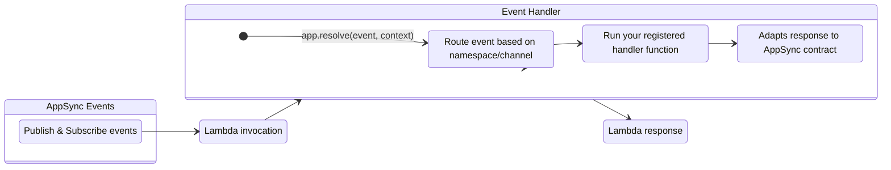
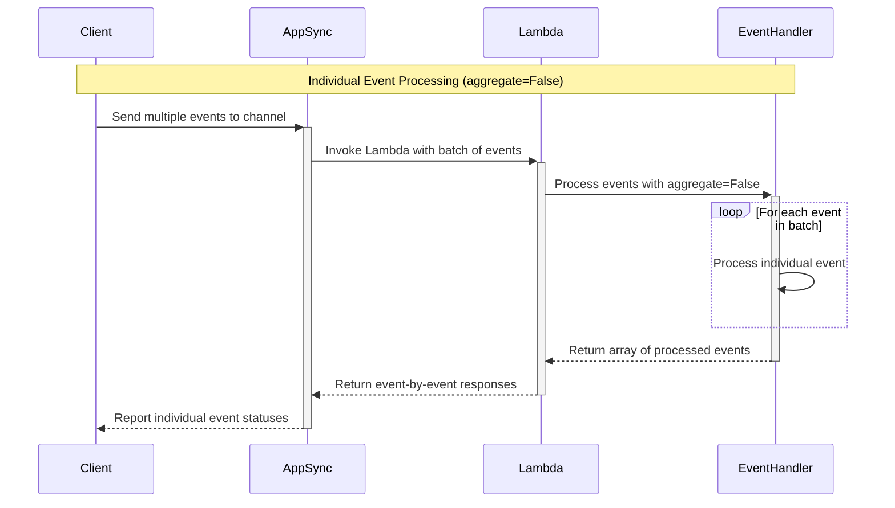
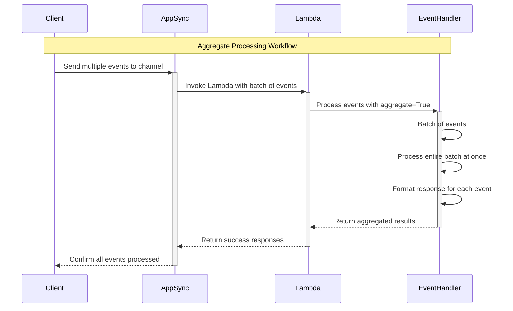
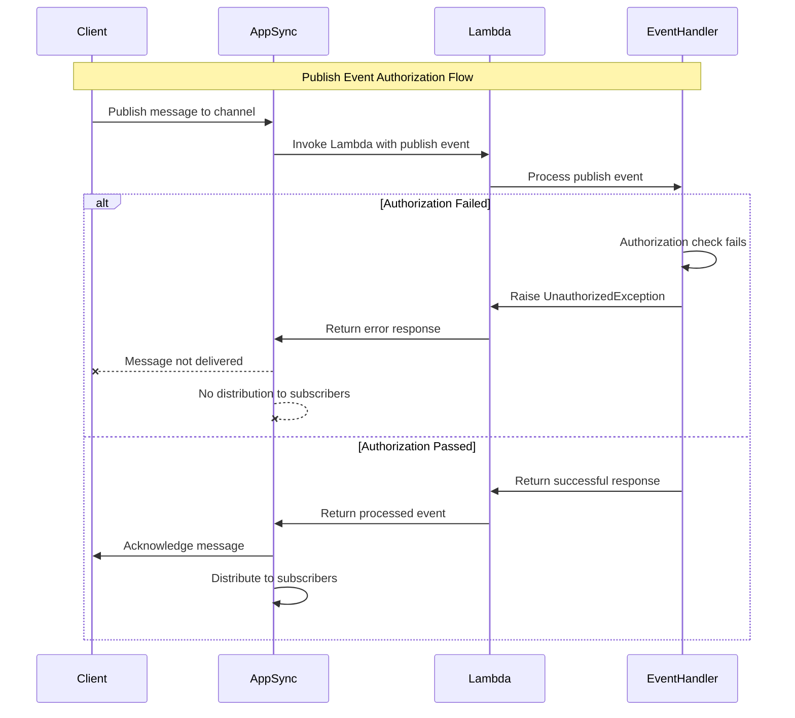
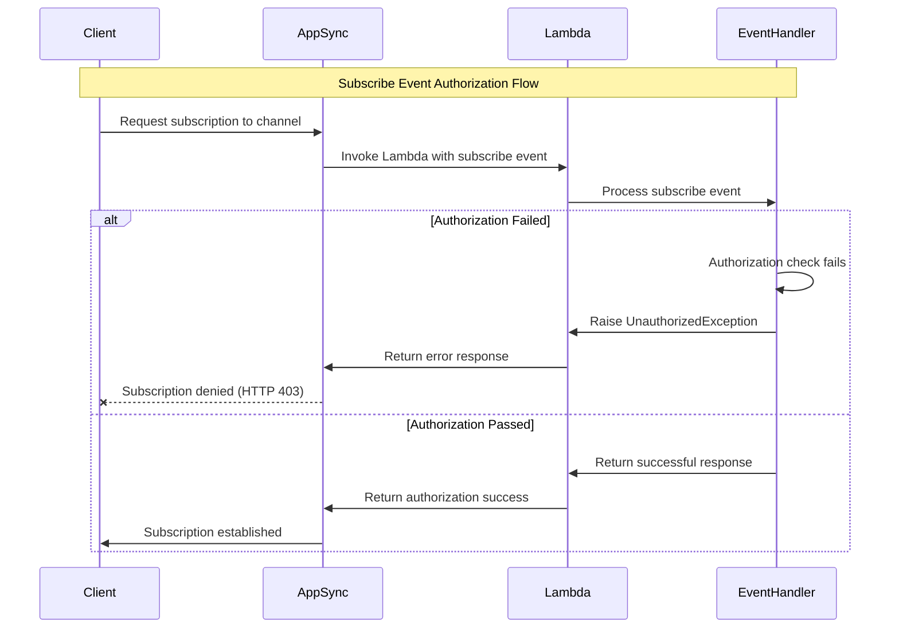

Event Handler for AWS AppSync real-time events.



## Key Features

* Easily handle publish and subscribe events with dedicated handler methods
* Automatic routing based on namespace and channel patterns
* Support for wildcard patterns to create catch-all handlers
* Process events in parallel and control aggregation for batch processing
* Graceful error handling for individual events

## Terminology

**[AWS AppSync Events](https://docs.aws.amazon.com/appsync/latest/eventapi/event-api-welcome.html){target="_blank"}**. A service that enables you to quickly build secure, scalable real-time WebSocket APIs without managing infrastructure or writing API code.

It handles connection management, message broadcasting, authentication, and monitoring, reducing time to market and operational costs.

## Getting started

???+ tip "Tip: New to AppSync Real-time API?"
    Visit [AWS AppSync Real-time documentation](https://docs.aws.amazon.com/appsync/latest/eventapi/event-api-getting-started.html){target="_blank"} to understand how to set up subscriptions and pub/sub messaging.

### Required resources

You must have an existing AppSync Events API with real-time capabilities enabled and IAM permissions to invoke your AWS Lambda function. That said, there are no additional permissions required to use Event Handler as routing requires no dependency.

Additionally, if you want the result of your handler to be used by AppSync you must set the integration type to `REQUEST_RESPONSE`.

=== "template.yaml"

    ```yaml
    --8<-- "examples/snippets/event-handler/appsync-events/templates/gettingStarted.yaml"
    ```

### AppSync request and response format

AppSync Events uses a specific event format for Lambda requests and responses. In most scenarios, Powertools for AWS simplifies this interaction by automatically formatting resolver returns to match the expected AppSync response structure.

=== "Request format"

    ```json
    --8<-- "examples/snippets/event-handler/appsync-events/samples/gettingStartedRequest.json"
    ```

=== "Response format"

    ```json
    --8<-- "examples/snippets/event-handler/appsync-events/samples/gettingStartedResponse.json"
    ```

=== "Response format with error"

    ```json
    --8<-- "examples/snippets/event-handler/appsync-events/samples/gettingStartedResponseWithError.json"
    ```

#### Events response with error

When processing events with Lambda, you can return errors to AppSync in three ways:

* **Item specific error:** Return an `error` key within each individual item's response. AppSync Events expects this format for item-specific errors.
* **Fail entire request:** Return a JSON object with a top-level `error` key. This signals a general failure, and AppSync treats the entire request as unsuccessful.
* **Unauthorized exception**: Throw an **UnauthorizedException** exception to reject a subscribe or publish request with HTTP 403.

### Route handlers

!!! important "The event handler automatically parses the incoming event data and invokes the appropriate handler based on the namespace/channel pattern you register."

You can define your handlers for different event types using the `onPublish()` and `onSubscribe()` methods and pass a function to handle the event.

=== "Publish events"

    ```typescript hl_lines="4 6 14"
    --8<-- "examples/snippets/event-handler/appsync-events/gettingStartedOnPublish.ts"
    ```

=== "Subscribe events"

    ```typescript hl_lines="10 12 18"
    --8<-- "examples/snippets/event-handler/appsync-events/gettingStartedOnSubscribe.ts"
    ```

If you prefer to use the decorator syntax, you can instead use the same methods on a class method to register your handlers.

=== "Publish events"

    ```typescript hl_lines="5 8 17"
    --8<-- "examples/snippets/event-handler/appsync-events/gettingStartedOnPublishDecorator.ts"
    ```

=== "Subscribe events"

    ```typescript hl_lines="11 14 21"
    --8<-- "examples/snippets/event-handler/appsync-events/gettingStartedOnSubscribeDecorator.ts"
    ```

## Advanced

### Wildcard patterns and handler precedence

You can use wildcard patterns to create catch-all handlers for multiple channels or namespaces. This is particularly useful for centralizing logic that applies to multiple channels.

When an event matches with multiple handler, the most specific pattern takes precedence.

!!! note "Supported wildcard patterns"
    Only the following patterns are supported:

    * `/namespace/*` - Matches all channels in the specified namespace
    * `/*` - Matches all channels in all namespaces

    Patterns like `/namespace/channel*` or `/namespace/*/subpath` are not supported.

    More specific handlers will always take precedence over less specific ones. For example, `/default/channel1` will take precedence over `/default/*`, which will take precedence over `/*`.

=== "Wildcard patterns"

    ```typescript hl_lines="6 10"
    --8<-- "examples/snippets/event-handler/appsync-events/wildcardPatterns.ts"
    ```

If the event doesn't match any registered handler, the Event Handler will log a warning and skip processing the event.

### Aggregated processing

In some scenarios, you might want to process all messages published to a channel as a batch rather than individually.

This is useful when you want to for example:

* Optimize database operations by making a single batch query
* Ensure all events are processed together or not at all
* Apply custom error handling logic for the entire batch

You can enable this with the `aggregate` parameter:

=== "Aggregated processing"

    ```typescript hl_lines="17 32 34"
    --8<-- "examples/snippets/event-handler/appsync-events/aggregatedProcessing.ts"
    ```

When enabling `aggregate`, your handler receives a list of all the events, requiring you to manage the response format. Ensure your response includes results for each event in the expected [AppSync Request and Response Format](#appsync-request-and-response-format).

If you want to omit one or more events from the response, you can do so by excluding them from the returned array. Likewise, if you want to discard the entire batch and prevent subscribers from receiving it, you can return an empty array.

=== "Aggregated processing with partial results"

    ```typescript hl_lines="17 19"
    --8<-- "examples/snippets/event-handler/appsync-events/aggregatedProcessingWithPartialResults.ts"
    ```

    1. You can also return an empty array `[]` to discard the entire batch and prevent subscribers from receiving it.

### Handling errors

You can filter or reject events by throwing exceptions in your resolvers or by formatting the payload according to the expected response structure. This instructs AppSync not to propagate that specific message, so subscribers will not receive it.

#### Handling errors with individual items

When processing items individually, you can throw an exception to fail a specific message. When this happens, the Event Handler will catch it and include the exception name and message in the response.

=== "Error handling with individual items"

    ```typescript hl_lines="5 6 13"
    --8<-- "examples/snippets/event-handler/appsync-events/errorHandlingWithIndividualItems.ts"
    ```

=== "Response format with error"

    ```json hl_lines="3-6"
    --8<-- "examples/snippets/event-handler/appsync-events/samples/errorHandlingWithIndividualItemsResponse.json"
    ```

#### Handling errors with aggregate

When processing batch of items with `aggregate` enabled, you must format the payload according the expected response.

=== "Error handling with batch of items"

    ```typescript hl_lines="21-24"
    --8<-- "examples/snippets/event-handler/appsync-events/errorHandlingWithBatchOfItems.ts"
    ```

=== "Response with errors in individual items"

    ```json
    --8<-- "examples/snippets/event-handler/appsync-events/samples/errorHandlingWithAggregateResponse.json"
    ```

If instead you want to fail the entire batch, you can throw an exception. This will cause the Event Handler to return an error response to AppSync and fail the entire batch.

=== "All or nothing error handling with batch of items"

    ```typescript hl_lines="21-24"
    --8<-- "examples/snippets/event-handler/appsync-events/allOrNothingBatch.ts"
    ```

=== "Response with entire batch error"

    ```json
    --8<-- "examples/snippets/event-handler/appsync-events/samples/allOrNothingErrorResponse.json"
    ```

#### Authorization control

!!! warning "Throwing `UnauthorizedException` will cause the Lambda invocation to fail."

You can also do content-based authorization for channel by throwing an `UnauthorizedException` error. This can cause two situations:

* **When working with publish events**, Powertools for AWS stops processing messages and prevents subscribers from receiving messages.
* **When working with subscribe events** it'll prevent the subscription from being created.

=== "UnauthorizedException"

    ```typescript hl_lines="3 14 25-27"
    --8<-- "examples/snippets/event-handler/appsync-events/unauthorizedException.ts"
    ```

### Accessing Lambda context and event

You can access to the original Lambda event or context for additional information. These are passed to the handler function as optional arguments.

=== "Access event and context"

    ```typescript hl_lines="10"
    --8<-- "examples/snippets/event-handler/appsync-events/accessEventAndContext.ts"
    ```

    1. The `event` parameter contains the original AppSync event and has type `AppSyncEventsPublishEvent` or `AppSyncEventsSubscribeEvent` from the `@aws-lambda-powertools/event-handler/types`.

### Logging

By default, the `AppSyncEventsResolver` uses the global `console` logger and emits only warnings and errors.

You can change this behavior by passing a custom logger instance to the `AppSyncEventsResolver` and setting the log level for it, or by enabling [Lambda Advanced Logging Controls](https://docs.aws.amazon.com/lambda/latest/dg/monitoring-cloudwatchlogs-advanced.html) and setting the log level to `DEBUG`.

When debug logging is enabled, the resolver will emit logs that show the underlying handler resolution process. This is useful for understanding how your handlers are being resolved and invoked and can help you troubleshoot issues with your event processing.

For example, when using the [Powertools for AWS Lambda logger](../logger.md), you can set the `LOG_LEVEL` to `DEBUG` in your environment variables or at the logger level and pass the logger instance to the `AppSyncEventsResolver` constructor to enable debug logging.

=== "Debug logging"

    ```typescript hl_lines="9"
    --8<-- "examples/snippets/event-handler/appsync-events/debugLogging.ts"
    ```

=== "Logs output"

    ```json
    --8<-- "examples/snippets/event-handler/appsync-events/samples/debugLogExcerpt.json"
    ```

## Flow diagrams

### Working with single items

<center>

</center>

### Working with aggregated items

<center>

</center>

### Unauthorized publish

<center>

</center>

### Unauthorized subscribe

<center>

</center>

## Testing your code

You can test your event handlers by passing a mock payload with the expected structure.

For example, when working with `PUBLISH` events, you can use the `OnPublishOutput` to easily cast the output of your handler to the expected type and assert the expected values.

=== "Testing publish events"

    ```typescript hl_lines="5 55"
    --8<-- "examples/snippets/event-handler/appsync-events/testingEventsOnPublish.ts"
    ```

    1. See [here](#route-handlers) to see the implementation of this handler.

=== "Sample publish event"

    ```json
    --8<-- "examples/snippets/event-handler/appsync-events/samples/onPublishEvent.json"
    ```

You can also assert that a handler throws an exception when processing a specific event.

=== "Testing subscribe events"

    ```typescript hl_lines="5 15-17"
    --8<-- "examples/snippets/event-handler/appsync-events/testingEventsOnSubscribe.ts"
    ```

    1. See [here](#authorization-control) to see the implementation of this handler.

=== "Sample subscribe event"

    ```json
    --8<-- "examples/snippets/event-handler/appsync-events/samples/onSubscribeEvent.json"
    ```
