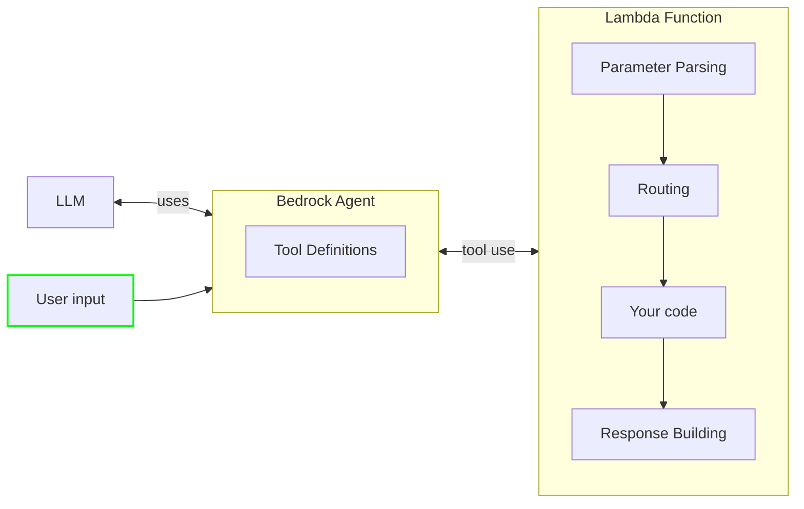

<!-- markdownlint-disable MD043 -->

Create [Amazon Bedrock Agents](https://docs.aws.amazon.com/bedrock/latest/userguide/agents.html#agents-how) and focus on building your agent's logic without worrying about parsing and routing requests.



## Key Features

* Easily expose tools for your Large Language Model (LLM) agents
* Automatic routing based on tool name and function details
* Graceful error handling and response formatting

## Terminology

**Event handler** is a Powertools for AWS feature that processes an event, runs data parsing and validation, routes the request to a specific function, and returns a response to the caller in the proper format.

**Function details** consist of a list of parameters, defined by their name, data type, and whether or not they are required. The agent uses these configurations to determine what information it needs to elicit from the user.

**Action group** is a collection of two resources where you define the actions that the agent should carry out: an OpenAPI schema to define the APIs that the agent can invoke to carry out its tasks, and a Lambda function to execute those actions.

**Large Language Models (LLM)** are very large deep learning models that are pre-trained on vast amounts of data, capable of extracting meanings from a sequence of text and understanding the relationship between words and phrases within that text.

**Amazon Bedrock Agent** is an Amazon Bedrock feature to build and deploy conversational agents that can interact with your customers using Large Language Models (LLM) and AWS Lambda functions.

## Getting Started

```shell
npm i @aws-lambda-powertools/event-handler
```

### Required resources

You must create an Amazon Bedrock Agent with at least one action group. Each action group can contain up to 5 tools, which in turn need to match the ones defined in your Lambda function. Bedrock must have permission to invoke your Lambda function.

??? note "Click to see example IaC templates"

    === "AWS SAM"

        ```yaml
        --8<-- "examples/snippets/event-handler/bedrock-agents/templates/gettingStartedSam.yaml"
        ```

    === "AWS CDK"

        ```typescript
        --8<-- "examples/snippets/event-handler/bedrock-agents/templates/gettingStartedCdk.ts"
        ```

### Usage

Use the `BedrockAgentFunctionResolver` to register your tools and handle the requests to your Lambda function. The resolver will automatically parse the request, route it to the appropriate function, and return a well-formed response that includes the tool's output and any existing session attributes.

When passing the tool parameters to your handler, we will automatically cast them to the appropriate type based on the `type` field defined in the action group. This means you can use native JavaScript types like `string`, `number`, `boolean` without worrying about parsing them yourself.

Currently, we don't support parsing `array` types, so you will receive them as strings.

=== "Define a tool"

  ```typescript hl_lines="4 6 20"
  --8<-- "examples/snippets/event-handler/bedrock-agents/gettingStartedFunctionsTool.ts"
  ```
  
  1. The `description` field is optional, but highly recommended in the action group definition so that the LLM can understand what the tool does and how to use it.

## Advanced

### Handling errors

By default, we will handle errors gracefully and return a well-formed response to the agent so that it can continue the conversation with the user.

When an error occurs, we send back an error message in the response body that includes the error type and message. The agent will then use this information to let the user know that something went wrong.

If you want to handle errors differently, you can return a `BedrockFunctionResponse` with a custom `body` and `responseState` set to `FAILURE`. This is useful when you want to abort the conversation.

!!! tip
    You can use the same technique to reprompt the user for missing information or for them to correct their input. Just return a `BedrockFunctionResponse` with a custom message and `responseState` set to `REPROMPT`.

=== "Custom error handling"

    ```typescript hl_lines="19-25"
    --8<-- "examples/snippets/event-handler/bedrock-agents/stopConversation.ts"
    ```

### Accessing Lambda context and event

You can access to the original Lambda event or context for additional information. These are passed to the handler function as optional arguments.

=== "Access event and context"

    ```typescript hl_lines="7-9"
    --8<-- "examples/snippets/event-handler/bedrock-agents/accessEventAndContext.ts"
    ```

### Setting session attributes

When Bedrock Agents invoke your Lambda function, it can pass session attributes that you can use to store information across multiple interactions with the user. You can access these attributes in your handler function and modify them as needed.

=== "Working with session attributes"

    ```typescript hl_lines="24-27"
    --8<-- "examples/snippets/event-handler/bedrock-agents/sessionAttributes.ts"
    ```

### Logging

By default, the `BedrockAgentFunctionResolver` uses the global `console` logger and emits only warnings and errors.

You can change this behavior by passing a custom logger instance to the `BedrockAgentFunctionResolver` constructor and setting its log level. Alternatively, you can also enable [Lambda Advanced Logging Controls](https://docs.aws.amazon.com/lambda/latest/dg/monitoring-cloudwatchlogs-advanced.html) and setting the log level to `DEBUG`.

When debug logging is enabled, the resolver will emit logs that show the underlying handler registration and the routing process. This is useful for understanding how the agent resolves the tools and routes the requests.

For example, when using the [Powertools for AWS Lambda logger](../logger.md), you can set the `LOG_LEVEL` to `DEBUG` in your environment variables or at the logger level and pass the logger instance to the `BedrockAgentFunctionResolver` constructor to enable debug logging.

=== "Debug logging"

    ```typescript hl_lines="9"
    --8<-- "examples/snippets/event-handler/bedrock-agents/debugLogging.ts"
    ```
