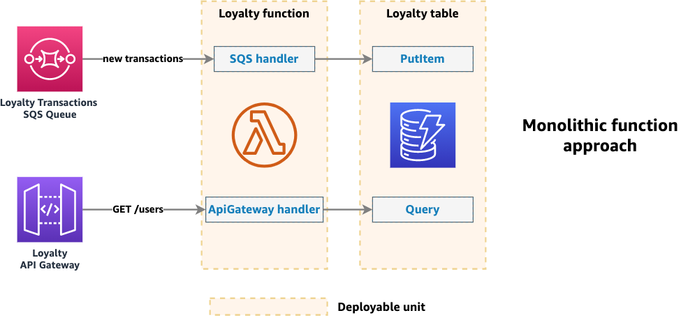
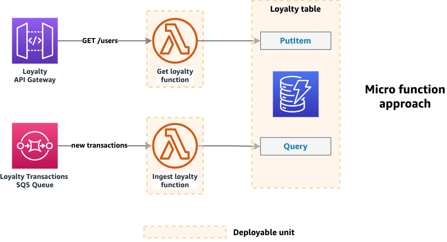

Event handler for Amazon API Gateway REST and HTTP APIs, Application Loader Balancer (ALB), and Lambda Function URLs<!--, and VPC Lattice -->.

## Key Features

* Lightweight routing to reduce boilerplate for API Gateway REST/HTTP API, ALB and Lambda Function URLs.
* Built-in middleware engine for request/response transformation (validation coming soon).
* Works with micro function (one or a few routes) and monolithic functions (see [Considerations](#considerations)).

## Getting started

### Install

<!-- !!! info "This is not necessary if you're using Powertools for AWS Lambda (TypeScript) via [Lambda layer](../../getting-started/lambda-layers.md)." -->

```shell
npm install @aws-lambda-powertools/event-handler
```

### Required resources

The event handler works with different types of events. It can process events from API Gateway REST APIs, HTTP APIs, ALB, Lambda Function URLs, and will soon support VPC Lattice as well.

You must have an existing integration configured to invoke your Lambda function depending on what you are using:

| Integration               | Documentation                                                                                                                                |
| ------------------------- | -------------------------------------------------------------------------------------------------------------------------------------------- |
| API Gateway REST API      | [Proxy integration](https://docs.aws.amazon.com/apigateway/latest/developerguide/set-up-lambda-proxy-integrations.html){target="_blank"}     |
| API Gateway HTTP API      | [Proxy integration](https://docs.aws.amazon.com/apigateway/latest/developerguide/http-api-develop-integrations-lambda.html){target="_blank"} |
| Application Load Balancer | [ALB configuration](https://docs.aws.amazon.com/elasticloadbalancing/latest/application/lambda-functions.html){target="_blank"}              |
| Lambda Function URL       | [Function URL configuration](https://docs.aws.amazon.com/lambda/latest/dg/urls-configuration.html){target="_blank"}                          |

<!-- In case of using [VPC Lattice](https://docs.aws.amazon.com/lambda/latest/dg/services-vpc-lattice.html){target="_blank"}, you must have a service network configured to invoke your Lambda function. -->

This is the sample infrastructure for the different integrations we are using for the examples in this documentation. There is no additional permissions or dependencies required to use this utility.

??? "See Infrastructure as Code (IaC) examples"
    === "API Gateway REST API SAM Template"

        ```yaml title="AWS Serverless Application Model (SAM) example"
        --8<-- "examples/snippets/event-handler/http/templates/api_gateway_rest_api.yml"
        ```
    
    === "API Gateway HTTP API SAM Template"

        ```yaml title="AWS Serverless Application Model (SAM) example"
        --8<-- "examples/snippets/event-handler/http/templates/api_gateway_http_api.yml"
        ```
    
    === "Lambda Function URL SAM Template"

        ```yaml title="AWS Serverless Application Model (SAM) example"
        --8<-- "examples/snippets/event-handler/http/templates/lambda_furl.yml"
        ```

### Route events

When a request is received, the event handler automatically detects the event type and converts it into a [`Request`](https://developer.mozilla.org/en-US/docs/Web/API/Request){target="_blank"} object.

You get access to headers, query parameters, request body, and path parameters via typed arguments. The response type is determined automatically based on the event.

#### Response auto-serialization

!!! tip "Want full control over the response, headers, and status code? Read how to [return `Response` objects](#returning-response-objects) directly."

For your convenience, when you return a JavaScript object from your route handler, we automatically perform these actions:

* Auto-serialize the response to JSON
* Include the response under the appropriate equivalent of a `body`
* Set the `Content-Type` header to `application/json`
* Set the HTTP status code to 200 (OK)

=== "index.ts"

    ```ts hl_lines="6"
    --8<-- "examples/snippets/event-handler/http/gettingStarted_serialization.ts"
    ```

    1. This object will be serialized and included under the `body` key

=== "JSON response"

    ```json hl_lines="6"
    --8<-- "examples/snippets/event-handler/http/samples/gettingStarted_serialization.json"
    ```

!!! tip "Automatic response format transformation"
    The event handler automatically ensures the correct response format is returned based on the event type received. For example, if your handler returns an API Gateway v1 proxy response but processes an ALB event, we'll automatically transform it into an ALB-compatible response. This allows you to swap integrations with little to no code changes.

### Dynamic routes

You can use `/todos/:todoId` to configure dynamic URL paths, where `:todoId` will be resolved at runtime.

All dynamic route parameters will be available as typed object properties in the first argument of your route handler.

=== "index.ts"

    ```ts hl_lines="14"
    --8<-- "examples/snippets/event-handler/http/gettingStarted_dynamic_routes.ts:3"
    ```

=== "Request"

    ```json
    --8<-- "examples/snippets/event-handler/http/samples/gettingStarted_dynamic_routes.json"
    ```

You can also nest dynamic paths, for example `/todos/:todoId/comments/:commentId`, where both `:todoId` and `:commentId` will be resolved at runtime.

#### Catch-all routes

For scenarios where you need to handle arbitrary or deeply nested paths, you can use regex patterns directly in your route definitions. These are particularly useful for proxy routes or when dealing with file paths.

**We recommend** having explicit routes whenever possible; use catch-all routes sparingly.

##### Using Regex Patterns

You can use standard [regular expressions](https://developer.mozilla.org/en-US/docs/Web/JavaScript/Guide/Regular_expressions){target="_blank" rel="nofollow"} in your route definitions, for example:

| Pattern   | Description                              | Examples                                                    |
|-----------|------------------------------------------|-------------------------------------------------------------|
| `/.+/`    | Matches one or more characters (greedy)  | `/\/proxy\/.+/` matches `/proxy/any/deep/path`              |
| `/.*/`    | Matches zero or more characters (greedy) | `/\/files\/.*/` matches `/files/` and `/files/deep/path`    |
| `/[^/]+/` | Matches one or more non-slash characters | `/\/api\/[^\/]+/` matches `/api/v1` but not `/api/v1/users` |
| `/\w+/`   | Matches one or more word characters      | `/\/users\/\w+/` matches `/users/john123`                   |

=== "index.ts"

    ```python hl_lines="7 10 13 20"
    --8<-- "examples/snippets/event-handler/http/gettingStarted_dynamic_routes_catch_all.ts"
    ```

???+ warning "Route Matching Priority"
    - For non-regex routes, routes are matched in **order of specificity**, not registration order
    - More specific routes (exact matches) take precedence over regex patterns
    - Among regex routes, registration order determines matching precedence, therefore, always place catch-all routes `/.*/` last

### HTTP Methods

You can use dedicated methods to specify the HTTP method that should be handled in each resolver. That is, `app.<httpMethod>()`, where the HTTP method could be `delete`, `get`, `head`, `patch`, `post`, `put`, `options`.

=== "index.ts"

    ```ts hl_lines="14 16"
    --8<-- "examples/snippets/event-handler/http/gettingStarted_methods.ts:3"
    ```

=== "Request"

    ```json
    --8<-- "examples/snippets/event-handler/http/samples/gettingStarted_methods.json"
    ```

If you need to accept multiple HTTP methods in a single function, or support an HTTP method for which no dedicated method exists (i.e. [`TRACE`](https://developer.mozilla.org/en-US/docs/Web/HTTP/Reference/Methods/TRACE){target="_blank"}), you can use the `route()` method and pass a list of HTTP methods.

=== "index.ts"

    ```ts hl_lines="21-24"
    --8<-- "examples/snippets/event-handler/http/gettingStarted_multi_methods.ts:3"
    ```

!!! tip
    We recommend defining separate route handlers for each HTTP method within your Lambda function, as the functionality typically differs between operations such as `GET`, `POST`, `PUT`, `DELETE` etc

### Data validation

!!! note "Coming soon"

We plan to add built-in support for request and response validation using [Standard Schema](https://standardschema.dev){target="_blank"} in a future release. For the time being, you can use any validation library of your choice in your route handlers or middleware.

Please [check this issue](https://github.com/aws-powertools/powertools-lambda-typescript/issues/4516) for more details and examples, and add 👍 if you would like us to prioritize it.

### Accessing request details

You can access request details such as headers, query parameters, and body using the `Request` object provided to your route handlers and middleware functions via `reqCtx.req`.

### Error handling

You can use the `errorHandler()` method as a higher-order function or class method decorator to define a custom error handler for errors thrown in your route handlers or middleware.

This allows you to catch and return custom error responses, or perform any other error handling logic you need.

Error handlers receive the error object and the request context as arguments, and can return a [`Response` object](#returning-response-objects) or a JavaScript object that will be auto-serialized as per the [response auto-serialization](#response-auto-serialization) section.

!!! tip "You can also pass a list of error classes to the `errorHandler()` method."

=== "index.ts"

    ```ts hl_lines="11"
    --8<-- "examples/snippets/event-handler/http/gettingStarted_error_handling.ts:4"
    ```

### Built-in Error Handlers

We provide built-in error handlers for common routing errors so you don't have to specify the Error type explicitly.

You can use the `notFound()` and `methodNotAllowed()` methods as higher-order functions or class method decorators to customize error responses for unmatched routes and unsupported HTTP methods.

By default, we return a `404 Not Found` response for unmatched routes.

=== "index.ts"

    ```ts hl_lines="11 23"
    --8<-- "examples/snippets/event-handler/http/gettingStarted_built_in_error_handler.ts"
    ```

### Throwing HTTP errors

You can throw HTTP errors in your route handlers to stop execution and return specific HTTP status codes and messages. Event Handler provides a set of built-in HTTP error classes that you can use to throw common HTTP errors.

This ensures that your Lambda function doesn't fail but returns a well-defined HTTP error response to the client.

If you need to send custom headers or a different response structure/code, you can use the [Response](#returning-response-objects) object instead.

!!! tip "You can throw HTTP errors in your route handlers, middleware, or custom error handlers!"

=== "index.ts"

    ```ts hl_lines="3 11"
    --8<-- "examples/snippets/event-handler/http/gettingStarted_throwing_http_errors.ts:3"
    ```

#### Available HTTP error classes

The following HTTP error classes are available for use in your route handlers:

| Error Class                  | HTTP Status Code | Description                                                                            |
| ---------------------------- | ---------------- | -------------------------------------------------------------------------------------- |
| `BadRequestError`            | 400              | Bad Request - The request cannot be fulfilled due to bad syntax                        |
| `UnauthorizedError`          | 401              | Unauthorized - Authentication is required and has failed or not been provided          |
| `ForbiddenError`             | 403              | Forbidden - The request is valid but the server is refusing action                     |
| `NotFoundError`              | 404              | Not Found - The requested resource could not be found                                  |
| `MethodNotAllowedError`      | 405              | Method Not Allowed - The request method is not supported for the requested resource    |
| `RequestTimeoutError`        | 408              | Request Timeout - The server timed out waiting for the request                         |
| `RequestEntityTooLargeError` | 413              | Request Entity Too Large - The request is larger than the server is willing to process |
| `InternalServerError`        | 500              | Internal Server Error - A generic error message for unexpected server conditions       |
| `ServiceUnavailableError`    | 503              | Service Unavailable - The server is currently unavailable                              |

All error classes accept optional parameters for custom messages and additional details:

* `message` - Custom error message
* `options` - Standard JavaScript `ErrorOptions`
* `details` - Additional structured data to include in the error response

### Route prefixes

When defining multiple routes related to a specific resource, it's common to have a shared prefix. For example, you might have several routes that all start with `/todos`.

For example, if you have a custom domain `api.example.com` and you want to map it to the `/v1` base path of your API. In this case, all the requests will contain `/v1/<resource>` in the path, requiring you to repeat the `/v1` prefix in all your route definitions.

To avoid repeating the prefix in each route definition, you can use the `prefix` constructor parameter when creating a new `Router` instance, and we'll automatically strip it from the request path before matching routes. After mapping a path prefix, the new root path will automatically be mapped to the path argument of `/`.

=== "index.ts"

    ```ts hl_lines="4 7"
    --8<-- "examples/snippets/event-handler/http/gettingStarted_route_prefix.ts:3"
    ```

This is also useful when splitting routes into separate files (see [Split routers](#split-routers) section) or when using [API mappings](https://docs.aws.amazon.com/apigateway/latest/developerguide/rest-api-mappings.html){target="_blank"} to map custom domains to specific base paths.

For example, when using `prefix: '/pay'`, there is no difference between a request path of `/pay` and `/pay/`; and the path argument would be defined as `/`.

## Advanced

### Middleware

Middleware are functions that execute during the request-response cycle, sitting between the
incoming request and your route handler. They provide a way to implement cross-cutting
concerns like authentication, logging, validation, and response transformation without
cluttering your route handlers.

Each middleware function receives two arguments:

* **reqCtx** - Request context containing the event, Lambda context, request, and response objects
* **next** - A function to pass control to the next middleware in the chain

Middleware can be applied on specific routes, globally on all routes, or a combination of both.

Middleware execution follows an onion pattern where global middleware runs first in
pre-processing, then route-specific middleware. After the handler executes, the order reverses
for post-processing. When middleware modify the same response properties, the middleware that
executes last in post-processing wins.

```mermaid
--8<-- "examples/snippets/event-handler/http/diagrams/middleware_execution_order.mermaid"

```

#### Registering middleware

You can use `app.use()` to register middleware that should always run regardless of the route
and you can apply middleware to specific routes by passing them as arguments before the route
handler.

=== "index.ts"

    ```ts hl_lines="9-14 16-21 31"
    --8<-- "examples/snippets/event-handler/http/advanced_mw_middleware_order.ts:3"
    ```

=== "Response"

    ```json hl_lines="6-7"
    --8<-- "examples/snippets/event-handler/http/samples/advanced_mw_middleware_order.json"
    ```

#### Returning early

There are cases where you may want to terminate the execution of the middleware chain early. To
do so, middleware can short-circuit processing by returning a `Response` or JSON object
instead of calling `await next()`.

Neither the handler nor any subsequent middleware will run
but the post-processing of already executed middleware will.

```mermaid
--8<-- "examples/snippets/event-handler/http/diagrams/middleware_early_return.mermaid"
```

=== "index.ts"

    ```ts hl_lines="13-18"
    --8<-- "examples/snippets/event-handler/http/advanced_mw_early_return.ts:3"
    ```

=== "Response"

    ```json hl_lines="2"
    --8<-- "examples/snippets/event-handler/http/samples/advanced_mw_early_return.json"
    ```

#### Error Handling

By default, any unhandled error in the middleware chain will be propagated as a HTTP
500 back to the client. As you would expect, unlike early return, this stops the middleware
chain entirely and no post-processing steps for any previously executed middleware will occur.

```mermaid
--8<-- "examples/snippets/event-handler/http/diagrams/middleware_error_handling.mermaid"
```

<center>*Unhandled errors*</center>

You can handle errors in middleware as you would anywhere else, simply surround your code in
a `try`/`catch` block and processing will occur as usual.

```mermaid
--8<-- "examples/snippets/event-handler/http/diagrams/middleware_handled_error.mermaid"
```

<center>*Handled errors*</center>

Similarly, you can choose to stop processing entirely by throwing an error in your
middleware. Event handler provides many [built-in HTTP errors](#throwing-http-errors) that
you can use or you can throw a custom error of your own. As noted above, this means
that no post-processing of your request will occur.

```mermaid
--8<-- "examples/snippets/event-handler/http/diagrams/middleware_throwing_error.mermaid"

```

<center>*Intentional errors*</center>

#### Custom middleware

A common pattern to create reusable middleware is to implement a factory functions that
accepts configuration options and returns a middleware function.

!!! note "Always `await next()` unless returning early"
    Middleware functions must always call `await next()` to pass control to the next middleware
    in the chain, unless you are intentionally returning early by returning a `Response` or
    JSON object.

=== "index.ts"

    ```ts hl_lines="20-21 36 41"
    --8<-- "examples/snippets/event-handler/http/advanced_mw_custom_middleware.ts:8"
    ```

In this example we have a middleware that acts only in the post-processing stage as all
the logic occurs after the `next` function has been called. This is so as to ensure that
the handler has run and we have access to request body.

#### Avoiding destructuring pitfalls

!!! warning "Never destructure the response object"
    When writing middleware, always access the response through `reqCtx.res` rather than destructuring `{ res }` from the request context. Destructuring captures a reference to the original response object, which becomes stale when middleware replaces the response.

=== "index.ts"

    ```ts hl_lines="6 14-15"
    --8<-- "examples/snippets/event-handler/http/advanced_mw_destructuring_problem.ts:3"
    ```

During the middleware execution chain, the response object (`reqCtx.res`) can be replaced by
other middleware or the route handler. When you destructure the request context, you capture
a reference to the response object as it existed at that moment, not the current response.

#### Composing middleware

You can create reusable middleware stacks by using the `composeMiddleware` function to combine
multiple middleware into a single middleware function. This is useful for creating standardized
middleware combinations that can be shared across different routes or applications.

=== "middleware.ts"

    ```ts hl_lines="1 21"
    --8<-- "examples/snippets/event-handler/http/advanced_mw_compose_middleware_shared.ts"
    ```

=== "index.ts"

    ```ts hl_lines="3 7"
    --8<-- "examples/snippets/event-handler/http/advanced_mw_compose_middleware_index.ts:3"
    ```

The `composeMiddleware` function maintains the same execution order as if you had applied the
middleware individually, following the onion pattern where middleware execute in order during
pre-processing and in reverse order during post-processing.

!!! note "Composition order"
    Unlike traditional function composition which typically works right-to-left, `composeMiddleware` follows the convention used by most web frameworks and executes middleware left-to-right (first to last in the array). This means `composeMiddleware([a, b, c])` executes middleware `a` first, then `b`, then `c`.

#### Being a good citizen

Middleware can add subtle improvements to request/response processing, but also add significant complexity if you're not careful.

Keep the following in mind when authoring middleware for Event Handler:

* **Call the next middleware.** If you are not returning early by returning a `Response` object
 or JSON object, always ensure you call the `next` function.
* **Keep a lean scope.** Focus on a single task per middleware to ease composability and maintenance.
* **Catch your own errors.** Catch and handle known errors to your logic, unless you want to raise HTTP Errors, or propagate specific errors to the client.
* **Avoid destructuring the response object.** As mentioned in the [destructuring pitfalls](#avoiding-destructuring-pitfalls) section, always access the response through `reqCtx.res` rather than destructuring to avoid stale references.

### Returning `Response` objects

You can use the Web API's `Response` object to have full control over the response. For
example, you might want to add additional headers, cookies, or set a custom content type.

=== "index.ts"

    ```ts hl_lines="11-18 25-31"
    --8<-- "examples/snippets/event-handler/http/advanced_fine_grained_responses.ts:6"
    ```

=== "Response"

    ```json hl_lines="4-6"
    --8<-- "examples/snippets/event-handler/http/samples/advanced_fine_grained_responses.json"
    ```

### CORS

You can configure CORS (Cross-Origin Resource Sharing) by using the `cors` middleware.

This will ensure that CORS headers are returned as part of the response when your functions match the path invoked and the Origin matches one of the allowed values.

=== "index.ts"

    ```ts hl_lines="2 8-11"
    --8<-- "examples/snippets/event-handler/http/advanced_cors_simple.ts:3"
    ```

=== "Response"

    ```json
    --8<-- "examples/snippets/event-handler/http/samples/advanced_cors_simple.json"
    ```

#### Pre-flight

Pre-flight (`OPTIONS`) requests are typically handled at the API Gateway or Lambda Function URL as per our [sample infrastructure](#required-resources), no Lambda integration is necessary. However, ALB expects you to handle pre-flight requests in your function.

For convenience, when you register the `cors` middleware, we automatically handle these requests for you as long as the path matches and the `Origin` header is present and valid.

#### Defaults

For convenience, these are the default CORS settings applied when you register the `cors` middleware without any options:

!!! warning "Security consideration"
    Always set the `origin` option to a specific domain or list of domains in production environments to avoid security risks associated with allowing all origins.

| Key             | Default Value                                                                | Description                                                                                                                                                               |
| --------------- | ---------------------------------------------------------------------------- | ------------------------------------------------------------------------------------------------------------------------------------------------------------------------- |
| `origin`        | `*`                                                                          | Specifies the allowed origin(s) that can access the resource. Use `*` to allow all origins.                                                                               |
| `methods`       | `['DELETE', 'GET', 'HEAD', 'PATCH', 'POST', 'PUT']`                          | Specifies the allowed HTTP methods.                                                                                                                                       |
| `allowHeaders`  | `[Authorization, Content-Type, X-Amz-Date, X-Api-Key, X-Amz-Security-Token]` | Specifies the allowed headers that can be used in the actual request.                                                                                                     |
| `exposeHeaders` | `[]`                                                                         | Any additional header beyond the [safe listed by CORS specification](https://developer.mozilla.org/en-US/docs/Glossary/CORS-safelisted_response_header){target="_blank"}. |
| `credentials`   | `false`                                                                      | Only necessary when you need to expose cookies, authorization headers or TLS client certificates.                                                                         |

#### Per-route overrides

You can override the global CORS settings on a per-route basis by passing options to the `cors` middleware when applying it to a specific route.

=== "index.ts"

    ```ts hl_lines="2 19"
    --8<-- "examples/snippets/event-handler/http/advanced_cors_per_route.ts:3"
    ```

=== "Response"

    ```json
    --8<-- "examples/snippets/event-handler/http/samples/advanced_cors_per_route.json"
    ```

### Compress

You can enable response compression by using the `compress` middleware. This will automatically compress responses using gzip and base64 encode them when the client indicates support via the `Accept-Encoding` header.

=== "index.ts"

    ```ts hl_lines="2 7"
    --8<-- "examples/snippets/event-handler/http/advanced_compress.ts:3"
    ```

=== "Request"

    ```json hl_lines="3"
    --8<-- "examples/snippets/event-handler/http/samples/advanced_compress_req.json"
    ```

=== "Response"

    ```json hl_lines="4-5 7-8"
    --8<-- "examples/snippets/event-handler/http/samples/advanced_compress_res.json"
    ```

### Binary responses

If you need to return binary data, there are several ways you can do so based on how much control you require.

#### Auto serialization

As described in the [response auto serialization](#response-auto-serialization) section, when you return a JavaScript object from your route handler, we automatically serialize it to JSON and set the `Content-Type` header to `application/json`.

A similar pattern applies to binary data where you can return an `ArrayBuffer`,
a [Nodejs stream](https://nodejs.org/api/stream.html){target="_blank"}, or
a [Web stream](https://developer.mozilla.org/en-US/docs/Web/API/Streams_API#browser_compatibility){target="_blank"}
directly from your handler. We will automatically serialize the response by setting the `isBase64Encoded` flag to `true` and `base64` encoding the binary data.

!!! note "Content types"
    The default header will be set to `application/json`. If you wish to change this,
    e.g., in the case of images, PDFs, videos, etc, then you should use the `reqCtx.res.headers` object to set the appropriate header.

=== "index.ts"

    ```ts hl_lines="8-9"
    --8<-- "examples/snippets/event-handler/http/advanced_binary_response_auto.ts"
    ```

=== "Request"

    ```json
    --8<-- "examples/snippets/event-handler/http/samples/advanced_binary_req_logo_image.json"
    ```

=== "Response"

    ```json
    --8<-- "examples/snippets/event-handler/http/samples/advanced_binary_res_logo_image.json"
    ```

#### Set `isBase64Encoded` parameter

You can indicate that you wish to `base64` encode any response, regardless of type, by setting the `isBase64Encoded` field in `reqCtx` to `true`.

=== "index.ts"

    ```ts hl_lines="7"
    --8<-- "examples/snippets/event-handler/http/advanced_binary_response_reqCtx.ts"
    ```

=== "Request"

    ```json
    --8<-- "examples/snippets/event-handler/http/samples/advanced_binary_req_json64.json"
    ```

=== "Response"

    ```json
    --8<-- "examples/snippets/event-handler/http/samples/advanced_binary_res_json64.json"
    ```

#### Manual serialization

For complete control you can return an `APIGatewayProxyEvent` (`v1` or `v2`) and this will be handled transparently by the resolver.

=== "index.ts"

    ```ts hl_lines="8-16"
    --8<-- "examples/snippets/event-handler/http/advanced_binary_response_manual.ts"
    ```

=== "Request"

    ```json
    --8<-- "examples/snippets/event-handler/http/samples/advanced_binary_req_logo_image.json"
    ```

=== "Response"

    ```json
    --8<-- "examples/snippets/event-handler/http/samples/advanced_binary_res_logo_image.json"
    ```
!!! note "Compression"
    If you wish to use binary responses together with the [`compress`](#compress) feature, the client must send the `Accept` header with the correct media type.

### Response streaming

!!! note "Compatibility"
    Response streaming is only available for [API Gateway REST APIs](https://docs.aws.amazon.com/apigateway/latest/developerguide/response-transfer-mode.html){target="_blank"}
    and [Lambda function URLs](https://docs.aws.amazon.com/lambda/latest/dg/configuration-response-streaming.html){target="_blank"}.

You can send responses to the client using HTTP streaming by wrapping your router with the `streamify` function to turn all the associated route handlers into stream compatible handlers. This is useful when you need to send large payloads or want to start sending data before the entire response is ready.

In order to gain the most benefit, you should return either a readable [Nodejs stream](https://nodejs.org/api/stream.html#readable-streams){target="_blank"},
a duplex [Nodejs stream](https://nodejs.org/api/stream.html#class-streamduplex){target="_blank"}, or
a [Web stream](https://developer.mozilla.org/en-US/docs/Web/API/Streams_API){target="_blank"} from your handlers. However, you can also return
other types and these will also be delivered via HTTP streaming.

=== "index.ts"

    ```ts hl_lines="3 17"
    --8<-- "examples/snippets/event-handler/http/advanced_response_streaming.ts:4"
    ```

!!! tip "When to use streaming"
    Consider response streaming when:

    - Returning large payloads (> 6MB)
    - Processing data that can be sent incrementally
    - Reducing time-to-first-byte for long-running operations is a requirement

    For most use cases, the standard `resolve` method is sufficient.

### Debug mode

You can enable debug mode via the `POWERTOOLS_DEV` environment variable.

When set to `true`, debug mode enhances error responses with detailed information to aid in debugging and testing.

!!! danger "Security consideration"
    Never enable debug mode in production environments as it exposes sensitive error details that could be exploited by attackers<!--  and relaxes CORS restrictions -->.

    Only use it during development and testing.

#### Enhanced error responses

When an unhandled error occurs in your route handler or middleware, Event Handler will return a HTTP 500 response by default.

=== "Production mode (default)"

    ```json
    --8<-- "examples/snippets/event-handler/http/samples/advanced_error_prod.json"
    ```

=== "Debug mode"

    ```json
    --8<-- "examples/snippets/event-handler/http/samples/advanced_error_debug.json"
    ```

#### Logging requests and responses

!!! note "Coming soon"
    Please [check this issue](https://github.com/aws-powertools/powertools-lambda-typescript/issues/4482) and add 👍 if you would like us to prioritize this feature.

### OpenAPI

!!! note "Coming soon"

Currently, Event Handler does not support automatic generation of OpenAPI documentation from your route definitions.

We plan to add this feature in a future release with an experience similar to what described in the [utility's RFC](https://github.com/aws-powertools/powertools-lambda-typescript/discussions/3500){target="_blank"} and to what available in [Powertools for AWS Lambda (Python)](https://docs.aws.amazon.com/powertools/python/latest/core/event_handler/api_gateway/#openapi){target="_blank"}.

Please [check this issue](https://github.com/aws-powertools/powertools-lambda-typescript/issues/4515) for more details, and add 👍 if you would like us to prioritize it.

### Split routers

As applications grow and the number of routes a Lambda function handles increases, it becomes natural to either break it into smaller Lambda functions or split routes into separate files to ease maintenance.

The `Router` class provide an `includeRouter` method to compose multiple router instances allowing developers to define routes in multiple files and merge route definitions. You will be able to define routes in separate files and import them into a main router file, improving code organization and maintainability.

!!! note "Merging with Global Middleware"
    When merging two `Router` instances together, if you have a global middleware defined in one of your instances, the global middleware gets applied to the all the merged routes.

Let's assume you have `index.ts` as your Lambda function entrypoint and routes in `split_route.ts`. This is how you'd use the `includeRouter` feature.

=== "split_route.ts"

    ```typescript
    --8<-- "examples/snippets/event-handler/http/split_route.ts"
    ```

=== "index.ts"

    ```typescript hl_lines="8"
    --8<-- "examples/snippets/event-handler/http/split_route_index.ts"
    ```

#### Route Prefix

In the previous example, `split_route.ts` routes had a `/todos` prefix. This might grow over time and become repetitive.

When necessary, you can set a prefix when including a `Router` instance. This means you can remove `/todos` prefix altogether.

=== "split_route_prefix.ts"

    ```typescript
    --8<-- "examples/snippets/event-handler/http/split_route_prefix.ts"
    ```
=== "index.ts"

    ```typescript hl_lines="8"
    --8<-- "examples/snippets/event-handler/http/split_route_prefix_index.ts"
    ```

### Considerations

This utility is optimized for AWS Lambda computing model and prioritizes fast startup, minimal feature set, and quick onboarding for triggers supported by Lambda.

Event Handler naturally leads to a single Lambda function handling multiple routes for a given service, which can be eventually broken into multiple functions.

Both single (monolithic) and multiple functions (micro) offer different set of trade-offs worth knowing.

!!! tip "TL;DR;"
    Start with a monolithic function, add additional functions with new handlers, and possibly break into micro functions if necessary.

#### Monolithic function



A monolithic function means that your final code artifact will be deployed to a single function. This is generally the best approach to start.

_**Benefits**_

* **Code reuse.** It's easier to reason about your service, modularize it and reuse code as it grows. Eventually, it can be turned into a standalone library.
* **No custom tooling.** Monolithic functions are treated just like normal Typescript packages; no upfront investment in tooling.
* **Faster deployment and debugging.** Whether you use all-at-once, linear, or canary deployments, a monolithic function is a single deployable unit. IDEs like WebStorm and VSCode have tooling to quickly profile, visualize, and step through debug any Typescript package.

_**Downsides**_

* **Cold starts.** Frequent deployments and/or high load can diminish the benefit of monolithic functions depending on your latency requirements, due to the [Lambda scaling model](https://docs.aws.amazon.com/lambda/latest/dg/invocation-scaling.html){target="_blank"}. Always load test to find a pragmatic balance between customer experience and developer cognitive load.
* **Granular security permissions.** The micro function approach enables you to use fine-grained permissions and access controls, separate external dependencies and code signing at the function level. Conversely, you could have multiple functions while duplicating the final code artifact in a monolithic approach. Regardless, least privilege can be applied to either approaches.
* **Higher risk per deployment.** A misconfiguration or invalid import can cause disruption if not caught early in automated testing. Multiple functions can mitigate misconfigurations but they will still share the same code artifact. You can further minimize risks with multiple environments in your CI/CD pipeline.

#### Micro function



A micro function means that your final code artifact will be different to each function deployed. This is generally the approach to start if you're looking for fine-grain control and/or high load on certain parts of your service.

_**Benefits**_

* **Granular scaling.** A micro function can benefit from the [Lambda scaling model](https://docs.aws.amazon.com/lambda/latest/dg/invocation-scaling.html){target="_blank"} to scale differently depending on each part of your application. Concurrency controls and provisioned concurrency can also be used at a granular level for capacity management.
* **Discoverability.** Micro functions are easier to visualize when using distributed tracing. Their high-level architectures can be self-explanatory, and complexity is highly visible — assuming each function is named after the business purpose it serves.
* **Package size.** An independent function can be significantly smaller (KB vs MB) depending on the external dependencies it requires to perform its purpose. Conversely, a monolithic approach can benefit from [Lambda Layers](https://docs.aws.amazon.com/lambda/latest/dg/invocation-layers.html){target="_blank"} to optimize builds for external dependencies.

_**Downsides**_

* **Upfront investment.** You need custom build tooling to bundle assets, including [native bindings for runtime compatibility](https://docs.aws.amazon.com/lambda/latest/dg/lambda-runtimes.html){target="_blank"}. Operations become more elaborate — you need to standardize tracing labels/annotations, structured logging, and metrics to pinpoint root causes.
* **Engineering discipline** is necessary for both approaches. However, the micro-function approach requires further attention to consistency as the number of functions grow, just like any distributed system.
* **Harder to share code.** Shared code must be carefully evaluated to avoid unnecessary deployments when this code changes. Equally, if shared code isn't a library, your development, building, deployment tooling need to accommodate the distinct layout.
* **Slower safe deployments.** Safely deploying multiple functions require coordination — AWS CodeDeploy deploys and verifies each function sequentially. This increases lead time substantially (minutes to hours) depending on the deployment strategy you choose. You can mitigate it by selectively enabling it in prod-like environments only, and where the risk profile is applicable.
Automated testing, operational and security reviews are essential to stability in either approaches.

## Testing your code

You can use any testing framework of your choice to test Lambda functions using Event Handler.

Since Event Handler doesn't require any server or socket to run, you can test your code as you would any other JavaScript/TypeScript function.

Below is an example using [Vitest](https://vitest.dev){target="_blank"}, including a helper function to create mock API Gateway events that you can copy and adapt to your needs.

=== "index.test.ts"

    ```ts
    --8<-- "examples/snippets/event-handler/http/advanced_testing_main.ts"
    ```

=== "event_helper.ts"

    ```ts
    --8<-- "examples/snippets/event-handler/http/advanced_testing_helper.ts"
    ```

=== "index.ts"

    ```ts
    --8<-- "examples/snippets/event-handler/http/advanced_cors_simple.ts:3"
    ```
