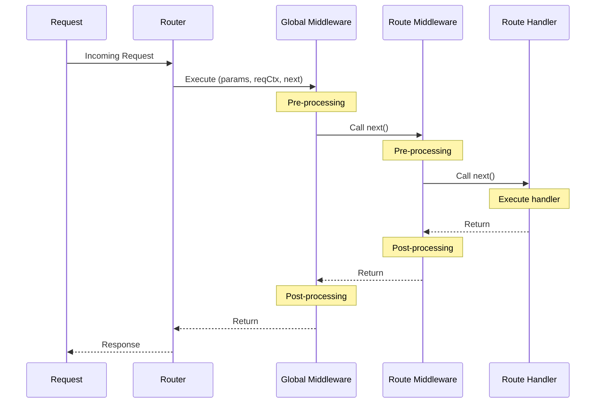
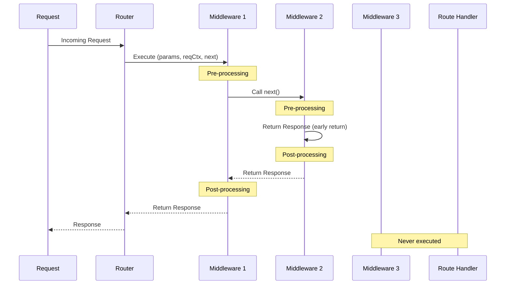
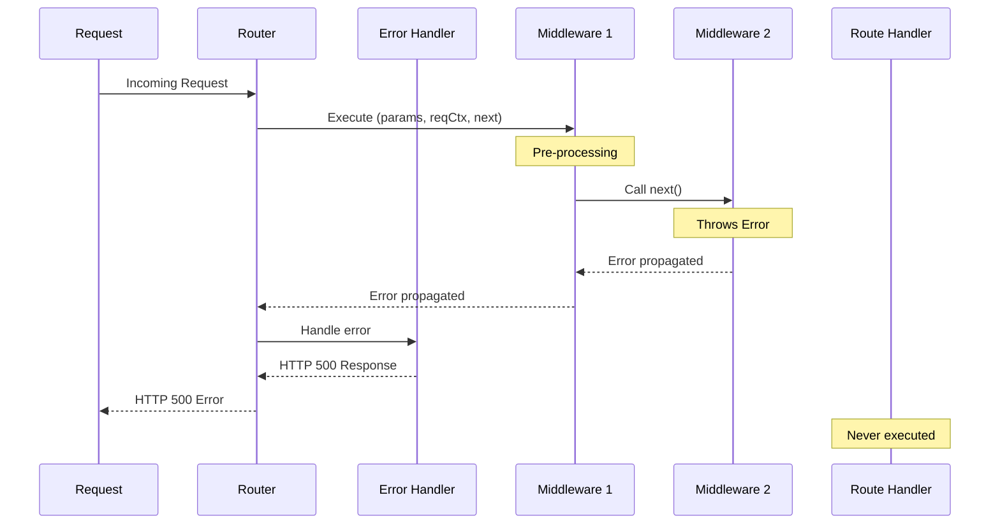
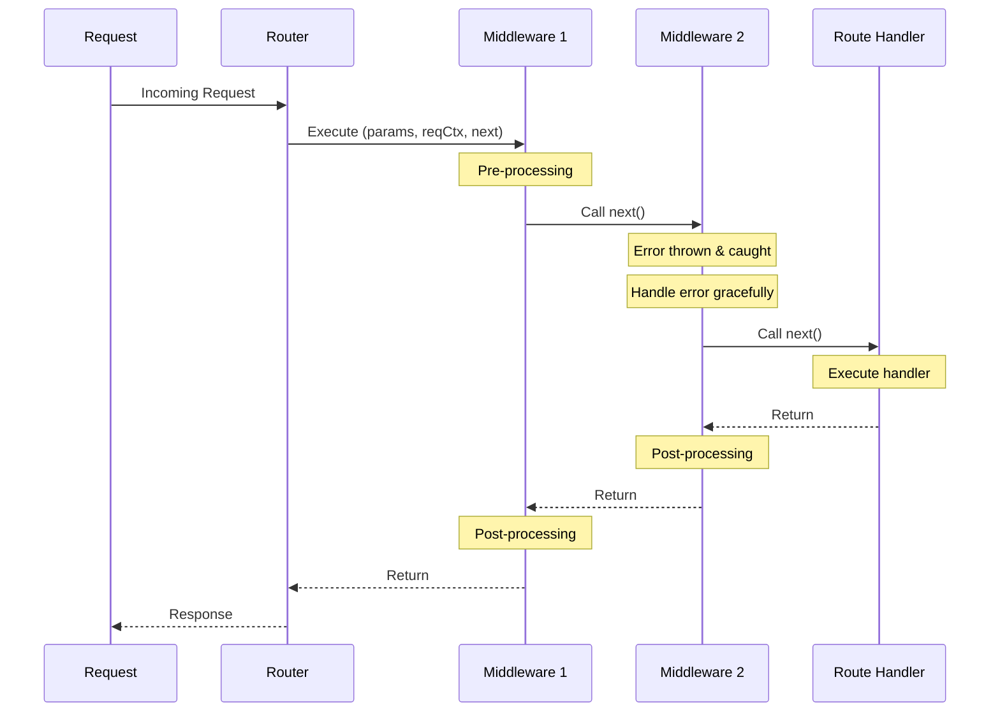
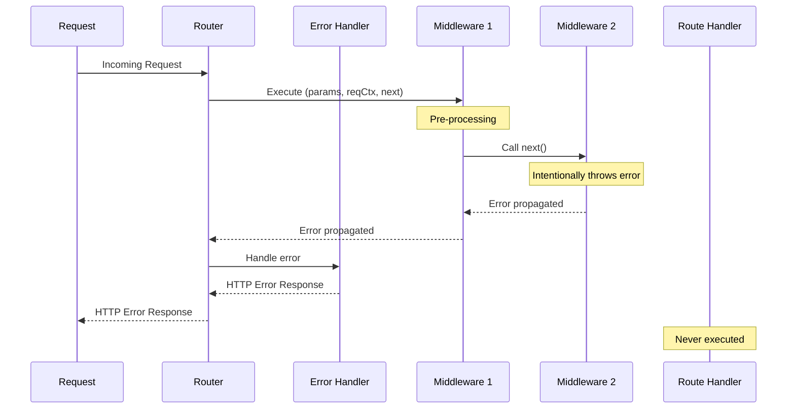

!!! warning "Feature status"
     This feature is under active development and may undergo significant changes. We recommend using it in non-critical workloads and [providing feedback](https://github.com/aws-powertools/powertools-lambda-typescript/issues/new/choose){target="_blank"} to help us improve it.

Event handler for Amazon API Gateway REST and HTTP APIs, Application Loader Balancer (ALB), Lambda Function URLs, and VPC Lattice.

## Key Features

* Lightweight routing to reduce boilerplate for API Gateway REST/HTTP API, ALB and Lambda Function URLs.
* Built-in middleware engine for request/response transformation and validation.
* Works with micro function (one or a few routes) and monolithic functions (all routes)

## Getting started

### Install

!!! info "This is not necessary if you're installing Powertools for AWS Lambda (TypeScript) via [Lambda layer](../../getting-started/lambda-layers.md)."

```shell
npm install @aws-lambda-powertools/event-handler
```

### Required resources

If you're using any API Gateway integration, you must have an existing [API Gateway Proxy integration](https://docs.aws.amazon.com/apigateway/latest/developerguide/set-up-lambda-proxy-integrations.html){target="_blank"} or [ALB](https://docs.aws.amazon.com/elasticloadbalancing/latest/application/lambda-functions.html){target="_blank"} configured to invoke your Lambda function.

In case of using [VPC Lattice](https://docs.aws.amazon.com/lambda/latest/dg/services-vpc-lattice.html){target="_blank"}, you must have a service network configured to invoke your Lambda function.

This is the sample infrastructure for API Gateway and Lambda Function URLs we are using for the examples in this documentation. There is no additional permissions or dependencies required to use this utility.

??? "See Infrastructure as Code (IaC) examples"
    === "API Gateway SAM Template"

        ```yaml title="AWS Serverless Application Model (SAM) example"
        --8<-- "examples/snippets/event-handler/rest/templates/api_gateway.yml"
        ```

### Route events

Before you start defining your routes, it's important to understand how the event handler works with different types of events. The event handler can process events from API Gateway REST APIs, and will soon support HTTP APIs, ALB, Lambda Function URLs, and VPC Lattice as well.

When a request is received, the event handler will automatically convert the event into a [`Request`](https://developer.mozilla.org/en-US/docs/Web/API/Request) object and give you access to the current request context, including headers, query parameters, and request body, as well as path parameters via typed arguments.

#### Response auto-serialization

!!! tip "Want full control over the response, headers, and status code? Read about it in the [Fine grained responses](#fine-grained-responses) section."

For your convenience, when you return a JavaScript object from your route handler, we automatically perform these actions:

* Auto-serialize the response to JSON and trim whitespace
* Include the response under the appropriate equivalent of a `body`
* Set the `Content-Type` header to `application/json`
* Set the HTTP status code to 200 (OK)

=== "index.ts"

    ```ts hl_lines="6"
    --8<-- "examples/snippets/event-handler/rest/gettingStarted_serialization.ts"
    ```

    1. This object will be serialized, trimmed, and included under the `body` key

=== "JSON response"

    ```json hl_lines="6"
    --8<-- "examples/snippets/event-handler/rest/samples/gettingStarted_serialization.json"
    ```

### Dynamic routes

You can use `/todos/:todoId` to configure dynamic URL paths, where `:todoId` will be resolved at runtime.

All dynamic route parameters will be available as typed object properties in the first argument of your route handler.

=== "index.ts"

    ```ts hl_lines="14"
    --8<-- "examples/snippets/event-handler/rest/gettingStarted_dynamic_routes.ts:3"
    ```

=== "Request"

    ```json
    --8<-- "examples/snippets/event-handler/rest/samples/gettingStarted_dynamic_routes.json"
    ```

You can also nest dynamic paths, for example `/todos/:todoId/comments/:commentId`, where both `:todoId` and `:commentId` will be resolved at runtime.

### HTTP Methods

You can use dedicated methods to specify the HTTP method that should be handled in each resolver. That is, `app.<httpMethod>`, where the HTTP method could be `delete`, `get`, `head`, `patch`, `post`, `put`, `options`.

=== "index.ts"

    ```ts hl_lines="14 16"
    --8<-- "examples/snippets/event-handler/rest/gettingStarted_methods.ts:3"
    ```

=== "Request"

    ```json
    --8<-- "examples/snippets/event-handler/rest/samples/gettingStarted_methods.json"
    ```

If you need to accept multiple HTTP methods in a single function, or support an HTTP method for which no dedicated method exists (i.e. [`TRACE`](https://developer.mozilla.org/en-US/docs/Web/HTTP/Reference/Methods/TRACE){target="_blank"}), you can use the `route` method and pass a list of HTTP methods.

=== "index.ts"

    ```ts hl_lines="21-24"
    --8<-- "examples/snippets/event-handler/rest/gettingStarted_multi_methods.ts:3"
    ```

!!! tip
    We generally recommend to have separate functions for each HTTP method, as the functionality tends to differ depending on which method is used.

### Data validation

!!! note "Coming soon"
    Please [open an issue](https://github.com/aws-powertools/powertools-lambda-typescript/issues/new/choose) if you would like us to prioritize this feature.

### Accessing request details

You can access request details such as headers, query parameters, and body using the `Request` object provided to your route handlers.

### Handling not found routes

!!! note "Coming soon"
    Please [open an issue](https://github.com/aws-powertools/powertools-lambda-typescript/issues/new/choose){target="_blank"} if you would like us to prioritize this feature.

### Error handling

!!! note "Coming soon"
    Please [open an issue](https://github.com/aws-powertools/powertools-lambda-typescript/issues/new/choose){target="_blank"} if you would like us to prioritize this feature.

### Throwing HTTP errors

!!! note "Coming soon"
    Please [open an issue](https://github.com/aws-powertools/powertools-lambda-typescript/issues/new/choose){target="_blank"} if you would like us to prioritize this feature.

### Enabling SwaggerUI

!!! note "Coming soon"
    Please [open an issue](https://github.com/aws-powertools/powertools-lambda-typescript/issues/new/choose){target="_blank"} if you would like us to prioritize this feature.

### Custom domains

!!! note "Coming soon"
    Please [open an issue](https://github.com/aws-powertools/powertools-lambda-typescript/issues/new/choose){target="_blank"} if you would like us to prioritize this feature.

## Advanced

### CORS

You can configure CORS at the router level via the `cors` middleware.

!!! note "Coming soon"

### Middleware

Middleware are functions that execute during the request-response cycle, sitting between the
incoming request and your route handler. They provide a way to implement cross-cutting
concerns like authentication, logging, validation, and response transformation without
cluttering your route handlers.

Each middleware function receives the following arguments:

* **params** Route parameters extracted from the URL path
* **reqCtx** Request context containing the event, Lambda context, request, and response objects
* **next** A function to pass control to the next middleware in the chain

Middleware can be applied on specific routes, globally on all routes, or a combination of both.

Middleware execution follows an onion pattern where global middleware runs first in
pre-processing, then route-specific middleware. After the handler executes, the order reverses
for post-processing. When middleware modify the same response properties, the middleware that
executes last in post-processing wins.



#### Registering middleware

You can use `app.use` to register middleware that should always run regardless of the route
and you can apply middleware to specific routes by passing them as arguments before the route
handler.

=== "index.ts"

    ```ts hl_lines="9-14 16-21 31"
    --8<-- "examples/snippets/event-handler/rest/advanced_mw_middleware_order.ts:3"
    ```

=== "JSON Response"

    ```json hl_lines="6-7"
    --8<-- "examples/snippets/event-handler/rest/samples/advanced_mw_middleware_order.json"
    ```

#### Returning early

There are cases where you may want to terminate the execution of the middleware chain early. To
do so, middleware can short-circuit processing by returning a `Response` or JSON object
instead of calling `next()`. Neither the handler nor any subsequent middleware will run
but the post-processing of already executed middleware will.



=== "index.ts"

    ```ts hl_lines="13-18"
    --8<-- "examples/snippets/event-handler/rest/advanced_mw_early_return.ts:3"
    ```

=== "JSON Response"

    ```json hl_lines="2"
    --8<-- "examples/snippets/event-handler/rest/samples/advanced_mw_early_return.json"
    ```

#### Error Handling

By default, any unhandled error in the middleware chain will be propagated as a HTTP
500 back to the client. As you would expect, unlike early return, this stops the middleware
chain entirely and no post-processing steps for any previously executed middleware will occur.



<center>*Unhandled errors*</center>

You can handle errors in middleware as you would anywhere else, simply surround your code in
a `try`/`catch` block and processing will occur as usual.



<center>*Handled errors*</center>

Similarly, you can choose to stop processing entirely by throwing an error in your
middleware. Event handler provides many [built-in HTTP errors](#throwing-http-errors) that
you can use or you can throw a custom error of your own. As noted above, this means
that no post-processing of your request will occur.



<center>*Intentional errors*</center>

#### Custom middleware

A common pattern to create reusable middleware is to implement a factory functions that
accepts configuration options and returns a middleware function.

=== "index.ts"

    ```ts hl_lines="5-26 31"
    --8<-- "examples/snippets/event-handler/rest/advanced_mw_custom_middleware.ts:3"
    ```

In this example we have a middleware that acts only in the post-processing stage as all
the logic occurs after the `next` function has been called. This is so as to ensure that
the handler has run and we have access to request body.

#### Avoiding destructuring pitfalls

!!! warning "Critical: Never destructure the response object"
    When writing middleware, always access the response through `reqCtx.res` rather than destructuring `{ res }` from the request context. Destructuring captures a reference to the original response object, which becomes stale when middleware replaces the response.

=== "index.ts"

    ```ts hl_lines="6 14-15"
    --8<-- "examples/snippets/event-handler/rest/advanced_mw_destructuring_problem.ts:3"
    ```

During the middleware execution chain, the response object (`reqCtx.res`) can be replaced by
other middleware or the route handler. When you destructure the request context, you capture
a reference to the response object as it existed at that moment, not the current response.

#### Composing middleware

You can create reusable middleware stacks by using the `composeMiddleware` function to combine
multiple middleware into a single middleware function. This is useful for creating standardized
middleware combinations that can be shared across different routes or applications.

=== "index.ts"

    ```ts hl_lines="33-34 39"
    --8<-- "examples/snippets/event-handler/rest/advanced_mw_compose_middleware.ts:3"
    ```

The `composeMiddleware` function maintains the same execution order as if you had applied the
middleware individually, following the onion pattern where middleware execute in order during
pre-processing and in reverse order during post-processing.

!!! note "Composition order"
    Unlike traditional function composition which typically works right-to-left, `composeMiddleware` follows the convention used by most web frameworks and executes middleware left-to-right (first to last in the array). This means `composeMiddleware([a, b, c])` executes middleware `a` first, then `b`, then `c`.

#### Being a good citizen

Middleware can add subtle improvements to request/response processing, but also add significant complexity if you're not careful.

Keep the following in mind when authoring middleware for Event Handler:

* **Call the next middleware.** If you are not returning early by returning a `Response` object
 or JSON object, always ensure you call the `next` function.
* **Keep a lean scope.** Focus on a single task per middleware to ease composability and maintenance.
* **Catch your own errors.** Catch and handle known errors to your logic, unless you want to raise HTTP Errors, or propagate specific errors to the client.
* **Avoid destructuring the response object.** As mentioned in the [destructuring pitfalls](#avoiding-destructuring-pitfalls) section, always access the response through `reqCtx.res` rather than destructuring to avoid stale references.

### Fine grained responses

You can use the Web API's `Response` object to have full control over the response. For
example, you might want to add additional headers, cookies, or set a custom content type.

=== "index.ts"

    ```ts hl_lines="11-19 25-32"
    --8<-- "examples/snippets/event-handler/rest/advanced_fine_grained_responses.ts:6"
    ```

=== "JSON Response"

    ```json hl_lines="4-6"
    --8<-- "examples/snippets/event-handler/rest/samples/advanced_fine_grained_responses.json"
    ```

### Response streaming

!!! note "Coming soon"
    Please [open an issue](https://github.com/aws-powertools/powertools-lambda-typescript/issues/new/choose) if you would like us to prioritize this feature.

### Compress

You can compress with gzip and base64 encode your responses via the `compress` parameter. You have the option to pass the `compress` parameter when working with a specific route or setting the correct `Accept-Encoding` header in the `Response` object.

!!! note "Coming soon"
    Please [open an issue](https://github.com/aws-powertools/powertools-lambda-typescript/issues/new/choose) if you would like us to prioritize this feature.

### Binary responses

!!! warning "Using API Gateway?"
    Amazon API Gateway does not support `*/*` binary media type when [CORS](#cors) is also configured. This feature requires API Gateway to configure binary media types, see our [sample infrastructure](#required-resources) for reference.

For convenience, we automatically base64 encode binary responses. You can also use it in combination with the `compress` parameter if your client supports gzip.

Like the `compress` feature, the client must send the `Accept` header with the correct media type.

!!! tip
    Lambda Function URLs handle binary media types automatically.

!!! note "Coming soon"
    Please [open an issue](https://github.com/aws-powertools/powertools-lambda-typescript/issues/new/choose) if you would like us to prioritize this feature.

### Debug mode

You can enable debug mode via the `POWERTOOLS_DEV` environment variable.

This will enable full stack traces errors in the response, log request and responses, and set CORS in development mode.

!!! note "Coming soon"
    Please [open an issue](https://github.com/aws-powertools/powertools-lambda-typescript/issues/new/choose) if you would like us to prioritize this feature.

### OpenAPI

When you enable [Data Validation](#data-validation), we use a combination of Zod and JSON Schemas to add constraints to your API's parameters.

In OpenAPI documentation tools like [SwaggerUI](#enabling-swaggerui), these annotations become readable descriptions, offering a self-explanatory API interface. This reduces boilerplate code while improving functionality and enabling auto-documentation.

!!! note "Coming soon"
    Please [open an issue](https://github.com/aws-powertools/powertools-lambda-typescript/issues/new/choose) if you would like us to prioritize this feature.

### Split routers

As you grow the number of routes a given Lambda function should handle, it is natural to either break into smaller Lambda functions, or split routes into separate files to ease maintenance - that's where the split `Router` feature is useful.

!!! note "Coming soon"
    Please [open an issue](https://github.com/aws-powertools/powertools-lambda-typescript/issues/new/choose) if you would like us to prioritize this feature.

### Considerations

This utility is optimized for AWS Lambda computing model and prioritizes fast startup, minimal feature set, and quick onboarding for triggers supported by Lambda.

Event Handler naturally leads to a single Lambda function handling multiple routes for a given service, which can be eventually broken into multiple functions.

Both single (monolithic) and multiple functions (micro) offer different set of trade-offs worth knowing.

!!! tip "TL;DR;"
    Start with a monolithic function, add additional functions with new handlers, and possibly break into micro functions if necessary.

#### Monolithic function


A monolithic function means that your final code artifact will be deployed to a single function. This is generally the best approach to start.

_**Benefits**_

* **Code reuse.** It's easier to reason about your service, modularize it and reuse code as it grows. Eventually, it can be turned into a standalone library.
* **No custom tooling.** Monolithic functions are treated just like normal Typescript packages; no upfront investment in tooling.
* **Faster deployment and debugging.** Whether you use all-at-once, linear, or canary deployments, a monolithic function is a single deployable unit. IDEs like WebStorm and VSCode have tooling to quickly profile, visualize, and step through debug any Typescript package.

_**Downsides**_

* **Cold starts.** Frequent deployments and/or high load can diminish the benefit of monolithic functions depending on your latency requirements, due to the [Lambda scaling model](https://docs.aws.amazon.com/lambda/latest/dg/invocation-scaling.html){target="_blank"}. Always load test to find a pragmatic balance between customer experience and developer cognitive load.
* **Granular security permissions.** The micro function approach enables you to use fine-grained permissions and access controls, separate external dependencies and code signing at the function level. Conversely, you could have multiple functions while duplicating the final code artifact in a monolithic approach. Regardless, least privilege can be applied to either approaches.
* **Higher risk per deployment.** A misconfiguration or invalid import can cause disruption if not caught early in automated testing. Multiple functions can mitigate misconfigurations but they will still share the same code artifact. You can further minimize risks with multiple environments in your CI/CD pipeline.

#### Micro function


A micro function means that your final code artifact will be different to each function deployed. This is generally the approach to start if you're looking for fine-grain control and/or high load on certain parts of your service.

_**Benefits**_

* **Granular scaling.** A micro function can benefit from the [Lambda scaling model](https://docs.aws.amazon.com/lambda/latest/dg/invocation-scaling.html){target="_blank"} to scale differently depending on each part of your application. Concurrency controls and provisioned concurrency can also be used at a granular level for capacity management.
* **Discoverability.** Micro functions are easier to visualize when using distributed tracing. Their high-level architectures can be self-explanatory, and complexity is highly visible — assuming each function is named after the business purpose it serves.
* **Package size.** An independent function can be significantly smaller (KB vs MB) depending on the external dependencies it requires to perform its purpose. Conversely, a monolithic approach can benefit from [Lambda Layers](https://docs.aws.amazon.com/lambda/latest/dg/invocation-layers.html){target="_blank"} to optimize builds for external dependencies.

_**Downsides**_

* **Upfront investment.** You need custom build tooling to bundle assets, including [native bindings for runtime compatibility](https://docs.aws.amazon.com/lambda/latest/dg/lambda-runtimes.html){target="_blank"}. Operations become more elaborate — you need to standardize tracing labels/annotations, structured logging, and metrics to pinpoint root causes.
* **Engineering discipline** is necessary for both approaches. However, the micro-function approach requires further attention to consistency as the number of functions grow, just like any distributed system.
* **Harder to share code.** Shared code must be carefully evaluated to avoid unnecessary deployments when this code changes. Equally, if shared code isn't a library, your development, building, deployment tooling need to accommodate the distinct layout.
* **Slower safe deployments.** Safely deploying multiple functions require coordination — AWS CodeDeploy deploys and verifies each function sequentially. This increases lead time substantially (minutes to hours) depending on the deployment strategy you choose. You can mitigate it by selectively enabling it in prod-like environments only, and where the risk profile is applicable.
Automated testing, operational and security reviews are essential to stability in either approaches.

## Testing your code

!!! note "Coming soon"
    Please open an issue if you would like us to prioritize this section.
