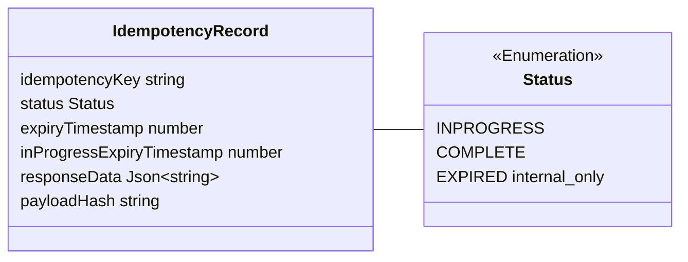
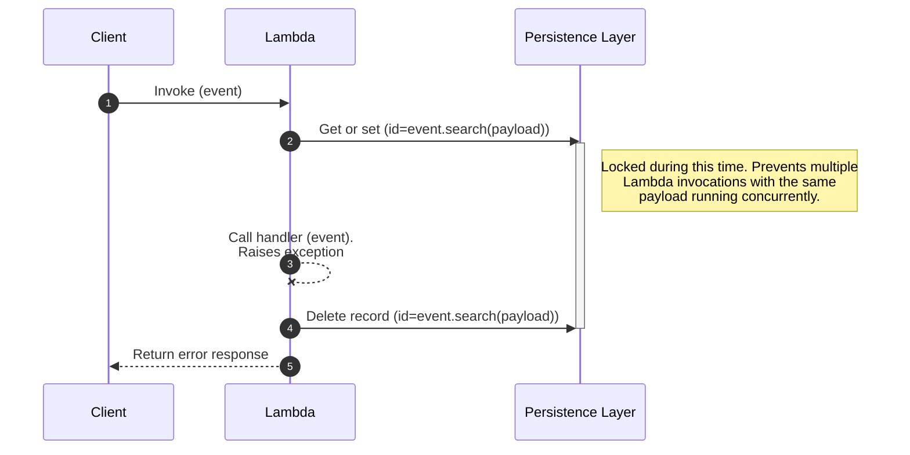
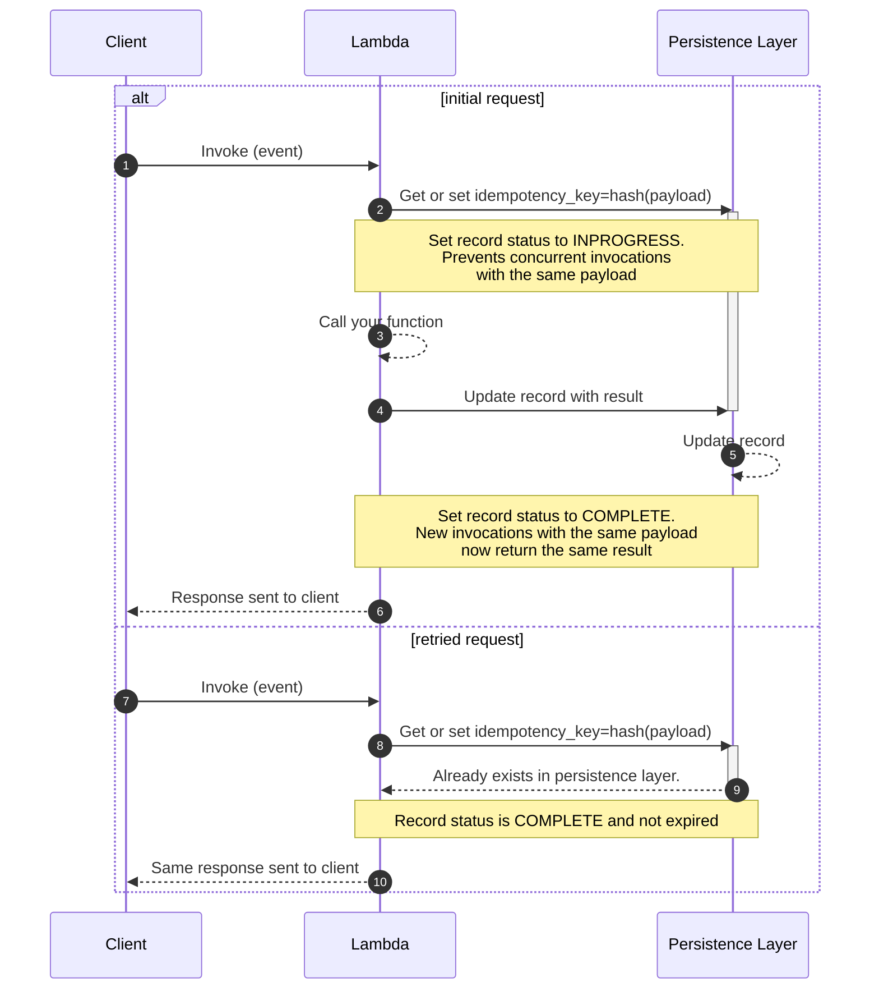
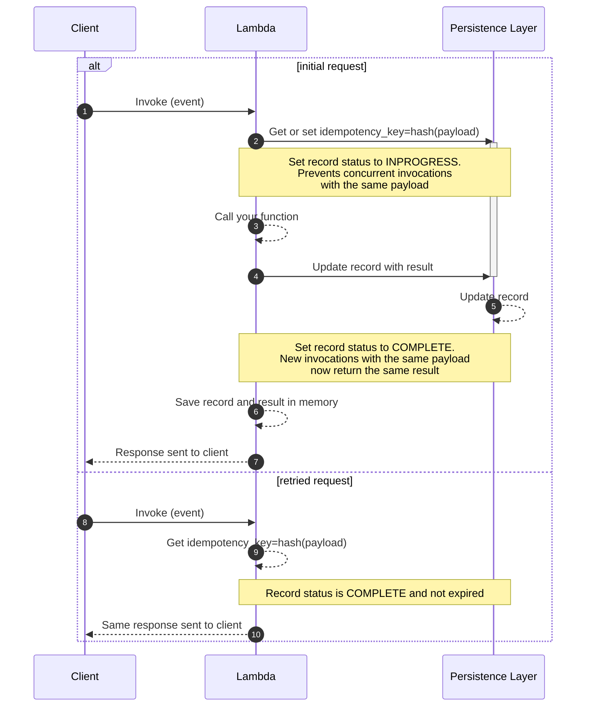
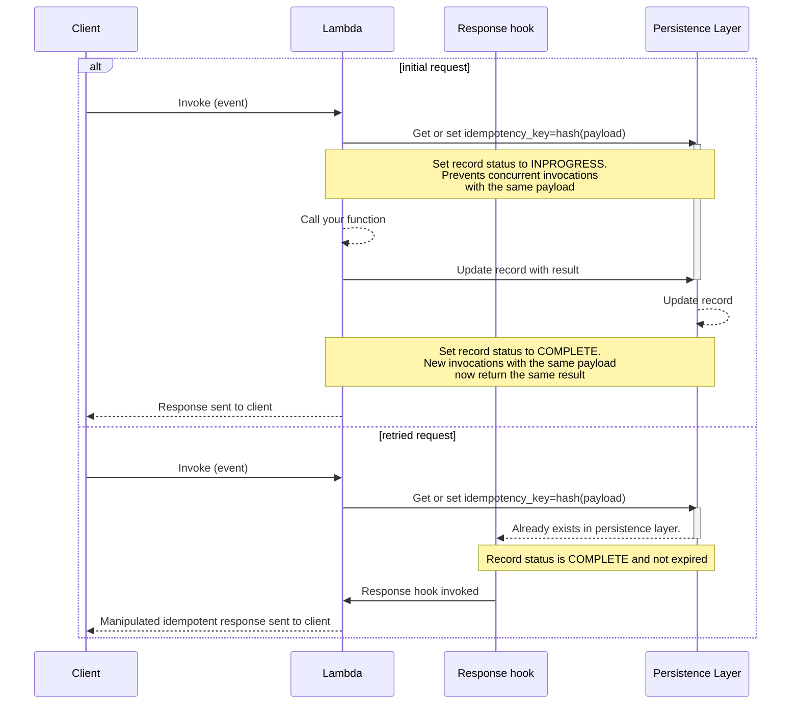
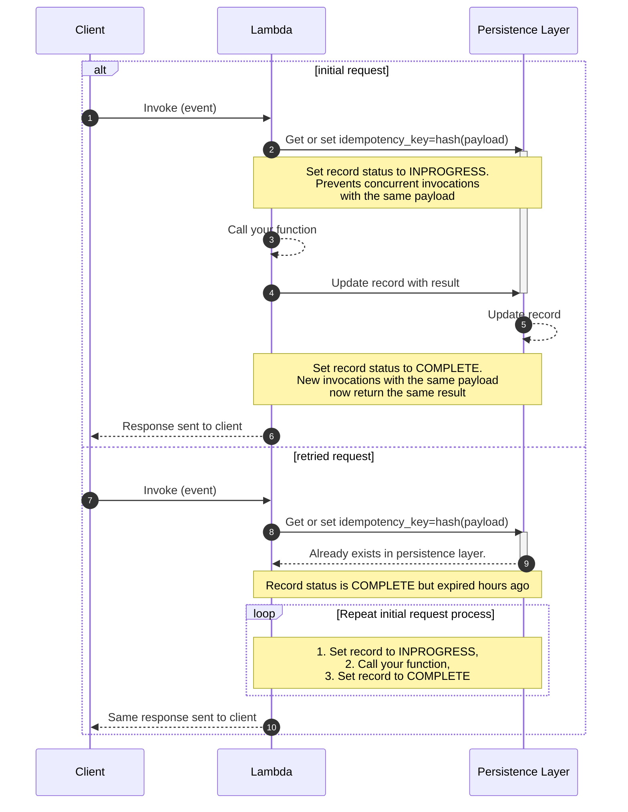
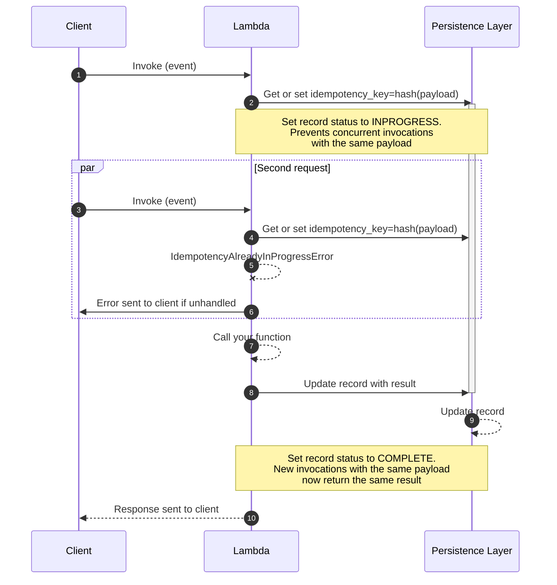
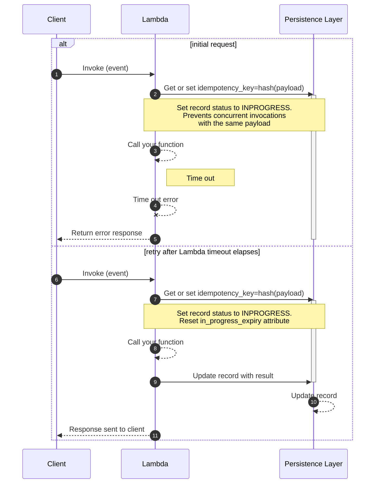
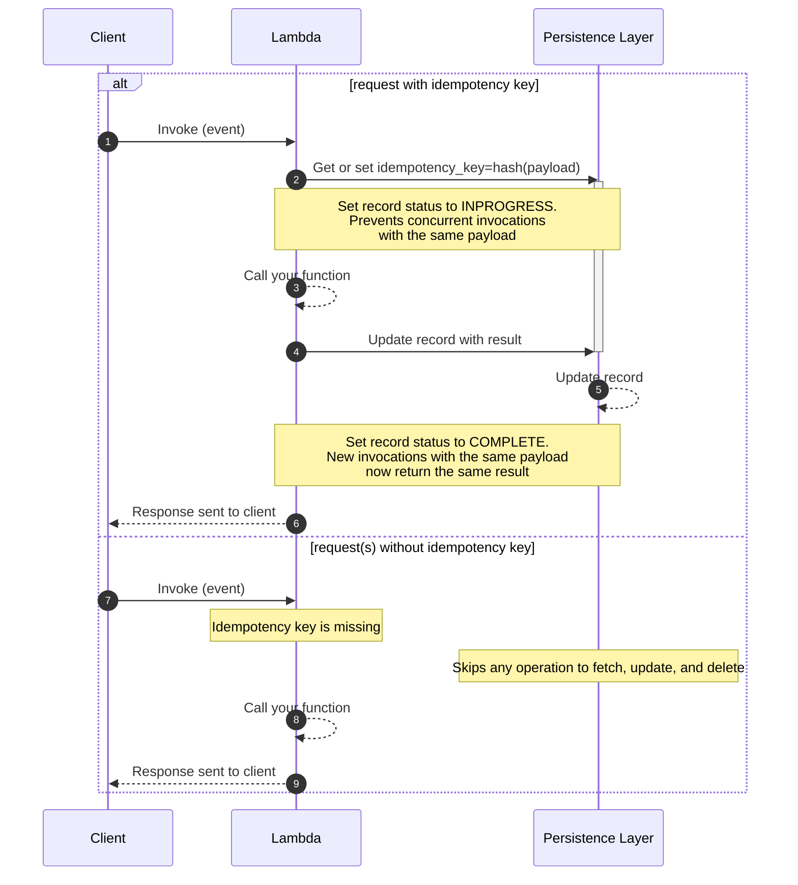
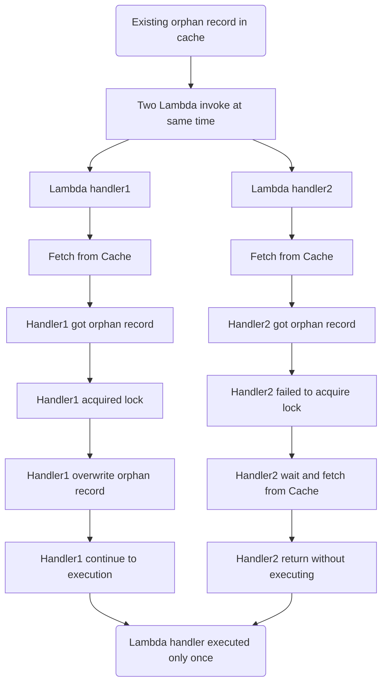

The idempotency utility provides a simple solution to convert your Lambda functions into idempotent operations which are safe to retry.

## Key features

* Prevent Lambda handler from executing more than once on the same event payload during a time window
* Ensure Lambda handler returns the same result when called with the same payload
* Select a subset of the event as the idempotency key using JMESPath expressions
* Set a time window in which records with the same payload should be considered duplicates
* Expires in-progress executions if the Lambda function times out halfway through
* Support for Amazon DynamoDB, Valkey, Redis OSS, or any Redis-compatible cache as the persistence layer

## Terminology

The property of idempotency means that an operation does not cause additional side effects if it is called more than once with the same input parameters.

**Idempotent operations will return the same result when they are called multiple times with the same parameters**. This makes idempotent operations safe to retry.

**Idempotency key** is a hash representation of either the entire event or a specific configured subset of the event, and invocation results are **JSON serialized** and stored in your persistence storage layer.

**Idempotency record** is the data representation of an idempotent request saved in your preferred  storage layer. We use it to coordinate whether a request is idempotent, whether it's still valid or expired based on timestamps, etc.

<center>


<i>Idempotency record representation</i>
</center>

## Getting started

We use Amazon DynamoDB as the default persistence layer in the documentation. If you prefer Cache, you can learn more from [this section](#cache-database).

### Installation

Install the library in your project

```shell
npm i @aws-lambda-powertools/idempotency @aws-sdk/client-dynamodb @aws-sdk/lib-dynamodb
```

While we support Amazon DynamoDB as a persistence layer out of the box, you need to bring your own AWS SDK for JavaScript v3 DynamoDB client.

???+ note
    This utility supports **[AWS SDK for JavaScript v3](https://docs.aws.amazon.com/AWSJavaScriptSDK/v3/latest/){target="_blank"} only**. If you are using the `nodejs18.x` runtime or newer, the AWS SDK for JavaScript v3 is already installed and you can install only the utility.

### IAM Permissions

Your Lambda function IAM Role must have `dynamodb:GetItem`, `dynamodb:PutItem`, `dynamodb:UpdateItem` and `dynamodb:DeleteItem` IAM permissions before using this feature. If you're using one of our examples: [AWS Serverless Application Model (SAM)](#required-resources) or [Terraform](#required-resources) the required permissions are already included.

### Required resources

To start, you'll need:

<!-- markdownlint-disable MD030 -->

<div class="grid cards" markdown>
*   :octicons-database-16:{ .lg .middle } __Persistent storage__

    ---

    [Amazon DynamoDB](#dynamodb-table) or [Cache](#cache-database)

*   :simple-awslambda:{ .lg .middle } **AWS Lambda function**

    ---

    With permissions to use your persistent storage

</div>

Before getting started, you need to create a persistent storage layer where the idempotency utility can store its state - your lambda functions will need read and write access to it.

#### DynamoDB table

You'll need to create a table first.

**Default table configuration**

If you're not [changing the default configuration for the DynamoDB persistence layer](#dynamodbpersistencelayer), this is the expected default configuration:

| Configuration      | Default value | Notes                                                                                  |
| ------------------ | :------------ | -------------------------------------------------------------------------------------- |
| Partition key      | `id`          | The id of each idempotency record which a combination of `functionName#hashOfPayload`. |
| TTL attribute name | `expiration`  | This can only be configured after your table is created if you're using AWS Console.   |

???+ tip "Tip: You can share a single state table for all functions"
    You can reuse the same DynamoDB table to store idempotency state. We add the Lambda function name in addition to the idempotency key as a hash key.

=== "AWS Cloud Development Kit (CDK) example"

    ```typescript title="template.ts" hl_lines="11-18 25"
    --8<-- "examples/snippets/idempotency/templates/tableCdk.ts"
    ```

=== "AWS Serverless Application Model (SAM) example"

    ```yaml title="template.yaml" hl_lines="6-14"
    --8<-- "examples/snippets/idempotency/templates/tableSam.yaml"
    ```

=== "Terraform example"

    ```terraform title="template.tf" hl_lines="14-26 64-70"
    --8<-- "examples/snippets/idempotency/templates/tableTerraform.tf"
    ```

???+ warning "Warning: Large responses with DynamoDB persistence layer"
    When using this utility with DynamoDB, your function's responses must be [smaller than 400KB](https://docs.aws.amazon.com/amazondynamodb/latest/developerguide/Limits.html#limits-items){target="_blank"}.

    Larger items cannot be written to DynamoDB and will cause exceptions.

???+ info "Info: DynamoDB"
    Each function invocation will make only 1 request to DynamoDB by using DynamoDB's [conditional expressions](https://docs.aws.amazon.com/amazondynamodb/latest/developerguide/Expressions.ConditionExpressions.html){target="_blank"} to ensure that we don't overwrite existing records,
    and [ReturnValuesOnConditionCheckFailure](https://docs.aws.amazon.com/amazondynamodb/latest/APIReference/API_PutItem.html#DDB-PutItem-request-ReturnValuesOnConditionCheckFailure){target="_blank"} to return the record if it exists.
    See [AWS Blog post on handling conditional write errors](https://aws.amazon.com/blogs/database/handle-conditional-write-errors-in-high-concurrency-scenarios-with-amazon-dynamodb/) for more details.
    For retried invocations, you will see 1WCU and 1RCU.
    Review the [DynamoDB pricing documentation](https://aws.amazon.com/dynamodb/pricing/){target="_blank"} to estimate the cost.

#### Cache database

We recommend you start with a Redis compatible management services such as [Amazon ElastiCache for Redis](https://aws.amazon.com/elasticache/redis/){target="_blank"} or [Amazon MemoryDB for Redis](https://aws.amazon.com/memorydb/){target="_blank"}.

In both services, you'll need to configure [VPC access](https://docs.aws.amazon.com/lambda/latest/dg/configuration-vpc.html){target="_blank"} to your AWS Lambda.

##### Cache IaC examples

!!! tip inline end "Prefer AWS Console/CLI?"

    Follow the official tutorials for [Amazon ElastiCache for Redis](https://docs.aws.amazon.com/AmazonElastiCache/latest/red-ug/LambdaRedis.html){target="_blank"} or [Amazon MemoryDB for Redis](https://aws.amazon.com/blogs/database/access-amazon-memorydb-for-redis-from-aws-lambda/){target="_blank"}

=== "Valkey AWS CloudFormation example"

    ```yaml hl_lines="5 21"
    --8<-- "examples/snippets/idempotency/templates/valkeyServerlessCloudformation.yml"
    ```

    1. Replace the Security Group ID and Subnet ID to match your VPC settings.
    2. Replace the Security Group ID and Subnet ID to match your VPC settings.

=== "Redis AWS CloudFormation example"

    ```yaml hl_lines="5 21"
    --8<-- "examples/snippets/idempotency/templates/redisServerlessCloudformation.yml"
    ```

    1. Replace the Security Group ID and Subnet ID to match your VPC settings.
    2. Replace the Security Group ID and Subnet ID to match your VPC settings.
    

Once setup, you can find a quick start example for Cache in [the persistent layers section](#cachepersistencelayer).

### MakeIdempotent function wrapper

You can quickly start by initializing the `DynamoDBPersistenceLayer` class and using it with the `makeIdempotent` function wrapper on your Lambda handler.

=== "index.ts"

    ```typescript hl_lines="2-3 21 35-38"
    --8<-- "examples/snippets/idempotency/makeIdempotentBase.ts"
    ```

=== "types.ts"

    ```typescript
    --8<-- "examples/snippets/idempotency/types.ts:3:16"
    ```

After processing this request successfully, a second request containing the exact same payload above will now return the same response, ensuring our customer isn't charged twice.

???+ note
    In this example, the entire Lambda handler is treated as a single idempotent operation. If your Lambda handler can cause multiple side effects, or you're only interested in making a specific logic idempotent, use the `makeIdempotent` high-order function only on the function that needs to be idempotent.

    See [Choosing a payload subset for idempotency](#choosing-a-payload-subset-for-idempotency) for more elaborate use cases.

You can also use the `makeIdempotent` function wrapper on any method that returns a response to make it idempotent. This is useful when you want to make a specific logic idempotent, for example when your Lambda handler performs multiple side effects and you only want to make a specific one idempotent.

???+ warning "Limitation"
    Make sure to return a JSON serializable response from your function, otherwise you'll get an error.

When using `makeIdempotent` on arbitrary functions, you can tell us which argument in your function signature has the data we should use via **`dataIndexArgument`**. If you don't specify this argument, we'll use the first argument in the function signature.

=== "index.ts"

    ```typescript hl_lines="22 34-38"
    --8<-- "examples/snippets/idempotency/makeIdempotentAnyFunction.ts"
    ```

=== "types.ts"

    ```typescript
    --8<-- "examples/snippets/idempotency/types.ts:3:16"
    ```

The function this example has two arguments, note that while wrapping it with the `makeIdempotent` high-order function, we specify the `dataIndexArgument` as `1` to tell the decorator that the second argument is the one with the data we should use to make the function idempotent. Remember that arguments are zero-indexed, so the first argument is `0`, the second is `1`, etc.

### Idempotent Decorator

You can also use the `@idempotent` decorator to make your Lambda handler idempotent, similar to the `makeIdempotent` function wrapper.

=== "index.ts"

    ```typescript hl_lines="17"
    --8<-- "examples/snippets/idempotency/idempotentDecoratorBase.ts"
    ```

=== "types.ts"

    ```typescript
    --8<-- "examples/snippets/idempotency/types.ts"
    ```

### MakeHandlerIdempotent Middy middleware

If you are using [Middy.js](https://middy.js.org){target="_blank"} as your middleware engine, you can use the `makeHandlerIdempotent` middleware to make your Lambda handler idempotent.

Similar to the `makeIdempotent` function wrapper, you can quickly make your Lambda handler idempotent by initializing the `DynamoDBPersistenceLayer` class and using it with the `makeHandlerIdempotent` middleware.

=== "index.ts"

    ```typescript hl_lines="22 36-40"
    --8<-- "examples/snippets/idempotency/makeHandlerIdempotent.ts"
    ```

=== "types.ts"

    ```typescript
    --8<-- "examples/snippets/idempotency/types.ts:3:16"
    ```

For the middleware to work, your Lambda function handler must return a value different from `undefined`. This is a [known limitation of the early return feature in Middy.js](https://github.com/middyjs/middy/issues/1236). If your use case requires early returns, you can use the `makeIdempotent` function wrapper instead.

### Choosing a payload subset for idempotency

Use [`IdempotencyConfig`](#customizing-the-default-behavior) to instruct the idempotent decorator to only use a portion of your payload to verify whether a request is idempotent, and therefore it should not be retried. When dealing with a more elaborate payload, where parts of the payload always change, you should use the **`eventKeyJmesPath`** parameter.

**Payment scenario**

In this example, we have a Lambda handler that creates a payment for a user subscribing to a product. We want to ensure that we don't accidentally charge our customer by subscribing them more than once.

Imagine the function executes successfully, but the client never receives the response due to a connection issue. It is safe to retry in this instance, as the idempotent decorator will return a previously saved response.

**What we want here** is to instruct Idempotency to use the `user` and `productId` fields from our incoming payload as our idempotency key. If we were to treat the entire request as our idempotency key, a simple HTTP header or timestamp change would cause our customer to be charged twice.

???+ warning "Deserializing JSON strings in payloads for increased accuracy."
    The payload extracted by the `eventKeyJmesPath` is treated as a string by default. This means there could be differences in whitespace even when the JSON payload itself is identical.

    To alter this behaviour, we can use the [JMESPath built-in function `powertools_json()`](jmespath.md#powertools_json-function) to treat the payload as a JSON object rather than a string.

=== "index.ts"

    ```typescript hl_lines="4 27 49"
    --8<-- "examples/snippets/idempotency/makeIdempotentJmes.ts"
    ```

=== "Example event"

    ```json hl_lines="28"
    --8<-- "examples/snippets/idempotency/samples/makeIdempotentJmes.json"
    ```

=== "types.ts"

    ```typescript
    --8<-- "examples/snippets/idempotency/types.ts:3:16"
    ```

### Lambda timeouts

To prevent against extended failed retries when a [Lambda function times out](https://aws.amazon.com/premiumsupport/knowledge-center/lambda-verify-invocation-timeouts/), Powertools for AWS Lambda calculates and includes the remaining invocation available time as part of the idempotency record.
This is automatically done when you wrap your Lambda handler with the [makeIdempotent](#makeidempotent-function-wrapper) function wrapper, or use the [`makeHandlerIdempotent`](#makehandleridempotent-middy-middleware) Middy middleware.

???+ example
    If a second invocation happens **after** this timestamp, and the record is marked as `INPROGRESS`, we will execute the invocation again as if it was in the `EXPIRED` state (e.g, `expire_seconds` field elapsed).

    This means that if an invocation expired during execution, it will be quickly executed again on the next retry.

???+ important
    If you are only using the [makeIdempotent function wrapper](#makeidempotent-function-wrapper) to guard isolated parts of your code outside of your handler, you must use `registerLambdaContext` available in the [idempotency config object](#customizing-the-default-behavior) to benefit from this protection.

Here is an example on how you register the Lambda context in your handler:

=== "Registering Lambda Context"

    ```typescript hl_lines="13 38"
    --8<-- "examples/snippets/idempotency/makeIdempotentLambdaContext.ts"
    ```

### Handling exceptions

If you are making on your entire Lambda handler idempotent, any unhandled exceptions that are raised during the code execution will cause **the record in the persistence layer to be deleted**.
This means that new invocations will execute your code again despite having the same payload. If you don't want the record to be deleted, you need to catch exceptions within the idempotent function and return a successful response.

<center>

<i>Idempotent sequence exception</i>
</center>

If you are using `makeIdempotent` on any other function, any unhandled exceptions that are thrown _inside_ the wrapped function will cause the record in the persistence layer to be deleted, and allow the function to be executed again if retried.

If an error is thrown _outside_ the scope of the decorated function and after your function has been called, the persistent record will not be affected. In this case, idempotency will be maintained for your decorated function. Example:

=== "Handling exceptions"

    ```typescript hl_lines="39-40 47-48"
    --8<-- "examples/snippets/idempotency/workingWithExceptions.ts"
    ```

???+ warning
    **We will throw `IdempotencyPersistenceLayerError`** if any of the calls to the persistence layer fail unexpectedly.

    As this happens outside the scope of your decorated function, you are not able to catch it when making your Lambda handler idempotent.

### Idempotency request flow

The following sequence diagrams explain how the Idempotency feature behaves under different scenarios.

#### Successful request

<center>

<i>Idempotent successful request</i>
</center>

#### Successful request with cache enabled

!!! note "[In-memory cache is disabled by default](#using-in-memory-cache)."

<center>

<i>Idempotent successful request cached</i>
</center>

#### Successful request with responseHook configured

<center>

<i>Successful idempotent request with a response hook</i>
</center>

#### Expired idempotency records

<center>

<i>Previous Idempotent request expired</i>
</center>

#### Concurrent identical in-flight requests

<center>

<i>Concurrent identical in-flight requests</i>
</center>

#### Lambda request timeout

<center>

<i>Idempotent request during and after Lambda timeouts</i>
</center>

#### Optional idempotency key

<center>

<i>Optional idempotency key</i>
</center>

#### Race condition with Cache

<center>

<i>Race condition with Cache</i>
</center>

### Persistence layers

#### DynamoDBPersistenceLayer

This persistence layer is built-in, and you can either use an existing DynamoDB table or create a new one dedicated for idempotency state (recommended).

=== "Customizing DynamoDBPersistenceLayer to suit your table structure"

    ```typescript hl_lines="7-15"
    --8<-- "examples/snippets/idempotency/customizePersistenceLayer.ts"
    ```

When using DynamoDB as a persistence layer, you can alter the attribute names by passing these parameters when initializing the persistence layer:

| Parameter                | Required           | Default                              | Description                                                                                              |
| ------------------------ | ------------------ | ------------------------------------ | -------------------------------------------------------------------------------------------------------- |
| **tableName**            | :heavy_check_mark: |                                      | Table name to store state                                                                                |
| **keyAttr**              |                    | `id`                                 | Partition key of the table. Hashed representation of the payload (unless **sort_key_attr** is specified) |
| **expiryAttr**           |                    | `expiration`                         | Unix timestamp of when record expires                                                                    |
| **inProgressExpiryAttr** |                    | `in_progress_expiration`             | Unix timestamp of when record expires while in progress (in case of the invocation times out)            |
| **statusAttr**           |                    | `status`                             | Stores status of the lambda execution during and after invocation                                        |
| **dataAttr**             |                    | `data`                               | Stores results of successfully executed Lambda handlers                                                  |
| **validationKeyAttr**    |                    | `validation`                         | Hashed representation of the parts of the event used for validation                                      |
| **sortKeyAttr**          |                    |                                      | Sort key of the table (if table is configured with a sort key).                                          |
| **staticPkValue**        |                    | `idempotency#{LAMBDA_FUNCTION_NAME}` | Static value to use as the partition key. Only used when **sort_key_attr** is set.                       |

#### CachePersistenceLayer

The `CachePersistenceLayer` enables you to use Valkey, Redis OSS, or any Redis-compatible cache as the persistence layer for idempotency state. To use it, initialize `CachePersistenceLayer` with a connected Redis-compatible client.

=== "Using Valkey Client"
    ```typescript hl_lines="9-18 21"
    --8<-- "examples/snippets/idempotency/cachePersistenceLayerValkey.ts"
    ```

=== "Using Redis Client"
    ```typescript hl_lines="9-12 15"
    --8<-- "examples/snippets/idempotency/cachePersistenceLayerRedis.ts"
    ```

##### Cache attributes

When using Cache as a persistence layer, you can alter the attribute names by passing these parameters when initializing the persistence layer:

| Parameter                | Required           | Default                              | Description                                                                                              |
| ------------------------ | ------------------ | ------------------------------------ | -------------------------------------------------------------------------------------------------------- |
| **client**               |  :heavy_check_mark: |                                      | A connected Redis-compatible client instance                                                              |
| **expiryAttr**           |                    | `expiration`                         | Unix timestamp of when record expires                                                                    |
| **inProgressExpiryAttr** |                    | `in_progress_expiration`             | Unix timestamp of when record expires while in progress (in case of the invocation times out)            |
| **statusAttr**           |                    | `status`                             | Stores status of the lambda execution during and after invocation                                        |
| **dataAttr**             |                    | `data`                               | Stores results of successfully executed Lambda handlers                                                  |
| **validationKeyAttr**    |                    | `validation`                         | Hashed representation of the parts of the event used for validation                                      |

=== "Using Valkey"
    ```typescript hl_lines="22-26"
    --8<-- "examples/snippets/idempotency/customizeCachePersistenceLayerValkey.ts"
    ```

=== "Using Redis"
    ```typescript hl_lines="16-20"
    --8<-- "examples/snippets/idempotency/customizeCachePersistenceLayerRedis.ts"
    ```

## Advanced

### Customizing the default behavior

Idempotent decorator can be further configured with **`IdempotencyConfig`** as seen in the previous examples. These are the available options for further configuration

| Parameter                     | Default     | Description                                                                                                                                                                                                                                |
| ----------------------------- | ----------- | ------------------------------------------------------------------------------------------------------------------------------------------------------------------------------------------------------------------------------------------ |
| **eventKeyJmespath**          | `''`        | JMESPath expression to extract the idempotency key from the event record using [built-in functions](./jmespath.md#built-in-jmespath-functions){target="_blank"}                                                                            |
| **payloadValidationJmespath** | `''`        | JMESPath expression to validate that the specified fields haven't changed across requests for the same idempotency key _e.g., payload tampering._                                                                                          |
| **jmesPathOptions**           | `undefined` | Custom JMESPath functions to use when parsing the JMESPath expressions. See [Custom JMESPath Functions](idempotency.md#custom-jmespath-functions)                                                                                           |
| **throwOnNoIdempotencyKey**   | `false`     | Throw an error if no idempotency key was found in the request                                                                                                                                                                              |
| **expiresAfterSeconds**       | 3600        | The number of seconds to wait before a record is expired, allowing a new transaction with the same idempotency key                                                                                                                         |
| **useLocalCache**             | `false`     | Whether to cache idempotency results in-memory to save on persistence storage latency and costs                                                                                                                                            |
| **localCacheMaxItems**        | 256         | Max number of items to store in local cache                                                                                                                                                                                                |
| **hashFunction**              | `md5`       | Function to use for calculating hashes, as provided by the [crypto](https://nodejs.org/api/crypto.html#cryptocreatehashalgorithm-options){target="_blank"} module in the standard library.                                                 |
| **responseHook**              | `undefined` | Function to use for processing the stored Idempotent response. This function hook is called when an existing idempotent response is found. See [Manipulating The Idempotent Response](idempotency.md#manipulating-the-idempotent-response) |

### Handling concurrent executions with the same payload

This utility will throw an **`IdempotencyAlreadyInProgressError`** error if you receive **multiple invocations with the same payload while the first invocation hasn't completed yet**.

???+ info
    If you receive `IdempotencyAlreadyInProgressError`, you can safely retry the operation.

This is a locking mechanism for correctness. Since we don't know the result from the first invocation yet, we can't safely allow another concurrent execution.

### Using in-memory cache

**By default, in-memory local caching is disabled**, since we don't know how much memory you consume per invocation compared to the maximum configured in your Lambda function.

???+ note "Note: This in-memory cache is local to each Lambda execution environment"
    This means it will be effective in cases where your function's concurrency is low in comparison to the number of "retry" invocations with the same payload, because cache might be empty.

You can enable in-memory caching with the **`useLocalCache`** parameter:

=== "Caching idempotent transactions in-memory to prevent multiple calls to storage"

    ```typescript hl_lines="12-13"
    --8<-- "examples/snippets/idempotency/workingWithLocalCache.ts"
    ```

When enabled, the default is to cache a maximum of 256 records in each Lambda execution environment - You can change it with the **`maxLocalCacheSize`** parameter.

### Expiring idempotency records

!!! note "By default, we expire idempotency records after **an hour** (3600 seconds)."

In most cases, it is not desirable to store the idempotency records forever. Rather, you want to guarantee that the same payload won't be executed within a period of time.

You can change this window with the **`expiresAfterSeconds`** parameter:

=== "Adjusting idempotency record expiration"

    ```typescript hl_lines="14"
    --8<-- "examples/snippets/idempotency/workingWithRecordExpiration.ts"
    ```

This will mark any records older than 5 minutes as expired, and [your function will be executed as normal if it is invoked with a matching payload](#expired-idempotency-records).

???+ important "Idempotency record expiration vs DynamoDB time-to-live (TTL)"
    [DynamoDB TTL is a feature](https://docs.aws.amazon.com/amazondynamodb/latest/developerguide/howitworks-ttl.html){target="_blank"} to remove items after a certain period of time, it may occur within 48 hours of expiration.

    We don't rely on DynamoDB or any persistence storage layer to determine whether a record is expired to avoid eventual inconsistency states.

    Instead, Idempotency records saved in the storage layer contain timestamps that can be verified upon retrieval and double checked within Idempotency feature.

    **Why?**

    A record might still be valid (`COMPLETE`) when we retrieved, but in some rare cases it might expire a second later. A record could also be [cached in memory](#using-in-memory-cache). You might also want to have idempotent transactions that should expire in seconds.

### Payload validation

???+ question "Question: What if your function is invoked with the same payload except some outer parameters have changed?"
    Example: A payment transaction for a given productID was requested twice for the same customer, **however the amount to be paid has changed in the second transaction**.

By default, we will return the same result as it returned before, however in this instance it may be misleading; we provide a fail fast payload validation to address this edge case.

With **`payloadValidationJmesPath`**, you can provide an additional JMESPath expression to specify which part of the event body should be validated against previous idempotent invocations

=== "Payload validation"

    ```typescript hl_lines="14-15"
    --8<-- "examples/snippets/idempotency/workingWithPayloadValidation.ts"
    ```

In this example, the **`userId`** and **`productId`** keys are used as the payload to generate the idempotency key, as per **`eventKeyJmespath`** parameter.

???+ note
    If we try to send the same request but with a different amount, we will raise **`IdempotencyValidationError`**.

Without payload validation, we would have returned the same result as we did for the initial request. Since we're also returning an amount in the response, this could be quite confusing for the client.

By using **`payloadValidationJmesPath="amount"`**, we prevent this potentially confusing behavior and instead throw an error.

### Custom JMESPath Functions

You can provide custom JMESPath functions for evaluating JMESPath expressions by passing them through the **`jmesPathOptions`** parameter. In this example, we use a custom function, `my_fancy_function`, to parse the payload as a JSON object instead of a string.

=== "Custom JMESPath functions"

    ```typescript hl_lines="16 20 28-29"
    --8<-- "examples/snippets/idempotency/workingWithCustomJmesPathFunctions.ts"
    ```

### Making idempotency key required

If you want to enforce that an idempotency key is required, you can set **`throwOnNoIdempotencyKey`** to `true`.

This means that we will raise **`IdempotencyKeyError`** if the evaluation of **`eventKeyJmesPath`** results in an empty subset.

???+ warning
    To prevent errors, transactions will not be treated as idempotent if **`throwOnNoIdempotencyKey`** is set to `false` and the evaluation of **`eventKeyJmesPath`** is an empty result. Therefore, no data will be fetched, stored, or deleted in the idempotency storage layer.

=== "Idempotency key required"

    ```typescript hl_lines="14-15"
    --8<-- "examples/snippets/idempotency/workingWithIdempotencyRequiredKey.ts"
    ```

=== "Success Event"

    ```json hl_lines="3 6"
    --8<-- "examples/snippets/idempotency/samples/workingWIthIdempotencyRequiredKeySuccess.json"
    ```

=== "Failure Event"

    ```json hl_lines="3 5"
    --8<-- "examples/snippets/idempotency/samples/workingWIthIdempotencyRequiredKeyError.json"
    ```

### Customizing the idempotency key prefix

!!! warning
    Changing the idempotency key generation will invalidate existing idempotency records

You can use the `keyPrefix` parameter in any of the idempotency configurations to define a custom prefix for your idempotency key. This allows you to decouple the idempotency key from the function name, which is especially useful during application refactorings.

=== "Using a custom prefix with function wrapper"

    ```typescript hl_lines="25"
    --8<-- "examples/snippets/idempotency/customKeyPrefixFnWrapper.ts"
    ```

=== "Using a custom prefix with decorator"

    ```typescript hl_lines="13"
    --8<-- "examples/snippets/idempotency/customKeyPrefixDecorator.ts"
    ```

=== "Using a custom prefix with Middy.js middleware"

    ```typescript hl_lines="14"
    --8<-- "examples/snippets/idempotency/customKeyPrefixMiddleware.ts"
    ```

### Batch integration

You can easily integrate with [Batch](batch.md) utility by using idempotency wrapper around your processing function.
This ensures that you process each record in an idempotent manner, and guard against a [Lambda timeout](#lambda-timeouts) idempotent situation.

???+ "Choosing a unique batch record attribute"
    In this example, we choose `messageId` as our idempotency key since we know it'll be unique.
    Depending on your use case, it might be more accurate [to choose another field](#choosing-a-payload-subset-for-idempotency) your producer intentionally set to define uniqueness.

=== "Integration with batch processor"

    ```typescript hl_lines="27 31-34 41"
    --8<-- "examples/snippets/idempotency/workingWithBatch.ts"
    ```

=== "Sample event"

    ```json hl_lines="4"
    --8<-- "examples/snippets/idempotency/samples/workingWithBatch.json"
    ```

### Customizing AWS SDK configuration

The **`clientConfig`** and **`awsSdkV3Client`** parameters enable you to pass in custom configurations or your own [DynamoDBClient](https://docs.aws.amazon.com/AWSJavaScriptSDK/v3/latest/client/dynamodb/){target="_blank"} when constructing the persistence store.

=== "Passing specific configuration"

    ```typescript hl_lines="8-10"
    --8<-- "examples/snippets/idempotency/workingWithCustomConfig.ts"
    ```

=== "Passing custom DynamoDBClient"

    ```typescript hl_lines="7-9 12"
    --8<-- "examples/snippets/idempotency/workingWithCustomClient.ts"
    ```

### Using a DynamoDB table with a composite primary key

When using a composite primary key table (hash+range key), use `sortKeyAttr` parameter when initializing your persistence layer.

With this setting, we will save the idempotency key in the sort key instead of the primary key. By default, the primary key will now be set to `idempotency#{LAMBDA_FUNCTION_NAME}`.

You can optionally set a static value for the partition key using the `staticPkValue` parameter.

=== "Reusing a DynamoDB table that uses a composite primary key"

    ```typescript hl_lines="9"
    --8<-- "examples/snippets/idempotency/workingWithCompositeKey.ts"
    ```

The example function above would cause data to be stored in DynamoDB like this:

| id                           | sort_key                         | expiration | status      | data                                                             |
| ---------------------------- | -------------------------------- | ---------- | ----------- | ---------------------------------------------------------------- |
| idempotency#MyLambdaFunction | 1e956ef7da78d0cb890be999aecc0c9e | 1636549553 | COMPLETED   | {"paymentId": "12345, "message": "success", "statusCode": 200}   |
| idempotency#MyLambdaFunction | 2b2cdb5f86361e97b4383087c1ffdf27 | 1636549571 | COMPLETED   | {"paymentId": "527212", "message": "success", "statusCode": 200} |
| idempotency#MyLambdaFunction | f091d2527ad1c78f05d54cc3f363be80 | 1636549585 | IN_PROGRESS |                                                                  |

### Bring your own persistent store

This utility provides an abstract base class (ABC), so that you can implement your choice of persistent storage layer.

You can create your own persistent store from scratch by inheriting the `BasePersistenceLayer` class, and implementing `_getRecord()`, `_putRecord()`, `_updateRecord()` and `_deleteRecord()`.

* `_getRecord()` – Retrieves an item from the persistence store using an idempotency key and returns it as a `IdempotencyRecord` instance.
* `_putRecord()` – Adds a `IdempotencyRecord` to the persistence store if it doesn't already exist with that key. Throws an `IdempotencyItemAlreadyExistsError` error if a non-expired entry already exists.
* `_updateRecord()` – Updates an item in the persistence store.
* `_deleteRecord()` – Removes an item from the persistence store.

Below an example implementation of a custom persistence layer backed by a generic key-value store.

=== "CustomPersistenceLayer"

    ```typescript hl_lines="9 19 28 35 52 95"
    --8<-- "examples/snippets/idempotency/advancedBringYourOwnPersistenceLayer.ts"
    ```

=== "index.ts"

    ```typescript hl_lines="10"
    --8<-- "examples/snippets/idempotency/advancedBringYourOwnPersistenceLayerUsage.ts"
    ```

=== "types.ts"

    ```typescript
    --8<-- "examples/snippets/idempotency/types.ts"
    ```

???+ danger
    Pay attention to the documentation for each - you may need to perform additional checks inside these methods to ensure the idempotency guarantees remain intact.

    For example, the `_putRecord()` method needs to throw an error if a non-expired record already exists in the data store with a matching key.

### Manipulating the Idempotent Response

You can set up a `responseHook` in the `IdempotentConfig` class to manipulate the returned data when an operation is idempotent. The hook function will be called with the current deserialized response object and the Idempotency record.

=== "Using an Idempotent Response Hook"

    ```typescript hl_lines="16 19 27 56"
    --8<-- "examples/snippets/idempotency/workingWithResponseHook.ts"
    ```

=== "Sample event"

    ```json
    --8<-- "examples/snippets/idempotency/samples/workingWithResponseHookSampleEvent.json"
    ```

=== "Sample Idempotent response"

    ```json hl_lines="6"
    --8<-- "examples/snippets/idempotency/samples/workingWithResponseHookIdempotentResponse.json"
    ```

???+ info "Info: Using custom de-serialization?"

    The responseHook is called after the custom de-serialization so the payload you process will be the de-serialized version.

#### Being a good citizen

When using response hooks to manipulate returned data from idempotent operations, it's important to follow best practices to avoid introducing complexity or issues. Keep these guidelines in mind:

1. **Response hook works exclusively when operations are idempotent.** The hook will not be called when an operation is not idempotent, or when the idempotent logic fails.

2. **Catch and Handle Exceptions.** Your response hook code should catch and handle any exceptions that may arise from your logic. Unhandled exceptions will cause the Lambda function to fail unexpectedly.

3. **Keep Hook Logic Simple** Response hooks should consist of minimal and straightforward logic for manipulating response data. Avoid complex conditional branching and aim for hooks that are easy to reason about.

## Testing your code

The idempotency utility provides several routes to test your code.

### Disabling the idempotency utility

When testing your code, you may wish to disable the idempotency logic altogether and focus on testing your business logic. To do this, you can set the environment variable `POWERTOOLS_IDEMPOTENCY_DISABLED` with a truthy value.

### Testing with local DynamoDB

When testing your Lambda function locally, you can use a local DynamoDB instance to test the idempotency feature. You can use [DynamoDB Local](https://docs.aws.amazon.com/amazondynamodb/latest/developerguide/DynamoDBLocal.DownloadingAndRunning.html) or [LocalStack](https://localstack.cloud/){target="_blank"}.

=== "handler.test.ts"

    ```typescript hl_lines="18"
    --8<-- "examples/snippets/idempotency/workingWithLocalDynamoDB.test.ts"
    ```

=== "handler.ts"

    ```typescript
    --8<-- "examples/snippets/idempotency/workingWithLocalDynamoDB.ts"
    ```

### Testing with local Cache

When testing your Lambda function locally, you can use a local redis instance to test the idempotency feature. You can use [Redis OSS](https://redis.io/docs/latest/get-started/){target="_blank"} or [Valkey](https://valkey.io/topics/installation/){target="_blank"} as a local server.

=== "handler.test.ts"

    ```typescript hl_lines="19"
    --8<-- "examples/snippets/idempotency/workingWithLocalCacheRedis.test.ts"
    ```

=== "handler.ts"

    ```typescript
    --8<-- "examples/snippets/idempotency/workingWithLocalCacheRedis.ts"
    ```

## Extra resources

If you're interested in a deep dive on how Amazon uses idempotency when building our APIs, check out
[this article](https://aws.amazon.com/builders-library/making-retries-safe-with-idempotent-APIs/){target="_blank"}.
