<!--  markdownlint-disable MD043 -->

## Overview

!!! note "Please treat this content as a living document."

This is document explains who the maintainers are, their responsibilities, and how they should be doing it. If you're interested in contributing, see [Contributing](./contributing/getting_started.md) document.

## Current Maintainers

| Maintainer         | GitHub ID                                                                   | Affiliation |
| ------------------ | --------------------------------------------------------------------------- | ----------- |
| Andrea Amorosi     | [dreamorosi](https://github.com/dreamorosi){target="_blank" rel="nofollow"} | Amazon      |
| Alexander Schueren | [am29d](https://github.com/am29d){target="_blank" rel="nofollow"}           | Amazon      |
| Simon Thulbourn    | [sthulb](https://github.com/sthulb){target="_blank" rel="nofollow"}         | Amazon      |

## Emeritus

Previous active maintainers who contributed to this project.

| Maintainer                 | GitHub ID                                                                       | Affiliation |
| -------------------------- | ------------------------------------------------------------------------------- | ----------- |
| Sara Gerion                | [saragerion](https://github.com/saragerion){target="_blank" rel="nofollow"}     | Amazon      |
| Florian Chazal             | [flochaz](https://github.com/flochaz){target="_blank" rel="nofollow"}           | Amazon      |
| Chadchapol Vittavutkarnvej | [ijemmy](https://github.com/ijemmy){target="_blank" rel="nofollow"}             | Booking.com |
| Alan Churley               | [alan-churley](https://github.com/alan-churley){target="_blank" rel="nofollow"} | CloudCall   |
| Michael Bahr               | [bahrmichael](https://github.com/bahrmichael){target="_blank" rel="nofollow"}   | Stedi       |

## Labels

These are the most common labels used by maintainers to triage issues, pull requests (PR), and for project management:

| Label                           | Usage                                                                                          | Notes                                                           |
| ------------------------------- | ---------------------------------------------------------------------------------------------- | --------------------------------------------------------------- |
| triage                          | New issues that require maintainers review                                                     | Issue template                                                  |
| documentation                   | Improvements or additions to documentation                                                     | Examples/Readme files; Doc additions, fixes, etc.;              |
| logger                          | Items related to the Logger Utility                                                            | PR automation                                                   |
| metrics                         | Items related to the Metrics Utility                                                           | PR automation                                                   |
| tracer                          | Items related to the Tracer Utility                                                            | PR automation                                                   |
| idempotency                     | Items related to the Idempotency Utility                                                       | PR automation                                                   |
| parameters                      | Items related to the Parameters Utility                                                        | PR automation                                                   |
| commons                         | Items related to the Commons Utility                                                           | PR automation                                                   |
| jmespath                        | Items related to the JMESPath Utility                                                          | PR automation                                                   |
| validation                      | Items related to the Validation Utility                                                        | PR automation                                                   |
| batch                           | Items related to the Batch Processing Utility                                                  | PR automation                                                   |
| parser                          | Items related to the Parser Utility                                                            | PR automation                                                   |
| event-handler                   | Items related to the Event Handler Utility                                                     | PR automation                                                   |
| automation                      | Items related to automation like GitHub workflows or CI/CD                                     | PR automation                                                   |
| layers                          | Items related to the Lambda Layers pipeline                                                    | PR automation                                                   |
| size/XS                         | PRs between 0-9 LOC                                                                            | PR automation                                                   |
| size/S                          | PRs between 10-29 LOC                                                                          | PR automation                                                   |
| size/M                          | PRs between 30-99 LOC                                                                          | PR automation                                                   |
| size/L                          | PRs between 100-499 LOC                                                                        | PR automation                                                   |
| size/XL                         | PRs between 500-999 LOC, often PRs that grown with feedback                                    | PR automation                                                   |
| size/XXL                        | PRs with 1K+ LOC, largely documentation related                                                | PR automation                                                   |
| customer-reference              | Authorization to use company name in our documentation                                         | Public Relations                                                |
| community-content               | Suggested content to feature in our documentation                                              | Public Relations                                                |
| do-not-merge                    | PRs that are blocked for varying reasons                                                       | Timeline is uncertain                                           |
| bug                             | Unexpected, reproducible and unintended software behavior                                      | PR/Release automation; Doc snippets are excluded;               |
| bug-upstream                    | Bug caused by upstream dependency                                                              |                                                                 |
| not-a-bug                       | New and existing bug reports incorrectly submitted as bug                                      | Analytics                                                       |
| deprecation                     | This item contains code deprecation                                                            |                                                                 |
| duplicate                       | This issue is a duplicate of an existing one                                                   | Analytics                                                       |
| feature-request                 | Issue requesting new or enhancements to existing features                                      | Issue template                                                  |
| feature                         | PRs that introduce new features                                                                | PR automation                                                   |
| enhancement                     | PRs that introduce minor changes, usually to existing features                                 | PR automation                                                   |
| RFC                             | Technical design documents related to a feature request                                        |                                                                 |
| internal                        | PRs that introduce changes in governance, tech debt and chores (linting setup, baseline, etc.) | PR automation                                                   |
| tests                           | PRs that add or change tests                                                                   | PR automation                                                   |
| dependencies                    | Changes that touch dependencies, e.g. Dependabot, etc.                                         | Issues/PR automation                                            |
| breaking-change                 | Changes that will cause customer impact and need careful triage                                |                                                                 |
| blocked                         | Items which progress is blocked by external dependency or reason                               |                                                                 |
| confirmed                       | Items with clear scope and that are ready for implementation                                   |                                                                 |
| discussing                      | Items that need to be discussed, elaborated, or refined                                        |                                                                 |
| on-hold                         | Items that are on hold and will be revisited in the future                                     |                                                                 |
| pending-release                 | Merged changes that will be available soon                                                     | Release automation auto-closes/notifies it                      |
| completed                       | Items that are complete and have been merged and/or shipped                                    |                                                                 |
| rejected                        | This is something we will not be working on. At least, not in the measurable future            |                                                                 |
| pending-close-response-required | This issue will be closed soon unless the discussion moves forward                             | Stale Automation                                                |
| revisit-in-3-months             | Blocked issues/PRs that need to be revisited                                                   | Often related to `need-customer-feedback`, prioritization, etc. |
| good-first-issue                | Something that is suitable for those who want to start contributing                            |                                                                 |
| help-wanted                     | Tasks you want help from anyone to move forward                                                | Bandwidth, complex topics, etc.                                 |
| need-customer-feedback          | Tasks that need more feedback before proceeding                                                | 80/20% rule, uncertain, etc.                                    |
| need-more-information           | Missing information before making any calls                                                    | Signal that investigation or answers are needed                 |
| need-response                   | Requires a response from a customer and might be automatically closed if none is received      | Marked as stale after 2 weeks, and closed after 3               |
| need-issue                      | PR is missing a related issue for tracking change                                              |                                                                 |

## Maintainer Responsibilities

Maintainers are active and visible members of the community, and have [maintain-level permissions on a repository](https://docs.github.com/en/organizations/managing-access-to-your-organizations-repositories/repository-permission-levels-for-an-organization){target="_blank" rel="nofollow"}. Use those privileges to serve the community and evolve code as follows.

Be aware of recurring ambiguous situations and [document them](#common-scenarios) to help your fellow maintainers.

### Uphold Code of Conduct

Model the behavior set forward by the [Code of Conduct](https://github.com/aws-powertools/powertools-lambda-typescript/blob/develop/CODE_OF_CONDUCT.md){target="_blank"} and raise any violations to other maintainers and admins. There could be unusual circumstances where inappropriate behavior does not immediately fall within the [Code of Conduct](https://github.com/aws-powertools/powertools-lambda-typescript/blob/develop/CODE_OF_CONDUCT.md){target="_blank"}.

These might be nuanced and should be handled with extra care - when in doubt, do not engage and reach out to other maintainers and admins.

### Prioritize Security

Security is your number one priority. Maintainer's Github keys must be password protected securely and any reported security vulnerabilities are addressed before features or bugs.

Note that this repository is monitored and supported 24/7 by Amazon Security, see [Reporting a Vulnerability](https://github.com/aws-powertools/powertools-lambda-typescript/blob/develop/SECURITY.md){target="_blank"} for details.

### Review Pull Requests

Review pull requests regularly, comment, suggest, reject, merge and close. Accept only high quality pull-requests. Provide code reviews and guidance on incoming pull requests.

PRs are [labeled](#labels) based on file changes and semantic title. Pay attention to whether labels reflect the current state of the PR and correct accordingly.

Use and enforce [semantic versioning](https://semver.org/) pull request titles, as these will be used for [CHANGELOG](./changelog.md) and [Release notes](https://github.com/aws-powertools/powertools-lambda-typescript/releases) - make sure they communicate their intent at the human level.

For issues linked to a PR, make sure `pending-release` label is applied to them when merging. [Upon release](#releasing-a-new-version), these issues will be notified which release version contains their change.

See [Common scenarios](#common-scenarios) section for additional guidance.

### Triage New Issues

Manage [labels](#labels), review issues regularly, and create new labels as needed by the project. Remove `triage` label when you're able to confirm the validity of a request, a bug can be reproduced, etc. Give priority to the original author for implementation, unless it is a sensitive task that is best handled by maintainers.

Make sure issues are assigned to our [board of activities](https://github.com/orgs/awslabs/projects/7/) and have the right [status](https://docs.powertools.aws.dev/lambda/typescript/latest/roadmap/#roadmap-status-definition).

Use our [labels](#labels) to signal good first issues to new community members, and to set expectation that this might need additional feedback from the author, other customers, experienced community members and/or maintainers.

Be aware of [casual contributors](https://opensource.com/article/17/10/managing-casual-contributors) and recurring contributors. Provide the experience and attention you wish you had if you were starting in open source.

See [Common scenarios](#common-scenarios) section for additional guidance.

### Triage Bug Reports

Be familiar with [our definition of bug](#is-that-a-bug). If it's not a bug, you can close it or adjust its title and labels - always communicate the reason accordingly.

For bugs caused by upstream dependencies, replace `bug` with `bug-upstream` label. Ask the author whether they'd like to raise the issue upstream or if they prefer us to do so.

Assess the impact and make the call on whether we need an emergency release. Contact other [maintainers](#current-maintainers) when in doubt.

See [Common scenarios](#common-scenarios) section for additional guidance.

### Triage RFCs

RFC is a collaborative process to help us get to the most optimal solution given the context. Their purpose is to ensure everyone understands what this context is, their trade-offs, and alternative solutions that were part of the research before implementation begins.

Make sure you ask these questions in mind when reviewing:

- Does it use our [RFC template](https://github.com/aws-powertools/powertools-lambda-typescript/discussions/new?category=rfcs)?
- Does the match our [Tenets](https://docs.powertools.aws.dev/lambda/typescript/latest/#tenets)?
- Does the proposal address the use case? If so, is the recommended usage explicit?
- Does it focus on the mechanics to solve the use case over fine-grained implementation details?
- Can anyone familiar with the code base implement it?
- If approved, are they interested in contributing? Do they need any guidance?
- Does this significantly increase the overall project maintenance? Do we have the skills to maintain it?
- If we can't take this use case, are there alternative projects we could recommend? Or does it call for a new project altogether?

When necessary, be upfront that the time to review, approve, and implement a RFC can vary - see [Contribution is stuck](#contribution-is-stuck). Some RFCs may be further updated after implementation, as certain areas become clearer.

Some examples using our initial and new RFC templates: [#447](https://github.com/aws-powertools/powertools-lambda-typescript/issues/447)

### Releasing a new version

Firstly, make sure all the PRs that you want to include in the release are merged into the `main` branch.

Next, run the integration tests one last time to make sure everything is working as expected. See [Run end to end tests](#run-end-to-end-tests) for more details.

**Looks good, what's next?**

Kickoff the `Make Release` workflow with the intended version - this might take around 20m-25m to complete.

Once complete, you can start drafting the release notes to let customers know **what changed and what's in it for them (a.k.a why they should care)**. We have guidelines in the release notes section so you know what good looks like.

> **NOTE**: Documentation might take a few minutes to reflect the latest version due to caching and CDN invalidations.

#### Release process visualized

Every release makes dozens of checks, linting, canaries and deployments - all of these are automated through a number of distinct workflows that together make up the release process.

This is a close visual representation of the main steps (GitHub Actions UI should be the source of truth), along with the approximate time it takes for each key step to complete.

```mermaid
gantt

title      Release process
dateFormat HH:mm
axisFormat %H:%M

Release start   : milestone, m1, 10:00, 8s

section Version
    Bump package version              : active, 8s
    Create commit (version bump)      : active, 8s
    Open version PR                   : active, 8s

Review and merge version PR : milestone, m2

section QA
    Quality checks                    : active, 2.4m

section Build
    Bundle release artifact (CJS+ESM) : active, 39s

section Git release
    Git Tag                           : active, 8s
    Push Tag                          : active, 8s

section Release
    Attest build                      : active, 8s
    Sign attestation                  : active, attestation, 10:04, 8s
    Publish npm.js                    : active, npm, after attestation, 40s

npmjs.com release : milestone, m3

section Layer release
    Build                             : active, layer_build, 10:05, 2.5m
    Deploy Beta                       : active, layer_beta, after layer_build, 4m
    Run Canary Test                   : active, layer_canary, after layer_beta, 2m
    Deploy Prod                       : active, layer_prod, after layer_canary, 4m

Layer release : milestone, m4

section Docs
    Create commit (Layer ARN)         : active, 10:18, 8s
    Open docs PR                      : active, 8s

Review andmerge docs PR : milestone, m5

    Publish updated docs              : active, 2m

Documentation release : milestone, m6

Release complete : milestone, m7
```

<!-- use 8s to graph steps faster than 8s like seal/checksum that actually takes 0s -->

#### Drafting release notes

Visit the [Releases page](https://github.com/aws-powertools/powertools-lambda-typescript/releases) and choose the edit pencil button.

Make sure the `tag` field reflects the new version you're releasing, the target branch field is set to `main`, and `release title` matches your tag e.g., `v1.14.1`.

You'll notice we group all changes based on their [labels](#labels) like `feature`, `bug`, `documentation`, etc.

**I spotted a typo or incorrect grouping - how do I fix it?**

Edit the respective PR title and update their [labels](#labels). Then run the [Release Drafter workflow](https://github.com/aws-powertools/powertools-lambda-typescript/**actions**/workflows/release-drafter.yml) to update the Draft release.

!!! note
    This won't change the CHANGELOG as the merge commit is immutable. Don't worry about it. We'd only rewrite git history only if this can lead to confusion and we'd pair with another maintainer.

**All looking good, what's next?**

The best part comes now. Replace the placeholder `[Human readable summary of changes]` with what you'd like to communicate to customers what this release is all about. Rule of thumb: always put yourself in the customers shoes.

These are some questions to keep in mind when drafting your first or future release notes:

- Can customers understand at a high level what changed in this release?
- Is there a link to the documentation where they can read more about each main change?
- Are there any graphics or [code snippets](https://carbon.now.sh/) that can enhance readability?
- Are we calling out any key contributor(s) to this release?
    - All contributors are automatically credited, use this as an exceptional case to feature them

Once you're happy, hit `Publish release` 🎉🎉🎉.

This will kick off the [Post Release workflow](https://github.com/aws-powertools/powertools-lambda-typescript/actions/workflows/post-release.yml) and within a few minutes you should see all issues labeled as `pending-release`  notified of the new release and labeled as `completed`.

### Run end to end tests

!!! note
    We are planning to automate this process in the future so that tests are run automatically when a PR is merged, see [#1149](https://github.com/aws-powertools/powertools-lambda-typescript/issues/1149){target="_blank" rel="nofollow"}

E2E tests should be ran before every merge to `main` or manually via [Run e2e Tests workflow](https://github.com/aws-powertools/powertools-lambda-typescript/actions/workflows/run-e2e-tests.yml) before making a release.

To run locally, you need [AWS CDK CLI](https://docs.aws.amazon.com/cdk/v2/guide/getting_started.html#getting_started_prerequisites) and an [account bootstrapped](https://docs.aws.amazon.com/cdk/v2/guide/bootstrapping.html) (`cdk bootstrap`). With a default AWS CLI profile configured, or `AWS_PROFILE` environment variable set, run `make e2e tests`.

For more information on how the tests are structured and how they can be run locally, see [Integration Tests](./contributing/testing.md).

### Releasing a documentation hotfix

You can rebuild the latest documentation without a full release via this [GitHub Actions Workflow](https://github.com/aws-powertools/powertools-lambda-typescript/actions/workflows/rebuild-latest-docs.yml). Choose `Run workflow`, keep `main` as the branch, and input the latest Powertools for AWS Lambda (TypeScript) version available.

This workflow will update both user guide and API documentation.

### Maintain Overall Health of the Repo

Keep the `main` branch at production quality at all times. Backport features as needed. Cut release branches and tags to enable future patches.

### Manage Roadmap

See [Roadmap section](https://docs.powertools.aws.dev/lambda/typescript/latest/roadmap/)

Ensure the repo highlights features that should be elevated to the project roadmap. Be clear about the feature’s status, priority, target version, and whether or not it should be elevated to the roadmap.

### Add Continuous Integration Checks

Add integration checks that validate pull requests and pushes to ease the burden on Pull Request reviewers. Continuously revisit areas of improvement to reduce operational burden in all parties involved.

### Publish Lambda Layers to new AWS Regions

When a new AWS region is available, make the Lambda Layers available in that region. Before doing so, ensure that the region supports AWS Lambda and that the Lambda Layers are compatible with the region.

Then bootstrap the region both in the beta and prod accounts by running `npm run cdk bootstrap aws://<account-id>/<region>` for each account while in the `layers` directory. Next, run the [`layer-balancer` script](https://github.com/aws-powertools/powertools-lambda-python/tree/develop/layer/scripts/layer-balancer) to align the layer version in the new region with the existing regions.

Finally, add the new region to the [`region` matrix](https://github.com/aws-powertools/powertools-lambda-typescript/blob/082b626c31f11138fb36d5724f922980d534c878/.github/workflows/reusable_deploy_layer_stack.yml#L33) in the `reusable_deploy_layer_stack.yml` workflow file, and add the corresponding ARN to the Lambda Layer ARN table in the [documentation](https://github.com/aws-powertools/powertools-lambda-typescript/blob/082b626c31f11138fb36d5724f922980d534c878/docs/index.md?plain=1#L42).

### Negative Impact on the Project

<!-- markdownlint-disable MD013 -->
Actions that negatively impact the project will be handled by the admins, in coordination with other maintainers, in balance with the urgency of the issue. Examples would be [Code of Conduct](https://github.com/aws-powertools/powertools-lambda-typescript/blob/develop/CODE_OF_CONDUCT.md){target="_blank"} violations, deliberate harmful or malicious actions, spam, monopolization, and security risks.
<!-- markdownlint-enable MD013 -->

### Becoming a maintainer

We need to improve our understanding of how other projects are doing, their mechanisms to promote key contributors, and how they interact daily.

We suspect this process might look similar to the [OpenSearch project](https://github.com/opensearch-project/.github/blob/main/MAINTAINERS.md#becoming-a-maintainer){target="_blank" rel="nofollow"} and will revisit this in late 2024.

## Common scenarios

These are recurring ambiguous situations that new and existing maintainers may encounter. They serve as guidance. It is up to each maintainer to follow, adjust, or handle in a different manner as long as [our conduct is consistent](#uphold-code-of-conduct)

### Contribution is stuck

A contribution can get stuck often due to lack of bandwidth and language barrier. For bandwidth issues, check whether the author needs help. Make sure you get their permission before pushing code into their existing PR - do not create a new PR unless strictly necessary.

For language barrier and others, offer a 1:1 chat to get them unblocked. Often times, English might not be their primary language, and writing in public might put them off, or come across not the way they intended to be.

In other cases, you may have constrained capacity. Use `help-wanted` label when you want to signal other maintainers and external contributors that you could use a hand to move it forward.

### Insufficient feedback or information

When in doubt, use `need-more-information` or `need-customer-feedback` labels to signal more context and feedback are necessary before proceeding. You can also use `revisit-in-3-months` label when you expect it might take a while to gather enough information before you can decide.

Note that issues marked as `need-response` will be automatically closed after 3 weeks of inactivity.

### Crediting contributions

We credit all contributions as part of each [release note](https://github.com/aws-powertools/powertools-lambda-typescript/releases){target="_blank"} as an automated process. If you find  contributors are missing from the release note you're producing, please add them manually.

### Is that a bug?

A bug produces incorrect or unexpected results at runtime that differ from its intended behavior. Bugs must be reproducible. They directly affect customers experience at runtime despite following its recommended usage.

Documentation snippets, use of internal components, or unadvertised functionalities are not considered bugs.

### Mentoring contributions

Always favor mentoring issue authors to contribute, unless they're not interested or the implementation is sensitive (_e.g., complexity, time to release, etc._).

Make use of `help-wanted` and `good-first-issue` to signal additional contributions the community can help.

### Long running issues or PRs

Try offering a 1:1 call in the attempt to get to a mutual understanding and clarify areas that maintainers could help.

In the rare cases where both parties don't have the bandwidth or expertise to continue, it's best to use the `on-hold` or `revisit-in-3-months` labels. After some time has passed, see if it's possible to break the PR or issue in smaller chunks, and eventually close if there is no progress.
