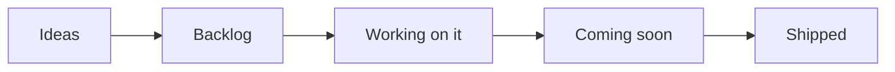
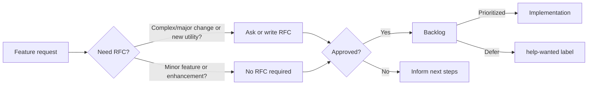

## Overview

This is our public roadmap that outlines the high level direction we are working towards, namely [Themes](#themes). We update this document when our priorities change: security and stability is our top priority.

[See our latest list of activities »](https://github.com/orgs/awslabs/projects/76/views/2){target="_blank"}

## Themes

!!! info "Operational Excellence is priority number 1."

Themes are key activities maintainers are focusing on, besides bug reports. These are updated periodically and you can get an idea of the overall progress in the [Milestones section](https://github.com/awslabs/aws-lambda-powertools-typescript/milestones){target="_blank"}.

### New utilities

After going GA, we want to start working on new utilities, specifically but not limited to the most commonly asked: **(1)** [Idempotency](https://github.com/awslabs/aws-lambda-powertools-typescript/issues/447) and **(2)** [Parameters](https://github.com/awslabs/aws-lambda-powertools-typescript/issues/846).

### Lambda Layers

We want to publish and maintain public Lambda Layers.

Work on this area is mostly complete and layers are already available in all commercial regions, however we still have some [work to do around automation](https://github.com/awslabs/aws-lambda-powertools-typescript/issues/1124).

### ES Modules support

Another one of the most requested features is [ES Modules support](https://github.com/awslabs/aws-lambda-powertools-typescript/issues/521). This topic requires some in-depth investigation to understand how to move forward and how to deal with some of our upstream dependencies.

When the time comes, we might open a RFC to discuss options.

### Improve operational excellence

We continue to work on increasing operational excellence to remove as much undifferentiated heavylifting for maintainers, so that we can focus on delivering features that help you.

This means improving our automation workflows, and project management, and test coverage.

## Roadmap status definition

<i>Visual representation</i>

Within our [public board](https://github.com/orgs/awslabs/projects/76/views/3){target="_blank"}, you'll see the following values in the `Status` column:

* **Ideas**. Incoming and existing feature requests that are not being actively considered yet. These will be reviewed when bandwidth permits and based on demand.
* **Backlog**. Accepted feature requests or enhancements that we want to work on.
* **Working on it**. Features or enhancements we're currently either researching or implementing it.
* **Coming soon**. Any feature, enhancement, or bug fixes that have been merged and are coming in the next release.
* **Shipped**. Features or enhancements that are now available in the most recent release.
* **On hold**. Features or items that are currently blocked until further notice.
* **Pending review**. Features which implementation is mostly completed, but need review and some additional iterations.

> Tasks or issues with empty `Status` will be categorized in upcoming review cycles.

## Process

<i>Visual representation</i>

Our end-to-end mechanism follows four major steps:

* **Feature Request**. Ideas start with a [feature request](https://github.com/awslabs/aws-lambda-powertools-typescript/issues/new?assignees=&labels=type/feature-request%2Ctriage&template=feature_request.yml&title=Feature+request%3A+TITLE){target="_blank"} to outline their use case at a high level. For complex use cases, maintainers might ask for/write a RFC.
    * Maintainers review requests based on [project tenets](index.md#tenets){target="_blank"}, customers reaction (👍), and use cases.
* **Request-for-comments (RFC)**. Design proposals use our [RFC issue template](https://github.com/awslabs/aws-lambda-powertools-typescript/issues/new?assignees=&labels=type/RFC%2Ctriage&template=rfc.yml&title=RFC%3A+TITLE){target="_blank"} to describe its implementation, challenges, developer experience, dependencies, and alternative solutions.
    * This helps refine the initial idea with community feedback before a decision is made.
* **Decision**. After carefully reviewing and discussing them, maintainers make a final decision on whether to start implementation, defer or reject it, and update everyone with the next steps.
* **Implementation**. For approved features, maintainers give priority to the original authors for implementation unless it is a sensitive task that is best handled by maintainers.

??? info "See [Maintainers](https://github.com/awslabs/aws-lambda-powertools-typescript/blob/develop/MAINTAINERS.md) document to understand how we triage issues and pull requests, labels and governance."

## Disclaimer

The AWS Lambda Powertools team values feedback and guidance from its community of users, although final decisions on inclusion into the project will be made by AWS.

We determine the high-level direction for our open roadmap based on customer feedback and popularity (👍🏽 and comments), security and operational impacts, and business value. Where features don’t meet our goals and longer-term strategy, we will communicate that clearly and openly as quickly as possible with an explanation of why the decision was made.

## FAQs

**Q: Why did you build this?**

A: We know that our customers are making decisions and plans based on what we are developing, and we want to provide our customers the insights they need to plan.

**Q: Why are there no dates on your roadmap?**

A: Because job zero is security and operational stability, we can't provide specific target dates for features. The roadmap is subject to change at any time, and roadmap issues in this repository do not guarantee a feature will be launched as proposed.

**Q: How can I provide feedback or ask for more information?**

A: For existing features, you can directly comment on issues. For anything else, please open an issue.