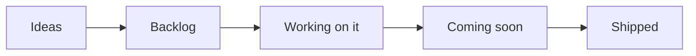
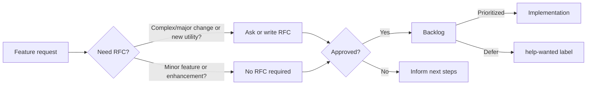

## Overview

Our public roadmap outlines the high level direction we are working towards, namely [Themes](#themes). We update this document when our priorities change: security and stability is our top priority.

!!! info "For most up-to-date information, see our [board of activities](https://github.com/orgs/aws-powertools/projects/7/views/3?query=is%3Aopen+sort%3Aupdated-desc){target="_blank"}."

## Themes

Operational Excellence is priority number 1. This means bug fixing, stability, security, customer's support, and governance will take precedence above all else.

**What are themes?**

They are key activities maintainers are focusing on. These are updated periodically and you can find the latest [under Themes in our GitHub Milestones](https://github.com/aws-powertools/powertools-lambda-typescript/milestones){target="_blank"}.

### Feature Parity

We want to close the gap between this version of Powertools for AWS Lambda and the [Python version](https://github.com/aws-powertools/powertools-lambda-python). This means that in the fullness of time, we want to have the same or equivalent features in both versions.

In 2023 we have released three the utilities, first as public betas and then as generally available:

- [x] [Parameters](https://docs.powertools.aws.dev/lambda/typescript/latest/utilities/parameters/)
- [x] [Idempotency](https://docs.powertools.aws.dev/lambda/typescript/latest/utilities/idempotency/)
- [x] [Batch Processing](https://docs.powertools.aws.dev/lambda/typescript/latest/utilities/batch/)

Over the next quarter, we are considering implementing one or more of the following utilities (in no particular order):

- [ ] Parser (Status: [RFC Finalized](https://github.com/aws-powertools/powertools-lambda-typescript/issues/1334) - Implementation: [In Progress](https://github.com/aws-powertools/powertools-lambda-typescript/milestone/15))
- [ ] Validation (Status: [RFC In Progress](https://github.com/aws-powertools/powertools-lambda-typescript/issues/508))
- [ ] Event Handler (Status: [RFC In Progress](https://github.com/aws-powertools/powertools-lambda-typescript/issues/413))

If any of these utilities are important to you, please let us know by upvoting the issue, leaving a comment under the RFCs, or by joining the discussion in our [Discord community](https://discord.gg/B8zZKbbyET){target="_blank"}.

### Improve operational excellence

We continue to work on increasing operational excellence to remove as much undifferentiated heavy lifting for maintainers, so that we can focus on delivering features that help you.

This means improving our automation workflows, project management, and test coverage.

## Roadmap status definition

<i>Visual representation</i>

Within our [public board](https://github.com/orgs/aws-powertools/projects/7/views/1?query=is%3Aopen+sort%3Aupdated-desc){target="_blank"}, you'll see the following values in the `Status` column:

- **Ideas**. Incoming and existing feature requests that are not being actively considered yet. These will be reviewed when bandwidth permits.
- **Backlog**. Accepted feature requests or enhancements that we want to work on.
- **Working on it**. Features or enhancements we're currently either researching or implementing it.
- **Coming soon**. Any feature, enhancement, or bug fixes that have been merged and are coming in the next release.
- **Shipped**. Features or enhancements that are now available in the most recent release.

> Tasks or issues with empty `Status` will be categorized in upcoming review cycles.

## Process

<i>Visual representation</i>

Our end-to-end mechanism follows four major steps:

- **Feature Request**. Ideas start with a [feature request](https://github.com/aws-powertools/powertools-lambda-typescript/issues/new?assignees=&labels=type%2Ffeature-request%2Ctriage&projects=aws-powertools%2F7&template=feature_request.yml&title=Feature+request%3A+TITLE){target="_blank"} to outline their use case at a high level. For complex use cases, maintainers might ask for/write a RFC.
    - Maintainers review requests based on [project tenets](index.md#tenets){target="_blank"}, customers reaction (👍), and use cases.
- **Request-for-comments (RFC)**. Design proposals use our [RFC issue template](https://github.com/aws-powertools/powertools-lambda-typescript/issues/new?assignees=&labels=type%2FRFC%2Ctriage&projects=aws-powertools%2F7&template=rfc.yml&title=RFC%3A+TITLE){target="_blank"} to describe its implementation, challenges, developer experience, dependencies, and alternative solutions.
    - This helps refine the initial idea with community feedback before a decision is made.
- **Decision**. After carefully reviewing and discussing them, maintainers make a final decision on whether to start implementation, defer or reject it, and update everyone with the next steps.
- **Implementation**. For approved features, maintainers give priority to the original authors for implementation unless it is a sensitive task that is best handled by maintainers.

??? info "See [Maintainers](./maintainers.md){target="_blank"} document to understand how we triage issues and pull requests, labels and governance."

## Disclaimer

The Powertools for AWS Lambda (TypeScript) team values feedback and guidance from its community of users, although final decisions on inclusion into the project will be made by AWS.

We determine the high-level direction for our open roadmap based on customer feedback and popularity (👍🏽 and comments), security and operational impacts, and business value. Where features don’t meet our goals and longer-term strategy, we will communicate that clearly and openly as quickly as possible with an explanation of why the decision was made.

## FAQs

**Q: Why did you build this?**

A: We know that our customers are making decisions and plans based on what we are developing, and we want to provide our customers the insights they need to plan.

**Q: Why are there no dates on your roadmap?**

A: Because job zero is security and operational stability, we can't provide specific target dates for features. The roadmap is subject to change at any time, and roadmap issues in this repository do not guarantee a feature will be launched as proposed.

**Q: How can I provide feedback or ask for more information?**

A: For existing features, you can directly comment on issues. For anything else, please open an issue.

## Launched

### Parameters

> [Docs](https://docs.powertools.aws.dev/lambda/typescript/latest/utilities/parameters/)

Feature parity on Parameters feature

- [x] Support for SSM Parameter Store
- [x] Support for Secrets Manager
- [x] Support for DynamoDB
- [x] Support for AppConfig
- [x] Support for Bring Your Own provider
- [x] Support for AWS SDK v3 escape hatch
- [x] Docs

### Version 2 release

> [Docs](https://docs.powertools.aws.dev/lambda/typescript/latest/upgrade/)

Over the past year, we have gathered a number of feature requests and improvements that we want to implement but that are not backwards compatible with the current API surface. We are going to release our next major version (v2) by the end of 2023, which will include some of these changes:

- [x] **ES Modules support ([#521](https://github.com/aws-powertools/powertools-lambda-typescript/issues/521))** - Thanks to the work of the community we have been able to validate the feasibility of dual support for CommonJS and ES Modules. We are currently working on a plan to implement this.
- [x] **TypeScript 5.x support ([#1375](https://github.com/aws-powertools/powertools-lambda-typescript/issues/1375))** - This new version of TypeScript brings breaking changes to the experimental decorators API, which we use in our core utilities. We need to investigate the impact of this change and how to best support it.
- [x] **Support for 3rd party observability providers ([#1500](https://github.com/aws-powertools/powertools-lambda-typescript/issues/1500))** - Many of our customers would like to use Powertools for AWS to send logs, traces, and metrics to providers other than Amazon CloudWatch. At the moment we are investigating the feasibility of this for the Logger utility, while the Python version of Powertools for AWS Lambda is considering this also for Tracer and Metrics.

You can find the full list of changes in the [v2 RFC](https://github.com/aws-powertools/powertools-lambda-typescript/issues/1714) and follow the progress in the [v2 milestone](https://github.com/aws-powertools/powertools-lambda-typescript/milestone/12).

Just like for the feature parity, if you have any feedback or would like to contribute to the discussion, please leave a comment in the RFC or join the discussion in our [Discord community](https://discord.gg/B8zZKbbyET){target="_blank"}.

