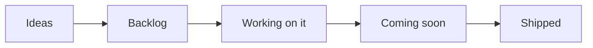
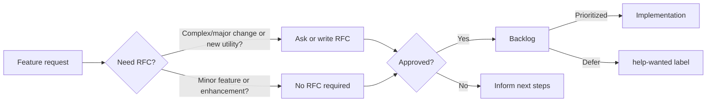

<!-- markdownlint-disable MD043 -->

## Overview

Our public roadmap outlines the high level direction we are working towards. We update this document when our priorities change: security and stability are our top priority.

!!! info "For most up-to-date information, see our [board of activities](https://github.com/orgs/aws-powertools/projects/7/views/13?query=is%3Aopen+sort%3Aupdated-desc){target="_blank"}."

### Key areas

Security and operational excellence take precedence above all else. This means bug fixing, stability, customer's support, and internal compliance may delay one or more key areas below.

!!! info "We may choose to reprioritize or defer items based on customer feedback, security, and operational impacts, and business value."

#### Event Handler REST (p0)

This is a roadmap item that we carry forward from 2024 and involves the creation of a new utility for customers to work with REST APIs built on AWS Lambda, and Amazon API Gateway REST and HTTP APIs, Application Load Balancer (ALB), Lambda Function URLs, and VPC Lattice. It's one of the most requested features in terms of feature parity from our customers.

You can follow the progress of this feature in the [Event Handler REST milestone](https://github.com/aws-powertools/powertools-lambda-typescript/milestone/17){target="_blank"}. Below are some of the key macro tasks that we will be working on:

- [x] [Explore pros & cons of whether to build atop lean frameworks (e.g., Hono) or from scratch](https://github.com/aws-powertools/powertools-lambda-typescript/issues/2409){target="_blank"}
- [x] [RFC to discuss initial thoughts and feasibility for TS/JS ecosystem](https://github.com/aws-powertools/powertools-lambda-typescript/discussions/3500){target="_blank"}
- [ ] Support for API Gateway REST API resolver
- [ ] Support for API Gateway HTTP API resolver
- [ ] Support for Lambda Function URL resolver
- [ ] Support for Application Load Balancer resolver
- [ ] Support for VPC Lattice resolver
- [ ] Support for Data Validation _(e.g., `Zod`)_
- [ ] Support for OpenAPI generation
- [ ] Support for Middlewares
- [ ] Support for Compression
- [ ] Support for Binary responses
- [ ] Support for custom serializer
- [ ] Support for injecting request details _(consider not doing globals like Python legacy)_
- [ ] Support for Router _(multi-file routes)_

#### Feature parity (p1)

To close the gap between Powertools for AWS Lambda (Python) and Powertools for AWS Lambda (TypeScript), we will focus our efforts on adding targeted features that are currently missing from the TypeScript version. These include (but are not limited to):

##### Logger

- [x] [Ability to add a correlation ID to logs via decorator/middleware](https://github.com/aws-powertools/powertools-lambda-typescript/issues/2863){target="_blank"}
- [ ] [Ability to pretty print stack traces](https://github.com/aws-powertools/powertools-lambda-typescript/issues/1362){target="_blank"}
- [x] [Ability to buffer logs](https://github.com/aws-powertools/powertools-lambda-typescript/releases/tag/v2.16.0){target="_blank"}
- [x] [Ability to refresh debug log sampling rate via decorator/middleware](https://github.com/aws-powertools/powertools-lambda-typescript/releases/tag/v2.16.0){target="_blank"}

##### Event Handler

In addition to the Event Handler REST feature mentioned above, we will also be working on the following:

- [ ] [Implement resolver for Amazon Bedrock Agents Functions](https://github.com/aws-powertools/powertools-lambda-typescript/issues/3710){target="_blank"}
- [ ] Implement resolver for Amazon Bedrock Agents OpenAPI
- [ ] Create RFC for AppSync GraphQL resolver

##### Validation

For the Validation utility, we'll experiment with a community-driven approach to building a new Powertools for AWS Lambda utility.

- [x] [Standalone validation utility](https://github.com/aws-powertools/powertools-lambda-typescript/issues/3607){target="_blank"}
- [x] [Class method decorator validation](https://github.com/aws-powertools/powertools-lambda-typescript/issues/3608){target="_blank"}
- [x] [Middy.js middleware validation](https://github.com/aws-powertools/powertools-lambda-typescript/issues/3609){target="_blank"}
- [x] [Documentation](https://github.com/aws-powertools/powertools-lambda-typescript/issues/3716){target="_blank"}

#### Governance & Advanced Use Cases (p2)

To streghten our offering for more advanced customers as well as enterprises, we will be working on a set of activities that will help us better support their needs and practices. These include:

- [x] [Publish Lambda layers to GovCloud](https://github.com/aws-powertools/powertools-lambda-typescript/issues/3423){target="_blank"}
- [ ] Publish Lambda layers to China regions
- [ ] Improve OSS supply chain posture (Q2) by making sure we're auditing our dependencies for compatible licenses and include NOTICE files in our Lambda layers
- [ ] Create a new "Advanced Use Cases" section in the docs - to help customers with more complex use cases, such as running Powertools for AWS Lambda in container environments
- [ ] Set up CI/CD for performance testing
- [ ] Improve performance of our core utilities
- [ ] [Improve performance overhead of Lambda layers](https://github.com/aws-powertools/powertools-lambda-typescript/issues/1725){target="_blank"}
- [x] [Publish SSM Parameters to lookup Lambda layers ARNs](https://github.com/aws-powertools/powertools-lambda-typescript/releases/tag/v2.14.0){target="_blank"}

#### Community engagement & new customers (p3)

To ensure we are attracting tomorrow's customers as well as new contributors to the project, we will be working on a set of activities that will help us better engage with the community and new customers. These include:

- [ ] [Create a new "Getting Started" guide in the docs](https://github.com/aws-powertools/powertools-lambda-typescript/issues/2948){target="_blank"}
- [ ] Further improve the "Contributing" & "How to find contributions" pages
- [ ] Surface contribution opportunities in Discord & other community channels
- [ ] Improve release notes announcements in Discord & other community channels
- [x] We will also attempt to create a community-developed new utility (see [Validation](#validation) above)

### Missing something?

You can help us prioritize by [upvoting existing feature requests](https://github.com/aws-powertools/powertools-lambda-typescript/issues?q=is%3Aissue+is%3Aopen+sort%3Aupdated-desc++label%3Atype%2Ffeature-request+), leaving a comment on what use cases it could unblock for you, and by joining our discussions on Discord.

{target="_blank"}

### Roadmap status definition

<i>Visual representation</i>

Within our [public board](https://github.com/orgs/aws-powertools/projects/7/views/1?query=is%3Aopen+sort%3Aupdated-desc){target="_blank"}, you'll see the following values in the `Status` column:

- **Ideas**. Incoming and existing feature requests that are not being actively considered yet. These will be reviewed when bandwidth permits.
- **Backlog**. Accepted feature requests or enhancements that we want to work on.
- **Working on it**. Features or enhancements we're currently either researching or implementing it.
- **Coming soon**. Any feature, enhancement, or bug fixes that have been merged and are coming in the next release.
- **Shipped**. Features or enhancements that are now available in the most recent release.

> Tasks or issues with empty `Status` will be categorized in upcoming review cycles.

### Process

<i>Visual representation</i>

Our end-to-end mechanism follows four major steps:

- **Feature Request**. Ideas start with a [feature request](https://github.com/aws-powertools/powertools-lambda-typescript/issues/new?assignees=&labels=type%2Ffeature-request%2Ctriage&template=feature_request.yml&title=Feature+request%3A+TITLE){target="_blank"} to outline their use case at a high level. For complex use cases, maintainers might ask for/write a RFC.
    - Maintainers review requests based on [project tenets](index.md#tenets){target="_blank"}, customers reaction (👍), and use cases.
- **Request-for-comments (RFC)**. Design proposals use our [RFC template](https://github.com/aws-powertools/powertools-lambda-typescript/discussions/new?category=rfcs){target="_blank"} to describe its implementation, challenges, developer experience, dependencies, and alternative solutions.
    - This helps refine the initial idea with community feedback before a decision is made.
- **Decision**. After carefully reviewing and discussing them, maintainers make a final decision on whether to start implementation, defer or reject it, and update everyone with the next steps.
- **Implementation**. For approved features, maintainers give priority to the original authors for implementation unless it is a sensitive task that is best handled by maintainers.

??? info "See [Maintainers](./maintainers.md){target="_blank"} document to understand how we triage issues and pull requests, labels and governance."

### Disclaimer

The Powertools for AWS Lambda (TypeScript) team values feedback and guidance from its community of users, although final decisions on inclusion into the project will be made by AWS.

We determine the high-level direction for our open roadmap based on customer feedback and popularity (👍🏽 and comments), security and operational impacts, and business value. Where features don’t meet our goals and longer-term strategy, we will communicate that clearly and openly as quickly as possible with an explanation of why the decision was made.

### FAQs

**Q: Why did you build this?**

A: We know that our customers are making decisions and plans based on what we are developing, and we want to provide our customers the insights they need to plan.

**Q: Why are there no dates on your roadmap?**

A: Because job zero is security and operational stability, we can't provide specific target dates for features. The roadmap is subject to change at any time, and roadmap issues in this repository do not guarantee a feature will be launched as proposed.

**Q: How can I provide feedback or ask for more information?**

A: For existing features, you can directly comment on issues. For anything else, please open an issue.
