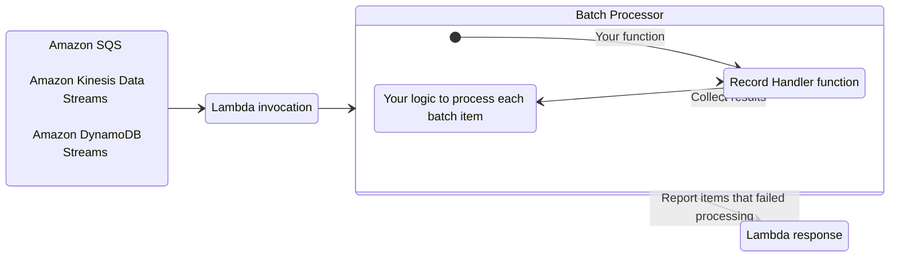
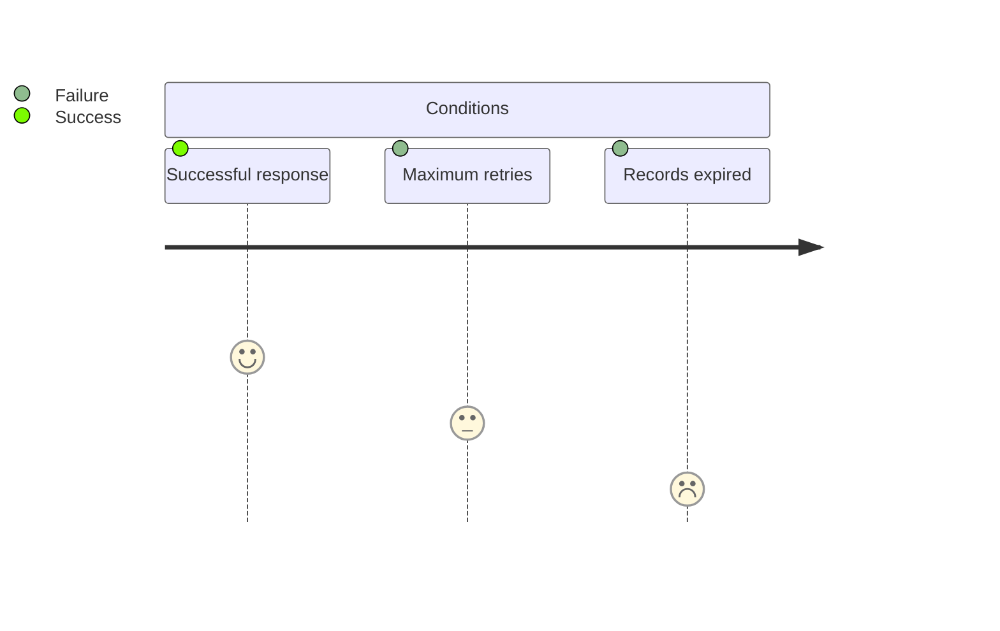
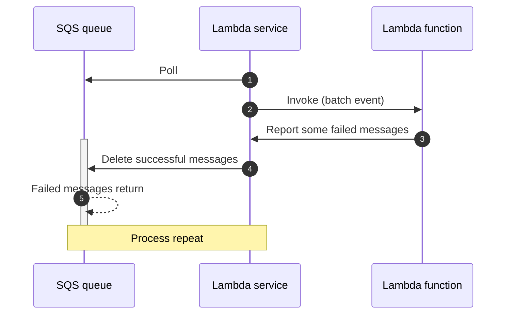
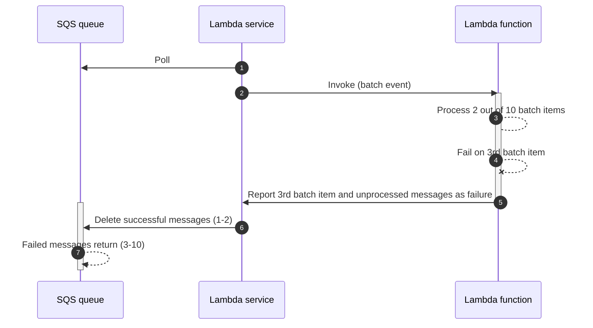
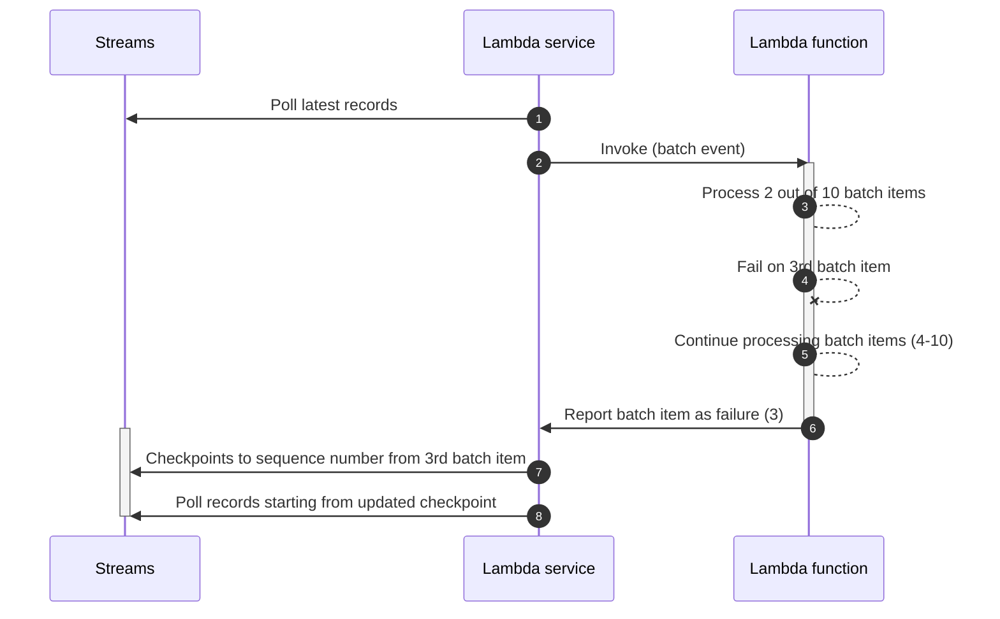
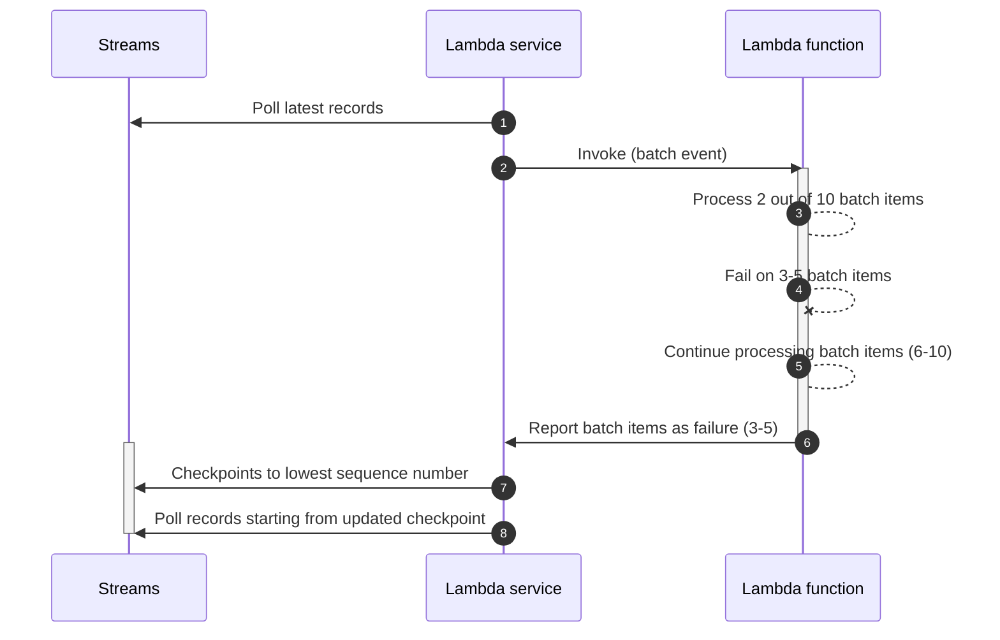
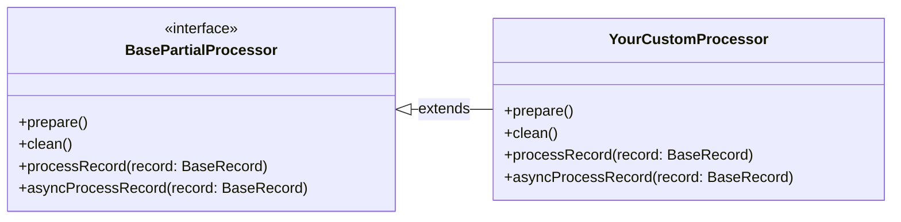

???+ warning
	**This utility is currently released as beta developer preview** and is intended strictly for feedback and testing purposes **and not for production workloads**. The version and all future versions tagged with the `-beta` suffix should be treated as not stable. Up until before the [General Availability release](https://github.com/aws-powertools/powertools-lambda-typescript/milestone/14) we might introduce significant breaking changes and improvements in response to customers feedback.

The batch processing utility handles partial failures when processing batches from Amazon SQS, Amazon Kinesis Data Streams, and Amazon DynamoDB Streams.



## Key features

* Reports batch item failures to reduce number of retries for a record upon errors
* Simple interface to process each batch record
* Build your own batch processor by extending primitives

## Background

When using SQS, Kinesis Data Streams, or DynamoDB Streams as a Lambda event source, your Lambda functions are triggered with a batch of messages.

If your function fails to process any message from the batch, the entire batch returns to your queue or stream. This same batch is then retried until either condition happens first: **a)** your Lambda function returns a successful response, **b)** record reaches maximum retry attempts, or **c)** when records expire.



This behavior changes when you enable Report Batch Item Failures feature in your Lambda function event source configuration:

<!-- markdownlint-disable MD013 -->
* [**SQS queues**](#sqs-standard). Only messages reported as failure will return to the queue for a retry, while successful ones will be deleted.
* [**Kinesis data streams**](#kinesis-and-dynamodb-streams) and [**DynamoDB streams**](#kinesis-and-dynamodb-streams). Single reported failure will use its sequence number as the stream checkpoint. Multiple  reported failures will use the lowest sequence number as checkpoint.

<!-- HTML tags are required in admonition content thus increasing line length beyond our limits -->
<!-- markdownlint-disable MD013 -->
???+ warning "Warning: This utility lowers the chance of processing records more than once; it does not guarantee it"
    We recommend implementing processing logic in an [idempotent manner](idempotency.md){target="_blank"} wherever possible.

    You can find more details on how Lambda works with either [SQS](https://docs.aws.amazon.com/lambda/latest/dg/with-sqs.html){target="_blank"}, [Kinesis](https://docs.aws.amazon.com/lambda/latest/dg/with-kinesis.html){target="_blank"}, or [DynamoDB](https://docs.aws.amazon.com/lambda/latest/dg/with-ddb.html){target="_blank"} in the AWS Documentation.

## Getting started

For this feature to work, you need to **(1)** configure your Lambda function event source to use `ReportBatchItemFailures`, and **(2)** return [a specific response](https://docs.aws.amazon.com/lambda/latest/dg/with-sqs.html#services-sqs-batchfailurereporting){target="_blank" rel="nofollow"} to report which records failed to be processed.

You use your preferred deployment framework to set the correct configuration while this utility handles the correct response to be returned.

### Required resources

The remaining sections of the documentation will rely on these samples. For completeness, this demonstrates IAM permissions and Dead Letter Queue where batch records will be sent after 2 retries were attempted.

!!! note "You do not need any additional IAM permissions to use this utility, except for what each event source requires."

=== "SQS"

    ```yaml title="template.yaml" hl_lines="30-31"
    --8<-- "docs/snippets/batch/templates/sam/sqs.yaml"
    ```

=== "Kinesis Data Streams"

    ```yaml title="template.yaml" hl_lines="44-45"
    --8<-- "docs/snippets/batch/templates/sam/kinesis.yaml"
    ```

=== "DynamoDB Streams"

    ```yaml title="template.yaml" hl_lines="43-44"
    --8<-- "docs/snippets/batch/templates/sam/dynamodb.yaml"
    ```

### Processing messages from SQS

Processing batches from SQS works in three stages:

1. Instantiate **`BatchProcessor`** and choose **`EventType.SQS`** for the event type
2. Define your function to handle each batch record, and use the `SQSRecord` type annotation for autocompletion
3. Use **`processPartialResponse`** to kick off processing

???+ info
    This code example optionally uses Logger for completion.

=== "index.ts"

    ```typescript hl_lines="1-5 14 17 29-31"
    --8<--
     docs/snippets/batch/gettingStartedSQS.ts::16
     docs/snippets/batch/gettingStartedSQS.ts:18:29
     docs/snippets/batch/gettingStartedSQS.ts:31:34
    --8<--
    ```

    1.  **Step 1**. Creates a partial failure batch processor for SQS queues. See [partial failure mechanics for details](#partial-failure-mechanics)
    2.  **Step 2**. Defines a function to receive one record at a time from the batch
    3.  **Step 3**. Kicks off processing   

=== "Sample response"

    The second record failed to be processed, therefore the processor added its message ID in the response.

    ```json
    --8<-- "docs/snippets/batch/samples/sampleSQSResponse.json"
    ```

=== "Sample event"

    ```json
    --8<-- "docs/snippets/batch/samples/sampleSQSEvent.json"
    ```

#### FIFO queues

When using [SQS FIFO queues](https://docs.aws.amazon.com/AWSSimpleQueueService/latest/SQSDeveloperGuide/FIFO-queues.html){target="_blank"}, we will stop processing messages after the first failure, and return all failed and unprocessed messages in `batchItemFailures`.
This helps preserve the ordering of messages in your queue.

```typescript hl_lines="1-4 13 28-30"
--8<-- "docs/snippets/batch/gettingStartedSQSFifo.ts"
```

1.  **Step 1**. Creates a partial failure batch processor for SQS FIFO queues. See [partial failure mechanics for details](#partial-failure-mechanics)

### Processing messages from Kinesis

Processing batches from Kinesis works in three stages:

1. Instantiate **`BatchProcessor`** and choose **`EventType.KinesisDataStreams`** for the event type
2. Define your function to handle each batch record, and use the `KinesisStreamRecord` type annotation for autocompletion
3. Use **`processPartialResponse`** to kick off processing

???+ info
    This code example optionally uses Logger for completion.

=== "index.ts"

    ```typescript hl_lines="1-5 14 17 27-29"
    --8<-- "docs/snippets/batch/gettingStartedKinesis.ts"
    ```

    1.  **Step 1**. Creates a partial failure batch processor for Kinesis Data Streams. See [partial failure mechanics for details](#partial-failure-mechanics)

=== "Sample response"

    The second record failed to be processed, therefore the processor added its sequence number in the response.

    ```json
    --8<-- "docs/snippets/batch/samples/sampleKinesisEvent.json"
    ```

=== "Sample event"

    ```json
    --8<-- "docs/snippets/batch/samples/sampleKinesisResponse.json"
    ```

### Processing messages from DynamoDB

Processing batches from DynamoDB Streams works in three stages:

1. Instantiate **`BatchProcessor`** and choose **`EventType.DynamoDBStreams`** for the event type
2. Define your function to handle each batch record, and use the `DynamoDBRecord` type annotation for autocompletion
3. Use **`processPartialResponse`** to kick off processing

???+ info
    This code example optionally uses Logger for completion.

=== "index.ts"

    ```typescript hl_lines="1-5 14 17 32-34"
    --8<-- "docs/snippets/batch/gettingStartedDynamoDBStreams.ts"
    ```

    1.  **Step 1**. Creates a partial failure batch processor for DynamoDB Streams. See [partial failure mechanics for details](#partial-failure-mechanics)

=== "Sample response"

    The second record failed to be processed, therefore the processor added its sequence number in the response.

    ```json
    --8<-- "docs/snippets/batch/samples/sampleDynamoDBStreamsResponse.json"
    ```

=== "Sample event"

    ```json
    --8<-- "docs/snippets/batch/samples/sampleDynamoDBStreamsEvent.json"
    ```

### Error handling

By default, we catch any exception raised by your record handler function. This allows us to **(1)** continue processing the batch, **(2)** collect each batch item that failed processing, and **(3)** return the appropriate  response correctly without failing your Lambda function execution.

=== "Sample error handling with custom exception"

    ```typescript hl_lines="30"
    --8<--
     docs/snippets/batch/gettingStartedErrorHandling.ts::29
     docs/snippets/batch/gettingStartedErrorHandling.ts:31:38
     docs/snippets/batch/gettingStartedErrorHandling.ts:40:43
    --8<--
    ```

    1. Any exception works here. See [extending BatchProcessor section, if you want to override this behavior.](#extending-batchprocessor)

    2. Exceptions raised in `record_handler` will propagate to `process_partial_response`. <br/><br/> We catch them and include each failed batch item identifier in the response dictionary (see `Sample response` tab).

=== "Sample response"

    ```json
    --8<-- "docs/snippets/batch/samples/sampleSQSResponse.json"
    ```

### Partial failure mechanics

All records in the batch will be passed to this handler for processing, even if exceptions are thrown - Here's the behaviour after completing the batch:

* **All records successfully processed**. We will return an empty list of item failures `{'batchItemFailures': []}`
* **Partial success with some exceptions**. We will return a list of all item IDs/sequence numbers that failed processing
* **All records failed to be processed**. We will raise `BatchProcessingError` exception with a list of all exceptions raised when processing

The following sequence diagrams explain how each Batch processor behaves under different scenarios.

#### SQS Standard

> Read more about [Batch Failure Reporting feature in AWS Lambda](https://docs.aws.amazon.com/lambda/latest/dg/with-sqs.html#services-sqs-batchfailurereporting){target="_blank"}.

Sequence diagram to explain how [`BatchProcessor` works](#processing-messages-from-sqs) with SQS Standard queues.

<center>

<i>SQS mechanism with Batch Item Failures</i>
</center>

#### SQS FIFO

> Read more about [Batch Failure Reporting feature in AWS Lambda](https://docs.aws.amazon.com/lambda/latest/dg/with-sqs.html#services-sqs-batchfailurereporting){target="_blank"}.

Sequence diagram to explain how [`SqsFifoPartialProcessor` works](#fifo-queues) with SQS FIFO queues.

<center>

<i>SQS FIFO mechanism with Batch Item Failures</i>
</center>

#### Kinesis and DynamoDB Streams

> Read more about [Batch Failure Reporting feature](https://docs.aws.amazon.com/lambda/latest/dg/with-kinesis.html#services-kinesis-batchfailurereporting){target="_blank"}.

Sequence diagram to explain how `BatchProcessor` works with both [Kinesis Data Streams](#processing-messages-from-kinesis) and [DynamoDB Streams](#processing-messages-from-dynamodb).

For brevity, we will use `Streams` to refer to either services. For theory on stream checkpoints, see this [blog post](https://aws.amazon.com/blogs/compute/optimizing-batch-processing-with-custom-checkpoints-in-aws-lambda/){target="_blank"}

<center>

<i>Kinesis and DynamoDB streams mechanism with single batch item failure</i>
</center>

The behavior changes slightly when there are multiple item failures. Stream checkpoint is updated to the lowest sequence number reported.

!!! important "Note that the batch item sequence number could be different from batch item number in the illustration."

<center>

<i>Kinesis and DynamoDB streams mechanism with multiple batch item failures</i>
</center>

### Processing messages asynchronously

You can use `AsyncBatchProcessor` class and `asyncProcessPartialResponse` function to process messages concurrently.

???+ question "When is this useful?"
    Your use case might be able to process multiple records at the same time without conflicting with one another.

    For example, imagine you need to process multiple loyalty points and incrementally save in a database. While you await the database to confirm your records are saved, you could start processing another request concurrently.

    The reason this is not the default behaviour is that not all use cases can handle concurrency safely (e.g., loyalty points must be updated in order).

```typescript hl_lines="1-5 14 28-30" title="High-concurrency with AsyncBatchProcessor"
--8<-- "docs/snippets/batch/gettingStartedAsync.ts"
```

## Advanced

### Accessing processed messages

Use the `BatchProcessor` directly in your function to access a list of all returned values from your `recordHandler` function.

* **When successful**. We will include a tuple with `success`, the result of `recordHandler`, and the batch record
* **When failed**. We will include a tuple with `fail`, exception as a string, and the batch record

```typescript hl_lines="25 27-28 30-33 38" title="Accessing processed messages"
--8<-- "docs/snippets/batch/accessProcessedMessages.ts"
```

1.  The processor requires the records array. This is typically handled by `processPartialResponse`.
2.  You need to register the `batch`, the `recordHandler` function, and optionally the `context` to access the Lambda context.

### Accessing Lambda Context

Within your `recordHandler` function, you might need access to the Lambda context to determine how much time you have left before your function times out.

We can automatically inject the [Lambda context](https://docs.aws.amazon.com/lambda/latest/dg/typescript-context.html){target="_blank"} into your `recordHandler` as optional second argument if you register it when using `BatchProcessor` or the `processPartialResponse` function.

```typescript hl_lines="17 35"
--8<-- "docs/snippets/batch/accessLambdaContext.ts"
```

### Extending BatchProcessor

You might want to bring custom logic to the existing `BatchProcessor` to slightly override how we handle successes and failures.

For these scenarios, you can subclass `BatchProcessor` and quickly override `successHandler` and `failureHandler` methods:

* **`successHandler()`** – Keeps track of successful batch records
* **`failureHandler()`** – Keeps track of failed batch records

???+ example
	Let's suppose you'd like to add a metric named `BatchRecordFailures` for each batch record that failed processing

```typescript hl_lines="5-6 17 21 25 31 35 50-52" title="Extending failure handling mechanism in BatchProcessor"
--8<-- "docs/snippets/batch/extendingFailure.ts"
```

### Create your own partial processor

You can create your own partial batch processor from scratch by inheriting the `BasePartialProcessor` class, and implementing the `prepare()`, `clean()`, `processRecord()` and `asyncProcessRecord()` abstract methods.

<center>

<i>Visual representation to bring your own processor</i>
</center>

* **`processRecord()`** – handles all processing logic for each individual message of a batch, including calling the `recordHandler` (`this.handler`)
* **`prepare()`** – called once as part of the processor initialization
* **`clean()`** – teardown logic called once after `processRecord` completes
* **`asyncProcessRecord()`** – If you need to implement asynchronous logic, use this method, otherwise define it in your class with empty logic

You can then use this class as a context manager, or pass it to `processPartialResponse` to process the records in your Lambda handler function.

```typescript hl_lines="8 12-14 20 29 40 61 72 83 93-95" title="Creating a custom batch processor"
--8<-- "docs/snippets/batch/customPartialProcessor.ts"
```

## Testing your code

As there is no external calls, you can unit test your code with `BatchProcessor` quite easily.

**Example**:

Given a SQS batch where the first batch record succeeds and the second fails processing, we should have a single item reported in the function response.

=== "index.test.ts"

    ```typescript
    --8<-- "docs/snippets/batch/testingYourCode.ts"
    ```

=== "index.ts"

    ```typescript
    --8<-- "docs/snippets/batch/gettingStartedSQS.ts"
    ```

=== "Sample SQS event"

    ```json title="events/sqs_event.json"
    --8<-- "docs/snippets/batch/samples/sampleSQSEvent.json"
    ```