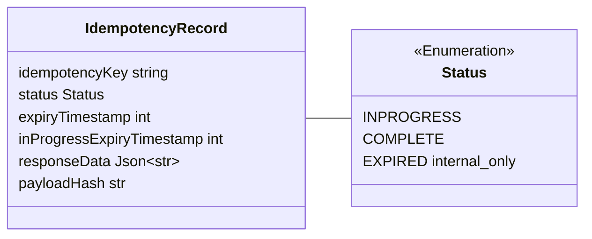
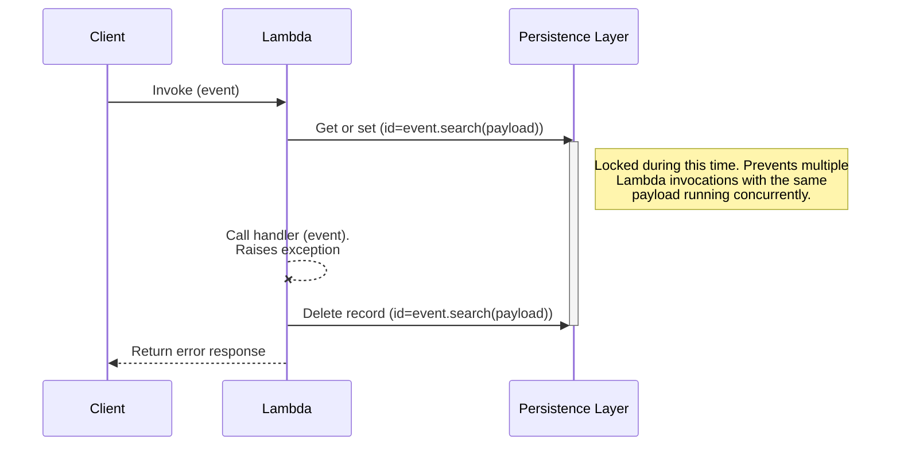
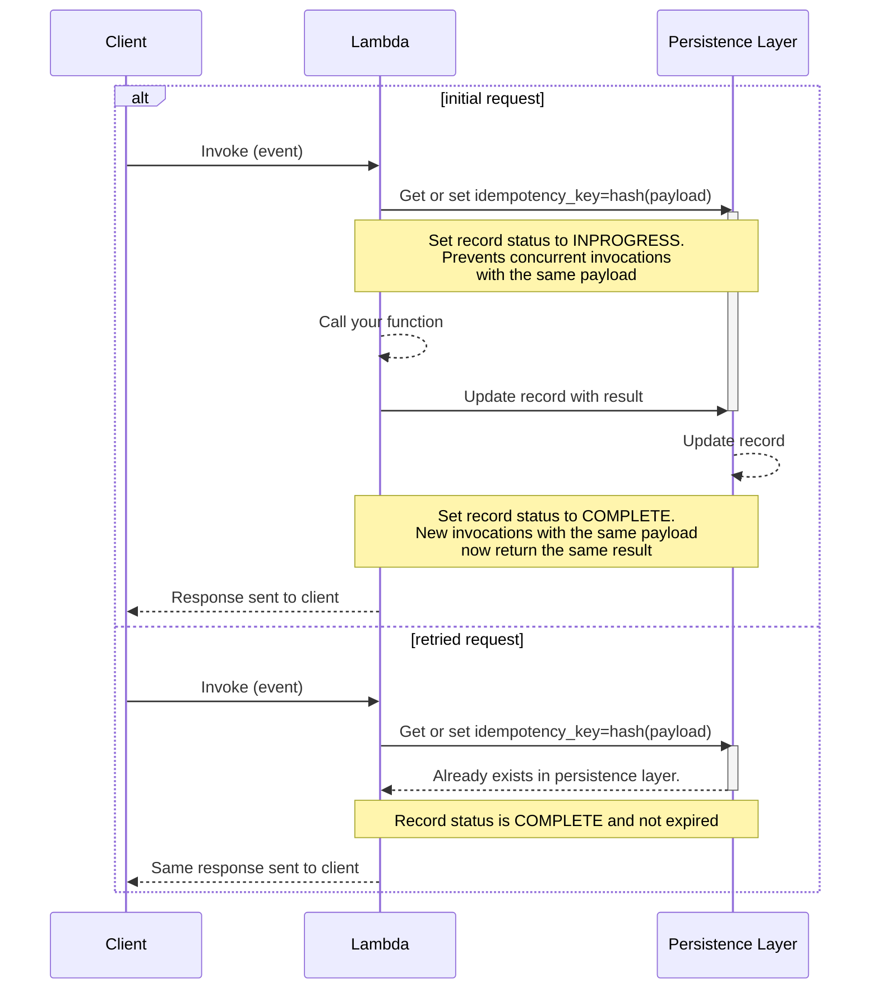
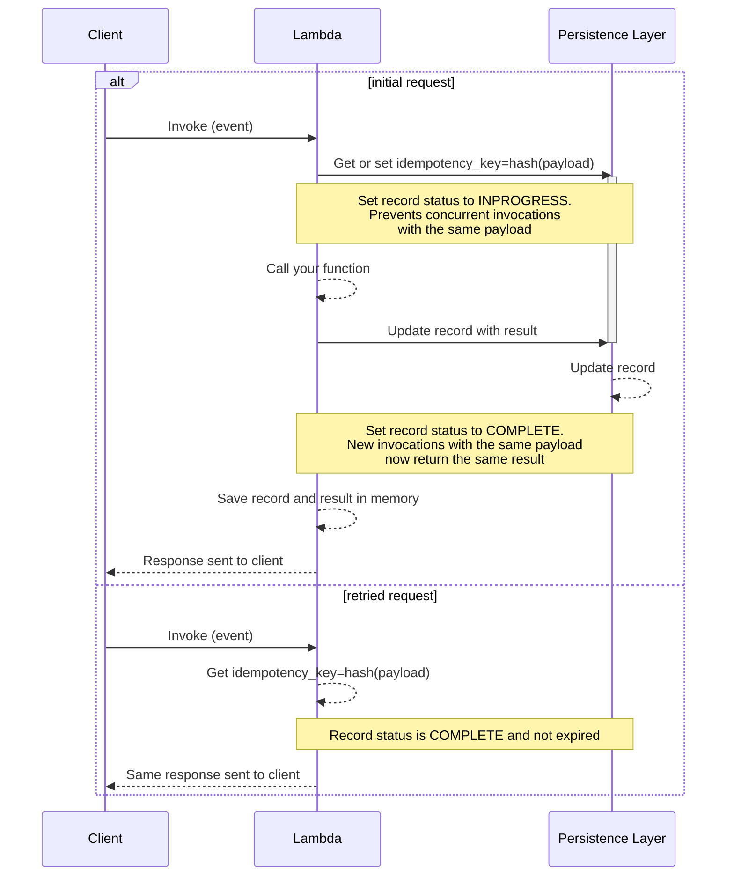
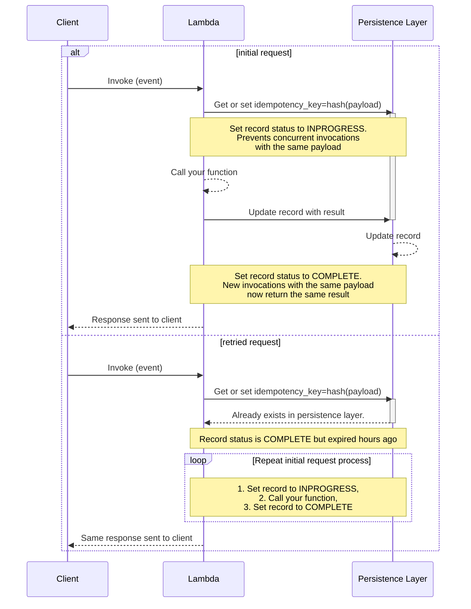
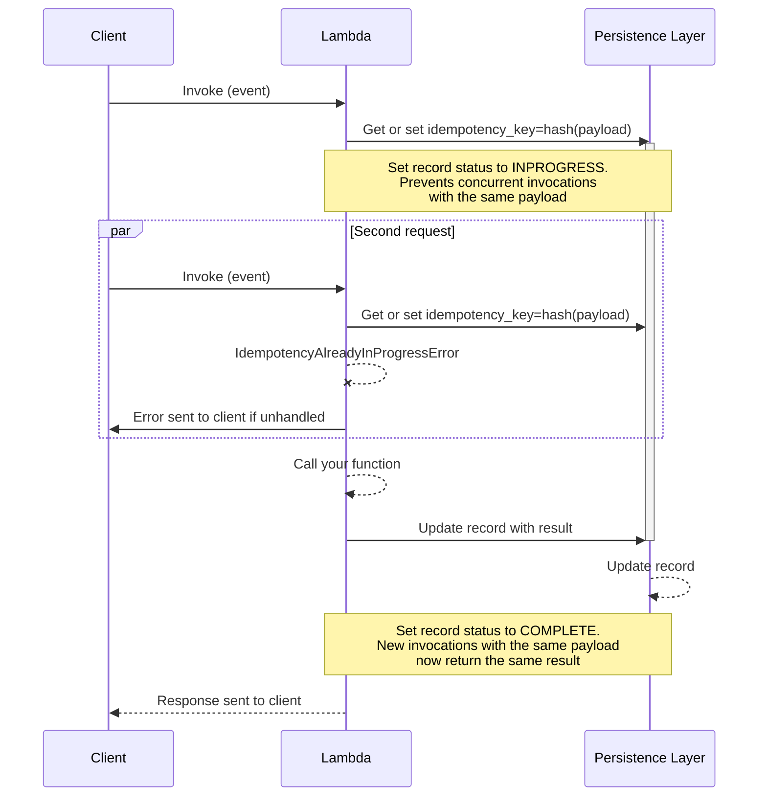
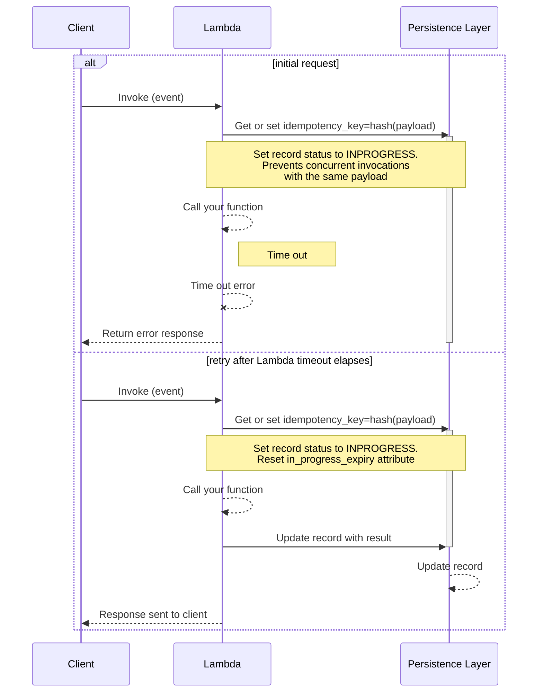

!!! warning
	This page refers to an **unreleased and upcoming utility**. Please refer to this [GitHub milestone](https://github.com/awslabs/aws-lambda-powertools-typescript/milestone/7) for the latest updates.

The idempotency utility provides a simple solution to convert your Lambda functions into idempotent operations which are safe to retry.

## Terminology

The property of idempotency means that an operation does not cause additional side effects if it is called more than once with the same input parameters.

**Idempotent operations will return the same result when they are called multiple times with the same parameters**. This makes idempotent operations safe to retry.

**Idempotency key** is a hash representation of either the entire event or a specific configured subset of the event, and invocation results are **JSON serialized** and stored in your persistence storage layer.

**Idempotency record** is the data representation of an idempotent request saved in your preferred  storage layer. We use it to coordinate whether a request is idempotent, whether it's still valid or expired based on timestamps, etc.

<center>


<i>Idempotency record representation</i>
</center>

## Key features

* Prevent Lambda handler from executing more than once on the same event payload during a time window
* Ensure Lambda handler returns the same result when called with the same payload
* Select a subset of the event as the idempotency key using JMESPath expressions
* Set a time window in which records with the same payload should be considered duplicates
* Expires in-progress executions if the Lambda function times out halfway through

## Getting started

### IAM Permissions

Your Lambda function IAM Role must have `dynamodb:GetItem`, `dynamodb:PutItem`, `dynamodb:UpdateItem` and `dynamodb:DeleteItem` IAM permissions before using this feature.

???+ note
    If you're using our example [AWS Serverless Application Model (SAM)](#required-resources), it already adds the required permissions.

### Required resources

Before getting started, you need to create a persistent storage layer where the idempotency utility can store its state - your lambda functions will need read and write access to it.

As of now, Amazon DynamoDB is the only supported persistent storage layer, so you'll need to create a table first.

**Default table configuration**

If you're not [changing the default configuration for the DynamoDB persistence layer](#dynamodbpersistencelayer), this is the expected default configuration:

| Configuration      | Value        | Notes                                                                               |
| ------------------ | ------------ | ----------------------------------------------------------------------------------- |
| Partition key      | `id`         |
| TTL attribute name | `expiration` | This can only be configured after your table is created if you're using AWS Console |

<!-- TODO: review qualified function name + link -->
???+ tip "Tip: You can share a single state table for all functions"
    You can reuse the same DynamoDB table to store idempotency state. We add `module_name` and [qualified name for classes and functions](https://peps.python.org/pep-3155/) in addition to the idempotency key as a hash key.

```yaml hl_lines="5-13 21-23" title="AWS Serverless Application Model (SAM) example"
Resources:
  IdempotencyTable:
	Type: AWS::DynamoDB::Table
	Properties:
	  AttributeDefinitions:
		-   AttributeName: id
			AttributeType: S
	  KeySchema:
		-   AttributeName: id
			KeyType: HASH
	  TimeToLiveSpecification:
		AttributeName: expiration
		Enabled: true
	  BillingMode: PAY_PER_REQUEST

  HelloWorldFunction:
  Type: AWS::Serverless::Function
  Properties:
	Runtime: nodejs18.x
	Policies:
	  - DynamoDBCrudPolicy:
		  TableName: !Ref IdempotencyTable
```

??? warning "Warning: Large responses with DynamoDB persistence layer"
    When using this utility with DynamoDB, your function's responses must be [smaller than 400KB](https://docs.aws.amazon.com/amazondynamodb/latest/developerguide/Limits.html#limits-items).

    Larger items cannot be written to DynamoDB and will cause exceptions.

???+ info "Info: DynamoDB"
    Each function invocation will generally make 2 requests to DynamoDB. If the
    result returned by your Lambda is less than 1kb, you can expect 2 WCUs per invocation. For retried invocations, you will see 1WCU and 1RCU. Review the [DynamoDB pricing documentation](https://aws.amazon.com/dynamodb/pricing/) to
    estimate the cost.

### IdempotentLambdaHandler decorator

You can quickly start by initializing the `DynamoDBPersistenceLayer` class and using it with the `idempotent` decorator on your Lambda handler.

???+ note
    In this example, the entire Lambda handler is treated as a single idempotent operation. If your Lambda handler can cause multiple side effects, or you're only interested in making a specific logic idempotent, use the [`idempotentMethod` decorator](#idempotentMethod-decorator) or the [`makeFunctionIdempotent` high-order function](#makeFunctionIdempotent-high-order-function) instead.

!!! tip "See [Choosing a payload subset for idempotency](#choosing-a-payload-subset-for-idempotency) for more elaborate use cases."

=== "index.ts"

    ```typescript hl_lines="1-2 6-8 12-14 23"
    --8<-- "docs/snippets/idempotency/idempotentLambdaHandler.ts"
    ```

    1. Binding your handler method allows your handler to access `this` within the class methods.

=== "Example event"

    ```json
    {
      "username": "xyz",
      "productId": "123456789"
    }
    ```

After processing this request successfully, a second request containing the exact same payload above will now return the same response, ensuring our customer isn't charged twice.

!!! question "New to idempotency concept? Please review our [Terminology](#terminology) section if you haven't yet."

### IdempotentMethod decorator

Similar to [idempotent decorator](#idempotent-decorator), you can use `idempotent_function` decorator for any synchronous Python function.

When using `idempotent_function`, you must tell us which keyword parameter in your function signature has the data we should use via **`data_keyword_argument`**.

!!! tip "We support JSON serializable data, [Python Dataclasses](https://docs.python.org/3.7/library/dataclasses.html){target="_blank"}, [Parser/Pydantic Models](parser.md){target="_blank"}, and our [Event Source Data Classes](./data_classes.md){target="_blank"}."

???+ warning "Limitation"
    Make sure to call your decorated function using keyword arguments.

=== "dataclass_sample.py"

    ```python hl_lines="3-4 23 33"
    from dataclasses import dataclass

    from aws_lambda_powertools.utilities.idempotency import (
        DynamoDBPersistenceLayer, IdempotencyConfig, idempotent_function)

    dynamodb = DynamoDBPersistenceLayer(table_name="idem")
    config =  IdempotencyConfig(
        event_key_jmespath="order_id",  # see Choosing a payload subset section
        use_local_cache=True,
    )

    @dataclass
    class OrderItem:
        sku: str
        description: str

    @dataclass
    class Order:
        item: OrderItem
        order_id: int


    @idempotent_function(data_keyword_argument="order", config=config, persistence_store=dynamodb)
    def process_order(order: Order):
        return f"processed order {order.order_id}"

	def lambda_handler(event, context):
		config.register_lambda_context(context) # see Lambda timeouts section
		order_item = OrderItem(sku="fake", description="sample")
		order = Order(item=order_item, order_id="fake-id")

		# `order` parameter must be called as a keyword argument to work
		process_order(order=order)
    ```

=== "parser_pydantic_sample.py"

    ```python hl_lines="1-2 22 32"
    from aws_lambda_powertools.utilities.idempotency import (
        DynamoDBPersistenceLayer, IdempotencyConfig, idempotent_function)
    from aws_lambda_powertools.utilities.parser import BaseModel

    dynamodb = DynamoDBPersistenceLayer(table_name="idem")
    config =  IdempotencyConfig(
        event_key_jmespath="order_id",  # see Choosing a payload subset section
        use_local_cache=True,
    )


    class OrderItem(BaseModel):
        sku: str
        description: str


    class Order(BaseModel):
        item: OrderItem
        order_id: int


    @idempotent_function(data_keyword_argument="order", config=config, persistence_store=dynamodb)
    def process_order(order: Order):
        return f"processed order {order.order_id}"

	def lambda_handler(event, context):
		config.register_lambda_context(context) # see Lambda timeouts section
		order_item = OrderItem(sku="fake", description="sample")
		order = Order(item=order_item, order_id="fake-id")

		# `order` parameter must be called as a keyword argument to work
		process_order(order=order)
    ```

### makeFunctionIdempotent higher-order function

### Choosing a payload subset for idempotency

???+ tip "Tip: Dealing with always changing payloads"
    When dealing with a more elaborate payload, where parts of the payload always change, you should use the **`eventKeyJmesPath`** parameter.

Use [`IdempotencyConfig`](#customizing-the-default-behavior) to instruct the idempotent decorator to only use a portion of your payload to verify whether a request is idempotent, and therefore it should not be retried.

> **Payment scenario**

In this example, we have a Lambda handler that creates a payment for a user subscribing to a product. We want to ensure that we don't accidentally charge our customer by subscribing them more than once.

Imagine the function executes successfully, but the client never receives the response due to a connection issue. It is safe to retry in this instance, as the idempotent decorator will return a previously saved response.

**What we want here** is to instruct Idempotency to use the `user` and `productId` fields from our incoming payload as our idempotency key. If we were to treat the entire request as our idempotency key, a simple HTTP header or timestamp change would cause our customer to be charged twice.

???+ tip "Deserializing JSON strings in payloads for increased accuracy."
    The payload extracted by the `eventKeyJmesPath` is treated as a string by default. This means there could be differences in whitespace even when the JSON payload itself is identical.

    To alter this behaviour, we can use the [JMESPath built-in function](jmespath_functions.md#powertools_json-function) `powertools_json()` to treat the payload as a JSON object (dict) rather than a string.

=== "payment.py"

    ```python hl_lines="2-4 10 12 15 20"
    import json
    from aws_lambda_powertools.utilities.idempotency import (
        IdempotencyConfig, DynamoDBPersistenceLayer, idempotent
    )

    persistence_layer = DynamoDBPersistenceLayer(table_name="IdempotencyTable")

    # Deserialize JSON string under the "body" key
    # then extract "user" and "product_id" data
    config = IdempotencyConfig(event_key_jmespath="powertools_json(body).[user, product_id]")

    @idempotent(config=config, persistence_store=persistence_layer)
    def handler(event, context):
        body = json.loads(event['body'])
        payment = create_subscription_payment(
            user=body['user'],
            product=body['product_id']
        )
        ...
        return {
            "payment_id": payment.id,
            "message": "success",
            "statusCode": 200
        }
    ```

=== "Example event"

    ```json hl_lines="28"
    {
      "version":"2.0",
      "routeKey":"ANY /createpayment",
      "rawPath":"/createpayment",
      "rawQueryString":"",
      "headers": {
        "Header1": "value1",
        "Header2": "value2"
      },
      "requestContext":{
        "accountId":"123456789012",
        "apiId":"api-id",
        "domainName":"id.execute-api.us-east-1.amazonaws.com",
        "domainPrefix":"id",
        "http":{
          "method":"POST",
          "path":"/createpayment",
          "protocol":"HTTP/1.1",
          "sourceIp":"ip",
          "userAgent":"agent"
        },
        "requestId":"id",
        "routeKey":"ANY /createpayment",
        "stage":"$default",
        "time":"10/Feb/2021:13:40:43 +0000",
        "timeEpoch":1612964443723
      },
      "body":"{\"user\":\"xyz\",\"product_id\":\"123456789\"}",
      "isBase64Encoded":false
    }
    ```

### Lambda timeouts

???+ note
    This is automatically done when you decorate your Lambda handler with [@idempotent decorator](#idempotent-decorator).

To prevent against extended failed retries when a [Lambda function times out](https://aws.amazon.com/premiumsupport/knowledge-center/lambda-verify-invocation-timeouts/), Powertools for AWS Lambda (Python) calculates and includes the remaining invocation available time as part of the idempotency record.

???+ example
    If a second invocation happens **after** this timestamp, and the record is marked as `INPROGRESS`, we will execute the invocation again as if it was in the `EXPIRED` state (e.g, `expire_seconds` field elapsed).

    This means that if an invocation expired during execution, it will be quickly executed again on the next retry.

???+ important
    If you are only using the [@idempotent_function decorator](#idempotent_function-decorator) to guard isolated parts of your code, you must use `register_lambda_context` available in the [idempotency config object](#customizing-the-default-behavior) to benefit from this protection.

Here is an example on how you register the Lambda context in your handler:

```python hl_lines="8 16" title="Registering the Lambda context"
from aws_lambda_powertools.utilities.data_classes.sqs_event import SQSRecord
from aws_lambda_powertools.utilities.idempotency import (
    IdempotencyConfig, idempotent_function
)

persistence_layer = DynamoDBPersistenceLayer(table_name="...")

config = IdempotencyConfig()

@idempotent_function(data_keyword_argument="record", persistence_store=persistence_layer, config=config)
def record_handler(record: SQSRecord):
    return {"message": record["body"]}


def lambda_handler(event, context):
    config.register_lambda_context(context)

    return record_handler(event)
```

### Handling exceptions

If you are using the `idempotent` decorator on your Lambda handler, any unhandled exceptions that are raised during the code execution will cause **the record in the persistence layer to be deleted**.
This means that new invocations will execute your code again despite having the same payload. If you don't want the record to be deleted, you need to catch exceptions within the idempotent function and return a successful response.

<center>

<i>Idempotent sequence exception</i>
</center>

If you are using `idempotent_function`, any unhandled exceptions that are raised _inside_ the decorated function will cause the record in the persistence layer to be deleted, and allow the function to be executed again if retried.

If an Exception is raised _outside_ the scope of the decorated function and after your function has been called, the persistent record will not be affected. In this case, idempotency will be maintained for your decorated function. Example:

```python hl_lines="2-4 8-10" title="Exception not affecting idempotency record sample"
def lambda_handler(event, context):
    # If an exception is raised here, no idempotent record will ever get created as the
    # idempotent function does not get called
    do_some_stuff()

    result = call_external_service(data={"user": "user1", "id": 5})

    # This exception will not cause the idempotent record to be deleted, since it
    # happens after the decorated function has been successfully called
    raise Exception


@idempotent_function(data_keyword_argument="data", config=config, persistence_store=dynamodb)
def call_external_service(data: dict, **kwargs):
    result = requests.post('http://example.com', json={"user": data['user'], "transaction_id": data['id']}
    return result.json()
```

???+ warning
    **We will raise `IdempotencyPersistenceLayerError`** if any of the calls to the persistence layer fail unexpectedly.

    As this happens outside the scope of your decorated function, you are not able to catch it if you're using the `idempotent` decorator on your Lambda handler.

### Idempotency request flow

The following sequence diagrams explain how the Idempotency feature behaves under different scenarios.

#### Successful request

<center>

<i>Idempotent successful request</i>
</center>

#### Successful request with cache enabled

!!! note "[In-memory cache is disabled by default](#using-in-memory-cache)."

<center>

<i>Idempotent successful request cached</i>
</center>

#### Expired idempotency records

<center>

<i>Previous Idempotent request expired</i>
</center>

#### Concurrent identical in-flight requests

<center>

<i>Concurrent identical in-flight requests</i>
</center>

#### Lambda request timeout

<center>

<i>Idempotent request during and after Lambda timeouts</i>
</center>

## Advanced

### Persistence layers

#### DynamoDBPersistenceLayer

This persistence layer is built-in, and you can either use an existing DynamoDB table or create a new one dedicated for idempotency state (recommended).

```python hl_lines="5-10" title="Customizing DynamoDBPersistenceLayer to suit your table structure"
from aws_lambda_powertools.utilities.idempotency import DynamoDBPersistenceLayer

persistence_layer = DynamoDBPersistenceLayer(
	table_name="IdempotencyTable",
	key_attr="idempotency_key",
	expiry_attr="expires_at",
	in_progress_expiry_attr="in_progress_expires_at",
	status_attr="current_status",
	data_attr="result_data",
	validation_key_attr="validation_key",
)
```

When using DynamoDB as a persistence layer, you can alter the attribute names by passing these parameters when initializing the persistence layer:

| Parameter                   | Required           | Default                              | Description                                                                                              |
| --------------------------- | ------------------ | ------------------------------------ | -------------------------------------------------------------------------------------------------------- |
| **table_name**              | :heavy_check_mark: |                                      | Table name to store state                                                                                |
| **key_attr**                |                    | `id`                                 | Partition key of the table. Hashed representation of the payload (unless **sort_key_attr** is specified) |
| **expiry_attr**             |                    | `expiration`                         | Unix timestamp of when record expires                                                                    |
| **in_progress_expiry_attr** |                    | `in_progress_expiration`             | Unix timestamp of when record expires while in progress (in case of the invocation times out)            |
| **status_attr**             |                    | `status`                             | Stores status of the lambda execution during and after invocation                                        |
| **data_attr**               |                    | `data`                               | Stores results of successfully executed Lambda handlers                                                  |
| **validation_key_attr**     |                    | `validation`                         | Hashed representation of the parts of the event used for validation                                      |
| **sort_key_attr**           |                    |                                      | Sort key of the table (if table is configured with a sort key).                                          |
| **static_pk_value**         |                    | `idempotency#{LAMBDA_FUNCTION_NAME}` | Static value to use as the partition key. Only used when **sort_key_attr** is set.                       |

### Customizing the default behavior

Idempotent decorator can be further configured with **`IdempotencyConfig`** as seen in the previous example. These are the available options for further configuration

| Parameter                       | Default | Description                                                                                                                               |
| ------------------------------- | ------- | ----------------------------------------------------------------------------------------------------------------------------------------- |
| **event_key_jmespath**          | `""`    | JMESPath expression to extract the idempotency key from the event record using [built-in functions](/utilities/jmespath_functions)        |
| **payload_validation_jmespath** | `""`    | JMESPath expression to validate whether certain parameters have changed in the event while the event payload                              |
| **raise_on_no_idempotency_key** | `False` | Raise exception if no idempotency key was found in the request                                                                            |
| **expires_after_seconds**       | 3600    | The number of seconds to wait before a record is expired                                                                                  |
| **use_local_cache**             | `False` | Whether to locally cache idempotency results                                                                                              |
| **local_cache_max_items**       | 256     | Max number of items to store in local cache                                                                                               |
| **hash_function**               | `md5`   | Function to use for calculating hashes, as provided by [hashlib](https://docs.python.org/3/library/hashlib.html) in the standard library. |

### Handling concurrent executions with the same payload

This utility will raise an **`IdempotencyAlreadyInProgressError`** exception if you receive **multiple invocations with the same payload while the first invocation hasn't completed yet**.

???+ info
    If you receive `IdempotencyAlreadyInProgressError`, you can safely retry the operation.

This is a locking mechanism for correctness. Since we don't know the result from the first invocation yet, we can't safely allow another concurrent execution.

### Using in-memory cache

**By default, in-memory local caching is disabled**, since we don't know how much memory you consume per invocation compared to the maximum configured in your Lambda function.

???+ note "Note: This in-memory cache is local to each Lambda execution environment"
    This means it will be effective in cases where your function's concurrency is low in comparison to the number of "retry" invocations with the same payload, because cache might be empty.

You can enable in-memory caching with the **`use_local_cache`** parameter:

```python hl_lines="8 11" title="Caching idempotent transactions in-memory to prevent multiple calls to storage"
from aws_lambda_powertools.utilities.idempotency import (
	IdempotencyConfig, DynamoDBPersistenceLayer, idempotent
)

persistence_layer = DynamoDBPersistenceLayer(table_name="IdempotencyTable")
config =  IdempotencyConfig(
	event_key_jmespath="body",
	use_local_cache=True,
)

@idempotent(config=config, persistence_store=persistence_layer)
def handler(event, context):
	...
```

When enabled, the default is to cache a maximum of 256 records in each Lambda execution environment - You can change it with the **`local_cache_max_items`** parameter.

### Expiring idempotency records

!!! note "By default, we expire idempotency records after **an hour** (3600 seconds)."

In most cases, it is not desirable to store the idempotency records forever. Rather, you want to guarantee that the same payload won't be executed within a period of time.

You can change this window with the **`expires_after_seconds`** parameter:

```python hl_lines="8 11" title="Adjusting idempotency record expiration"
from aws_lambda_powertools.utilities.idempotency import (
	IdempotencyConfig, DynamoDBPersistenceLayer, idempotent
)

persistence_layer = DynamoDBPersistenceLayer(table_name="IdempotencyTable")
config =  IdempotencyConfig(
	event_key_jmespath="body",
	expires_after_seconds=5*60,  # 5 minutes
)

@idempotent(config=config, persistence_store=persistence_layer)
def handler(event, context):
	...
```

This will mark any records older than 5 minutes as expired, and [your function will be executed as normal if it is invoked with a matching payload](#expired-idempotency-records).

???+ important "Idempotency record expiration vs DynamoDB time-to-live (TTL)"
    [DynamoDB TTL is a feature](https://docs.aws.amazon.com/amazondynamodb/latest/developerguide/howitworks-ttl.html){target="_blank"} to remove items after a certain period of time, it may occur within 48 hours of expiration.

    We don't rely on DynamoDB or any persistence storage layer to determine whether a record is expired to avoid eventual inconsistency states.

    Instead, Idempotency records saved in the storage layer contain timestamps that can be verified upon retrieval and double checked within Idempotency feature.

    **Why?**

    A record might still be valid (`COMPLETE`) when we retrieved, but in some rare cases it might expire a second later. A record could also be [cached in memory](#using-in-memory-cache). You might also want to have idempotent transactions that should expire in seconds.

### Payload validation

???+ question "Question: What if your function is invoked with the same payload except some outer parameters have changed?"
    Example: A payment transaction for a given productID was requested twice for the same customer, **however the amount to be paid has changed in the second transaction**.

By default, we will return the same result as it returned before, however in this instance it may be misleading; we provide a fail fast payload validation to address this edge case.

With **`payload_validation_jmespath`**, you can provide an additional JMESPath expression to specify which part of the event body should be validated against previous idempotent invocations

=== "app.py"

    ```python hl_lines="7 11 18 25"
    from aws_lambda_powertools.utilities.idempotency import (
        IdempotencyConfig, DynamoDBPersistenceLayer, idempotent
    )

    config = IdempotencyConfig(
        event_key_jmespath="[userDetail, productId]",
        payload_validation_jmespath="amount"
    )
    persistence_layer = DynamoDBPersistenceLayer(table_name="IdempotencyTable")

    @idempotent(config=config, persistence_store=persistence_layer)
    def handler(event, context):
        # Creating a subscription payment is a side
        # effect of calling this function!
        payment = create_subscription_payment(
          user=event['userDetail']['username'],
          product=event['product_id'],
          amount=event['amount']
        )
        ...
        return {
            "message": "success",
            "statusCode": 200,
            "payment_id": payment.id,
            "amount": payment.amount
        }
    ```

=== "Example Event 1"

    ```json hl_lines="8"
    {
        "userDetail": {
            "username": "User1",
            "user_email": "user@example.com"
        },
        "productId": 1500,
        "charge_type": "subscription",
        "amount": 500
    }
    ```

=== "Example Event 2"

    ```json hl_lines="8"
    {
        "userDetail": {
            "username": "User1",
            "user_email": "user@example.com"
        },
        "productId": 1500,
        "charge_type": "subscription",
        "amount": 1
    }
    ```

In this example, the **`userDetail`** and **`productId`** keys are used as the payload to generate the idempotency key, as per **`event_key_jmespath`** parameter.

???+ note
    If we try to send the same request but with a different amount, we will raise **`IdempotencyValidationError`**.

Without payload validation, we would have returned the same result as we did for the initial request. Since we're also returning an amount in the response, this could be quite confusing for the client.

By using **`payload_validation_jmespath="amount"`**, we prevent this potentially confusing behavior and instead raise an Exception.

### Making idempotency key required
{
const If you new want to enforce that an idempotency key is required, you can set **`throwOnNoIdempotencyKey: t* to `True`.}
;
This means that we will raise **`IdempotencyKeyError`** if the evaluation of **`event_key_jmespath`** is `None`.

=== "app.py"

    ```typescript hl_lines="9-10 13"
    
    ```

=== "Success Event"

    ```json hl_lines="3 6"
    {
        "user": {
            "uid": "BB0D045C-8878-40C8-889E-38B3CB0A61B1",
            "name": "foo bar"
        },
        "orderId": 10000
    }
    ```

=== "Failure Event"

    Notice that `orderId` is now accidentally within the `user` key

    ```json hl_lines="3 5"
    {
        "user": {
            "uid": "BB0D045C-8878-40C8-889E-38B3CB0A61B1",
            "name": "foo bar",
            "orderId": 10000
        },
    }
    ```

### Customizing boto configuration

The **`boto_config`** and **`boto3_session`** parameters enable you to pass in a custom [botocore config object](https://botocore.amazonaws.com/v1/documentation/api/latest/reference/config.html) or a custom [boto3 session](https://boto3.amazonaws.com/v1/documentation/api/latest/reference/core/session.html) when constructing the persistence store.

=== "Custom session"

    ```python hl_lines="1 6 9 14"
    import boto3
    from aws_lambda_powertools.utilities.idempotency import (
        IdempotencyConfig, DynamoDBPersistenceLayer, idempotent
    )

    boto3_session = boto3.session.Session()
    persistence_layer = DynamoDBPersistenceLayer(
        table_name="IdempotencyTable",
        boto3_session=boto3_session
    )

    config = IdempotencyConfig(event_key_jmespath="body")

    @idempotent(config=config, persistence_store=persistence_layer)
    def handler(event, context):
       ...
    ```
=== "Custom config"

    ```python hl_lines="1 7 10"
    from botocore.config import Config
    from aws_lambda_powertools.utilities.idempotency import (
        IdempotencyConfig, DynamoDBPersistenceLayer, idempotent
    )

    config = IdempotencyConfig(event_key_jmespath="body")
    boto_config = Config()
    persistence_layer = DynamoDBPersistenceLayer(
        table_name="IdempotencyTable",
        boto_config=boto_config
    )

    @idempotent(config=config, persistence_store=persistence_layer)
    def handler(event, context):
       ...
    ```

### Using a DynamoDB table with a composite primary key

When using a composite primary key table (hash+range key), use the `sortKeyAttr` parameter when initializing your persistence layer.

With this setting, we will save the idempotency key in the sort key instead of the primary key. By default, the primary key will now be set to `idempotency#{LAMBDA_FUNCTION_NAME}`.

You can optionally set a static value for the partition key using the `staticPkValue` parameter.

```python hl_lines="5" title="Reusing a DynamoDB table that uses a composite primary key"
--8<-- "docs/snippets/idempotency/dynamoDBCompositePK.ts"
```

<!-- TODO check that the code above actually generates this table -->

The example function above would cause data to be stored in DynamoDB like this:

| id                           | sort_key                         | expiration | status      | data                                 |
| ---------------------------- | -------------------------------- | ---------- | ----------- | ------------------------------------ |
| idempotency#MyLambdaFunction | 1e956ef7da78d0cb890be999aecc0c9e | 1636549553 | COMPLETED   | {"id": 12391, "message": "success"}  |
| idempotency#MyLambdaFunction | 2b2cdb5f86361e97b4383087c1ffdf27 | 1636549571 | COMPLETED   | {"id": 527212, "message": "success"} |
| idempotency#MyLambdaFunction | f091d2527ad1c78f05d54cc3f363be80 | 1636549585 | IN_PROGRESS |                                      |

<!-- TODO: bring your own persistence layer - see #1484 -->

## Testing your code

The idempotency utility provides several routes to test your code.

### Disabling the idempotency utility

When testing your code, you may wish to disable the idempotency logic altogether and focus on testing your business logic. To do this, you can set the environment variable `POWERTOOLS_IDEMPOTENCY_DISABLED` with a truthy value.

=== "index.test.ts"

    ```python hl_lines="16"
    --8<-- "docs/snippets/idempotency/disablingUtility.ts"
    ```

=== "index.ts"

    ```typescript
    --8<-- "docs/snippets/idempotency/testingYourCodeFunction.ts"
    ```

### Testing with DynamoDB Local

To test with [DynamoDB Local](https://docs.aws.amazon.com/amazondynamodb/latest/developerguide/DynamoDBLocal.DownloadingAndRunning.html), you can replace the `DynamoDBClient` used by the persistence layer with one you create inside your tests. This allows you to set a local endpoint.

=== "index.test.ts"

    ```python
    --8<-- "docs/snippets/idempotency/localDynamoDB.ts"
    ```

=== "index.ts"

    ```typescript
    --8<-- "docs/snippets/idempotency/testingYourCodeFunction.ts"
    ```

### How do I mock all DynamoDB I/O operations

The idempotency utility lazily creates an AWS SDK for JavaScript v3 [`DynamoDBClient`](https://docs.aws.amazon.com/AWSJavaScriptSDK/v3/latest/clients/client-dynamodb/index.html) which it uses to access DynamoDB. This means it is possible to mock or spy on the API calls.

=== "index.test.ts"

    ```python
    --8<-- "docs/snippets/idempotency/jestMockDynamoDB.ts"
    ```

=== "index.ts"

    ```typescript
    --8<-- "docs/snippets/idempotency/testingYourCodeFunction.ts"
    ```

## Extra resources

If you're interested in a deep dive on how Amazon uses idempotency when building our APIs, check out
[this article](https://aws.amazon.com/builders-library/making-retries-safe-with-idempotent-APIs/).